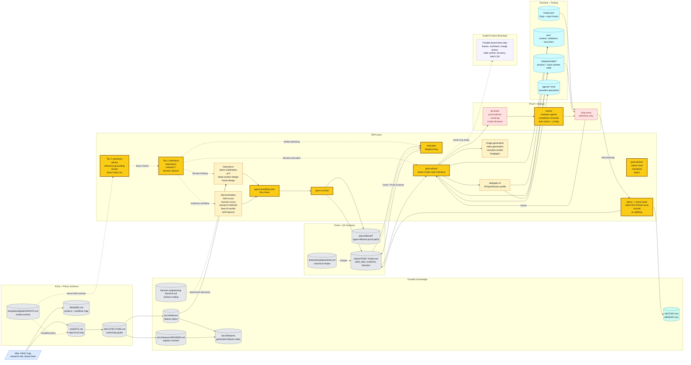

# Farplane Architecture

Current-state system map for Farplane.

Use this file as the top-level architecture guide after the repo-local
[AGENTS.md](AGENTS.md). It explains
which surfaces exist, what each one owns, and where to go next.

Documentation routing starts in
[README.md](README.md). Keep this file
and README in sync whenever the public workflow, shipped capability list, or
whole-system diagram changes.

The canonical product and framework contracts are [Farplane V1](docs/prd.md)
and the [framework lifecycle](docs/farplane-framework/lifecycle.md). The
lifecycle routes to the technical contracts for project files, Pulse,
ticket execution, hooks, reporting, and graphs.

## Purpose

Farplane is the cloneable harness substrate for running long-form AI work
through visible artifacts instead of hidden runtime state or transcript memory
alone. Operators clone Farplane to own their standards, skills, evals,
templates, tickets, automations, runtime adapters, Goal Packets, guardrails,
review loops, and self-improvement machinery.

Farplane Core pairs with Farplane UI:

| Surface | Path | Owns |
| --- | --- | --- |
| Farplane Core | `Farplane/` | Harness contracts, framework files, skills, hooks, evals, templates, tickets, review, proof, graph/projection payloads, and repo memory |
| Farplane UI | `../Farplane-UI/` | Operator cockpit, global harness modules, project/company views, visual office entrypoints, state bridge, and settings |
| Runtime adapters | external / optional | Codex by default for local project/thread visibility; OpenClaw when persistent gateway/agent customization is needed |

The UI scope split is part of the architecture contract:

- **Global harness surfaces** inspect and maintain Farplane itself: Harness
  Map, Skill OS, Eval OS, Rollout, Template Tracking, User Comms, and Settings.
- **Project/company surfaces** treat each project as an autonomous company with
  stable problems, teams, agents, board state, files, memory, evidence,
  metrics, and review loops.

The repo is organized around five concerns:

- `AGENTS.md`: project-local operating map loaded every loop
- `ARCHITECTURE.md`: top-level system map and canonical surface guide
- `docs/`: durable knowledge and feature specs
- `tickets/`: active execution objects, compact closed-issue locators, and
  readable legacy local archive history
- `skills/`, `agents/`, `bin/`: reusable workflows, bounded specialists, and
  runtime helpers

## One Picture



Legend:

- `blue` = incoming operator surface
- `gray` = durable docs, feature specs, and ticket files
- `amber/yellow` = skill contracts and highlighted handoff skills
- `cyan` = runtime helpers and specialist process surfaces
- `red` = proof, review, and Stop-hook gates
- `teal` = memory/writeback
- `dashed purple` = future scale boundary, not shipped behavior

## Canonical Surfaces

### Documentation router

The public docs are intentionally split by job:

| Surface | Owns | Must Stay In Sync With |
| --- | --- | --- |
| [README.md](README.md) | reader routing, setup, current-state summary, roadmap cap | this file, `docs/features/README.md` |
| [ARCHITECTURE.md](ARCHITECTURE.md) | system diagram, surface ownership, read order, current limits | README, `docs/features/README.md` |
| [docs/features/README.md](docs/features/README.md) | canonical feature-spec index and doc-gardening loop | README, this file |
| [tickets/README.md](tickets/README.md) | ticket state machine, invocation policy, metadata contract | ticket template, invocation feature spec |
| [docs/HISTORY.md](docs/HISTORY.md) / [docs/MEMORY.md](docs/MEMORY.md) | durable timeline and project invariants | closeout tickets and nearest module docs |

If a public harness claim changes, update the relevant row's surfaces in the
same pass and run:

```bash
python3 bin/validators/check_doc_parity.py
python3 bin/validators/check_harness_invariants.py
python3 tickets/scripts/check_ticket_metadata.py
```

Do not shrink or remove the colored Mermaid maps in README or ARCHITECTURE
during cleanup unless the replacement carries the same routing information.

### Entry surfaces

- [AGENTS.md](AGENTS.md)
  Purpose: project-local operating map, read-first paths, local rules
- [README.md](README.md)
  Purpose: product story, setup, and major public entrypoints
- [ARCHITECTURE.md](ARCHITECTURE.md)
  Purpose: system map, ownership boundaries, and where each concern lives

### Knowledge surfaces

- [docs/features/README.md](docs/features/README.md)
  Purpose: index of canonical feature specs and generated registry outputs
- [docs/features/FEAT-0015-symphony-compatible-farplane-invocation-contract.md](docs/features/FEAT-0015-symphony-compatible-farplane-invocation-contract.md)
  Purpose: historical record of the removed invocation, board, compute, and
  ticket-runtime experiment
- [docs/fundamentals/harness-engineering-doctrine.md](docs/fundamentals/harness-engineering-doctrine.md)
  Purpose: routing doctrine for where harness changes belong before widening policy or adding new surfaces
- [docs/features/README.md](docs/features/README.md)
  Purpose: current-state technique inventory, with implemented versus proposed
  techniques kept explicit
- [docs/systems/README.md](docs/systems/README.md)
  Purpose: public system stack and authored source for `SYS-*` systems
- [docs/features/FEAT-0060-registry-backed-documentation-os.md](docs/features/FEAT-0060-registry-backed-documentation-os.md)
  Purpose: lifecycle, read defaults, drain flows, and keep/delete rules for
  durable filesystem state
- [docs/features/README.md](docs/features/README.md)
  Purpose: first-class `FEAT-*` feature docs plus generated registry output for
  surfaces, source references, evidence, limits, and metrics
- [skills/feed-scout/SKILL.md](skills/feed-scout/SKILL.md)
  Purpose: tracked-profile monitoring recipe for discovering X, YouTube, and
  blog content, deduping canonical URLs in a content/proposal ledger, and
  routing eligible items to harness-scout and best-of-worlds
- [docs/features/FEAT-0060-registry-backed-documentation-os.md](docs/features/FEAT-0060-registry-backed-documentation-os.md)
  Purpose: structural versus narrative doc-audit policy and the doc-gardening
  workflow
- [docs/HISTORY.md](docs/HISTORY.md)
  Purpose: append-only change log
- [docs/MEMORY.md](docs/MEMORY.md)
  Purpose: curated durable invariants and constraints
- [docs/TASTE.md](docs/TASTE.md)
  Purpose: shared visual doctrine when a repo has UI work
- [qa/README.md](qa/README.md)
  Purpose: repo-owned QA/browser-test entry guidance and cookbook policy
- [qa/cookbook](qa/cookbook)
  Purpose: reusable shortcuts, deep links, seeds, probes, and workflow runbooks for agent-efficient QA

### Execution surfaces

- [tickets/README.md](tickets/README.md)
  Purpose: ticket lifecycle, frontmatter contract, invocation policy, and
  durable progress policy
- [tickets/templates/ticket.md](tickets/templates/ticket.md)
  Purpose: canonical compact ticket-as-program shape for task scope, delta,
  program pseudocode, map, `Done / Proof`, state, links, and optional agent
  contract/run hints for delegated or unattended work
- [tickets](tickets)
  Purpose: active ticket board
- `tickets/archive-index.jsonl`
  Purpose: compact identity, status, and URL locator for new closed issues in
  each project's configured GitHub repository; not a duplicate ticket archive
- [tickets/archive](tickets/archive)
  Purpose: readable legacy completed or retired work history; no new terminal
  packet is created there

### Review and proof surfaces

- [docs/features/FEAT-0008-artifact-first-qa-and-completion-proof.md](docs/features/FEAT-0008-artifact-first-qa-and-completion-proof.md)
  Purpose: QA -> reviewer -> Stop-hook quality gate split
- [skills/review/README.md](skills/review/README.md)
  Purpose: public entrypoint to the review system
- [docs/review/rubrics/review-rubric-index.md](docs/review/rubrics/review-rubric-index.md)
  Purpose: canonical scoring map, thresholds, and rubric family selection

The review scoring model is canonical in `skills/review/*`, not in this file.

### Runtime and orchestration surfaces

- [docs/features/FEAT-0007-ticket-as-durable-task-memory.md](docs/features/FEAT-0007-ticket-as-durable-task-memory.md)
  Purpose: end-to-end execution model, lane roles, and orchestration boundaries
- [docs/features/FEAT-0015-symphony-compatible-farplane-invocation-contract.md](docs/features/FEAT-0015-symphony-compatible-farplane-invocation-contract.md)
  Purpose: retired runtime history; it is not an active execution surface
- [skills/goal-advisor/SKILL.md](skills/goal-advisor/SKILL.md)
  Purpose: canonical execution compiler that turns listed files, trigger mode,
  budget, and proof policy into native Goal, heartbeat, batch, rollout,
  feedback, or direct-route prompts
- [skills/delegate-cli/SKILL.md](skills/delegate-cli/SKILL.md)
  Purpose: public external CLI delegation workflow for routing bounded builder
  work through profile/adapter contracts while Farplane keeps ticket, QA, and
  review authority
- [bin](bin)
  Purpose: hooks, validators, runtime helpers
- `.farplane/` local state
  Purpose: ignored project-local runtime, generated, event, scout, eval, and
  product state

## Ownership Boundaries

- Root docs should stay map-like.
- Detailed behavior belongs in feature docs under `docs/features/`.
- Ticket-local state belongs in `tickets/TASK-*/ticket.md`, not in chat.
- Reusable QA shortcuts and deterministic browser-entry guidance belong in
  `qa/cookbook/*`, not in ticket prose or transient chat.
- Review scoring belongs in `skills/review/*`.
- Runtime machinery belongs in `bin/`, `hooks.json`, and runtime feature specs.
- Reusable workflow detail belongs in `skills/*`.
- Skill tier leverage classes and first-load loading rules belong in
  `docs/skills/README.md`, the generated skill registry, and direct `SKILL.md`
  checklist links. The global template carries only the always-loaded
  skill-loading reflex.

## Read Order

When orienting on the repo:

1. Read [AGENTS.md](AGENTS.md).
2. Read [ARCHITECTURE.md](ARCHITECTURE.md).
3. Read [README.md](README.md) for product/setup context.
4. Read [docs/features/README.md](docs/features/README.md).
5. Read [docs/fundamentals/harness-engineering-doctrine.md](docs/fundamentals/harness-engineering-doctrine.md) when the task changes the harness itself.
6. Read the active ticket and [tickets/README.md](tickets/README.md).
7. Follow links into the specific feature spec, skill, or runtime surface you actually need.

## Current Limits

- The architecture map is intentionally current-state-first and should not become
  a second encyclopedia.
- README is the documentation router; ARCHITECTURE is the ownership map. Update
  both together when the public harness story changes.
- Farplane has strong single-ticket orchestration and Goal-backed file-list
  execution, but not parallel N-agent board drain with leases, worktrees, merge
  policy, stale-worker recovery, and batch QA yet.
- Doc governance is hybrid by design: structural entrypoint checks are
  mechanical, while narrative drift is audited with a prompt-driven workflow.
