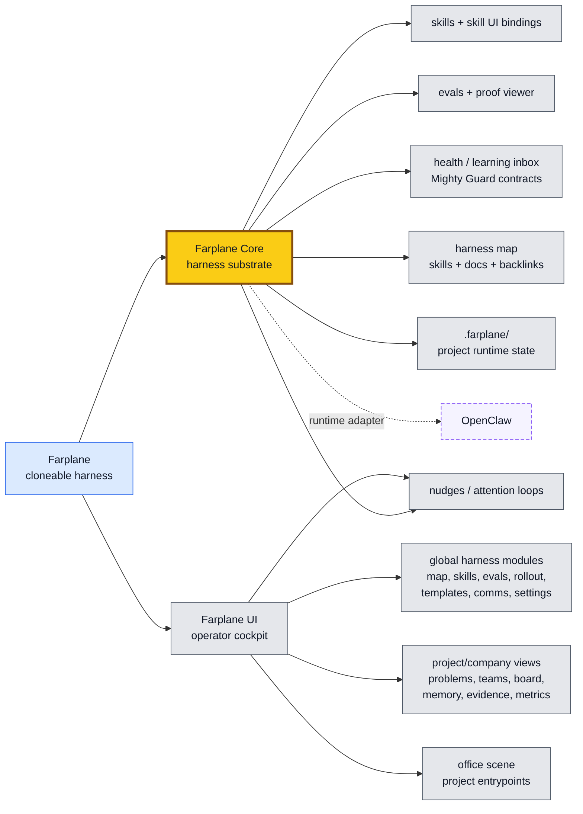
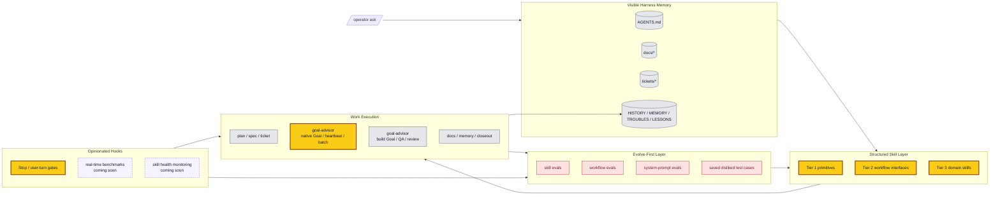
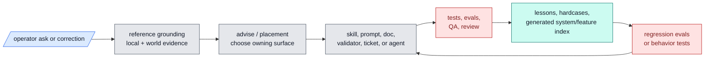

# Farplane


Farplane is the cloneable AI harness substrate.

The current product contract is [Farplane V1](docs/prd.md), implemented by the
[framework lifecycle](docs/farplane-framework/lifecycle.md) and its linked
technical contracts.

Clone this repo when you want to build and maintain your own operating harness
for AI work: standards, skills, evals, templates, tickets, automations, runtime
adapters, Goal Packets, guardrails, graph projections, review loops, and
self-improvement machinery. Farplane Core is the durable substrate; Farplane UI
is the cockpit that makes the substrate visible and steerable.

The product has two operating scopes:

- **Global harness scope**: inspect and maintain the harness itself, including
  skills, evals, templates, rollout, graph/lifecycle maps, runtime settings,
  and user communication surfaces.
- **Project/company scope**: treat each project as an autonomous company with
  stable problems, teams, agents, board state, files, memory, evidence,
  metrics, and review loops.

Farplane is broader than tickets. The ticket-first autonomous coding loop is
one important feature, but the larger purpose is to keep an AI harness learning
without letting it silently sprawl, forget, or self-approve weak work.

## Five Developer-Facing Differences

Farplane is for developers who want Codex to do serious work without turning
their repo into a haze of prompts, chat memory, and unverifiable claims.

1. **A local control plane for agent work.** Farplane keeps plans, tickets,
   runtime state, memories, feature specs, and proof in files that developers can diff,
   review, and repair.
2. **Objective loops that do not drift.** Project metric objectives live in
   `farplane/metrics.yaml` with explicit direction, and Core derives movement
   from raw observations. Goal Packets give selected long-running work a
   `ticket.md`, `program.md`, and `progress.md` so a business, product, or
   multi-agent loop can keep a longer horizon without becoming one giant
   prompt.
3. **Completion that requires evidence.** QA, reviewer lanes, browser proof,
   maintainability review, and Done / Proof contracts make "done" inspectable
   instead of self-reported.
4. **Skills that improve like software.** Farplane skills carry checklists,
   references, examples, evals, registries, validators, and maintenance scripts,
   so repeated workflows get better without bloating the global prompt.
5. **Harness health as a product surface.** Harness Map, Skill OS, Eval OS,
   Rollout, Template Tracking, and Mighty Guard-style checks turn weak skills,
   stale docs, failing evals, drift, telemetry, nudges, and maintenance
   findings into visible operator workflows.

## Product Shape

Farplane has a simple source-of-truth split:

- **Farplane Core** is this repo. It owns harness contracts, project framework
  files, skills, evals, templates, tickets, review gates, proof contracts,
  graph/projection payloads, repo memory, and install/runtime policy.
- **Farplane UI** is the sibling cockpit repo. It owns the browser-facing
  global harness modules and project/company views that make the harness useful
  day to day.
- **Runtime adapters** such as Codex and OpenClaw stay adapters. They run or
  expose agent work; Farplane gives that work a visible harness.

Farplane Core also owns the global `farplane` CLI. App-specific commands stay
with their owning module repos, but install, hooks, doctor checks, UI linking,
UI start, and local delegation all route through this Core-owned command.

Current repo shape:

| Surface | Path | Owns |
| --- | --- | --- |
| Farplane Core | `Farplane/` | Harness contracts, skills, hooks, evals, tickets, review, proof, and repo memory |
| Farplane UI | `Farplane-UI/` | Operator cockpit, global harness entrypoints, project/company surfaces, visual office, state bridge, and settings |
| Runtime adapters | external / optional | Codex by default for local project/thread visibility; OpenClaw where persistent gateway/agent customization is needed |

Other app ideas should graduate into Core contracts, UI modules, skill-owned
viewers, or archived experiments instead of becoming new centers of gravity.



The product rule is:

- **One cloneable harness:** Farplane owns the parent story while Core and UI
  keep clean source-of-truth boundaries.
- **Core owns proof:** Farplane Core owns harness semantics, skills, hooks,
  evals, tickets, review, memory, runtime state, and Done / Proof contracts.
- **UI owns operation:** Farplane UI owns the cockpit: global harness modules,
  project/company views, visual office entrypoints, and operator settings.
- **Skill-owned UI incubation:** a skill may ship a small viewer, panel, or URL
  binding before the workflow is productized.
- **Roll-up when proven:** useful skill UIs graduate into Farplane UI modules
  while keeping a skill binding back to the owning workflow.
- **Adapters stay adapters:** OpenClaw, Telegram paths, external CLIs, and
  future runtimes connect to the engine without becoming the product core.
- **State is Farplane-native:** project-local product/runtime state lives under
  `.farplane/`; global product state can live under `~/.farplane/` when the
  multi-project shell needs it.

## Architecture



## Operating Loop

Farplane turns each material request into a visible loop:

```text
ask -> ground -> choose the owner -> act -> prove -> learn
```

The global prompt stays lean; durable behavior lives in skills, feature specs, tickets,
validators, subagents, evals, and review gates. When work fails, the correction
can become a lesson, hardcase, eval row, skill update, or harness-placement
decision instead of disappearing into chat history.

## Improvement Loop



## Repo Index

| Path | Contains |
| --- | --- |
| `AGENTS.md` | Project-local operating contract for developing Farplane itself. |
| `ARCHITECTURE.md` | Deeper system map, ownership boundaries, and read order. |
| `agents/` | Bounded specialist role configs. |
| `assets/` | Repo-level media and generated assets. |
| `bin/` | Hooks, runtime helpers, validator wrappers, launchers, and sync scripts. |
| `bin/validators/` | Testable repo-wide validators for docs, harness invariants, skills, tiers, and registries. |
| `docs/` | Systems, feature specs, generated registries, history, memory, troubles, lessons, and durable research. |
| `docs/systems/` | Authored public system docs plus generated system registry. |
| `docs/features/` | Authored first-class feature specs plus generated feature registry output. |
| `docs/fundamentals/` | Harness theory, doctrine, and cross-surface best practices. |
| `.farplane/` | Ignored project-local runtime, generated, event, and product state. |
| `qa/` | QA cookbook, browser proof paths, and reusable test-entry guidance. |
| `rules/` | Machine-readable local rule files. Durable best-practice docs live under `docs/features/`. |
| `skills/` | Farplane skill packages, references, scripts, and templates. |
| `templates/` | Install-time global Codex templates and config scaffolding. |
| `tickets/` | Active task board, ticket template, artifacts, and archive. |

## Start Here

- Install / onboarding: [Local CLI Onboarding](#local-cli-onboarding)
- Architecture map: [ARCHITECTURE.md](ARCHITECTURE.md)
- Fundamentals: [docs/fundamentals/README.md](docs/fundamentals/README.md)
- Systems stack: [docs/systems/README.md](docs/systems/README.md)
- Feature spec index: [docs/features/README.md](docs/features/README.md)
- Harness algebra: [docs/fundamentals/harness-algebra.md](docs/fundamentals/harness-algebra.md)
- Prompt engineering: [docs/fundamentals/prompt-engineering.md](docs/fundamentals/prompt-engineering.md)
- Feature/spec registry: [docs/features/README.md](docs/features/README.md)
- System source: [docs/systems/README.md](docs/systems/README.md)
- Generated system registry data: [docs/systems/registry.jsonl](docs/systems/registry.jsonl)
- Feature docs and registry contract: [docs/features/README.md](docs/features/README.md)
- Generated feature registry data: [docs/features/registry.jsonl](docs/features/registry.jsonl)
- Skill guide: [docs/skills/README.md](docs/skills/README.md)
- Skill best practices: [docs/skills/best-practices.md](docs/skills/best-practices.md)
- Ticket contract: [tickets/README.md](tickets/README.md)
- Goal loop contract: [docs/features/FEAT-0029-goal-packet-architecture-for-native-codex-goals.md](docs/features/FEAT-0029-goal-packet-architecture-for-native-codex-goals.md)
- QA cookbook surface: [qa/README.md](qa/README.md)
- Review scoring: [skills/review/README.md](skills/review/README.md)
- Maintainability code review: [skills/code-review/README.md](skills/code-review/README.md)
- Active queue: [tickets](tickets)

## Local CLI Onboarding

Use this path when Farplane Core is already installed locally and you want to
attach the optional Farplane-UI office checkout.

```bash
cd /path/to/Farplane
bash install.sh
farplane doctor
farplane hooks list --json
farplane hooks doctor
farplane ticket close TASK-XXXX
farplane ui link /path/to/Farplane-UI
farplane ui start
```

What Core owns:

- `farplane doctor`: reports readiness for Core install, hooks, linked UI repo,
  local config hygiene, and this checkout's Doppler secret source.
- `farplane install`: performs safe mechanical install/reinstall work: renders
  Codex config, links hooks, and refreshes the global CLI link. In this
  checkout it automatically runs the installer subprocess through Doppler when
  Doppler is configured and the current shell is not already Doppler-injected.
- `farplane hooks install`: refreshes the hook install through Core.
- `farplane hooks list`: inventories every managed Codex hook command.
- `farplane hooks doctor`: verifies Core-owned hook links, command targets,
  interpreters, and known silent-skip regressions without requiring optional
  Farplane UI/Node telemetry.
- `farplane ticket close TASK-XXXX`: marks the ticket done, clears its claim,
  archives it, emits one completion event, and invokes the configured mining
  route; reruns are idempotent.
- `farplane notify status|enable|disable`: inspects or toggles the Farplane
  turn-complete notify script in the rendered Codex config, preserving desktop
  notify wrappers when present.
- `farplane run -- <command>`: runs a command through the current project's
  Doppler secret environment.
- `farplane metrics primitives --project-root /path/to/project --date YYYY-MM-DD --json`:
  refreshes Core primitive readings for ticket/KPI/product counts, Codex thread
  usage, burn source gaps, and ticket/thread association backfill.
- `farplane project snapshot --project-root /path/to/project --json`: writes a
  read-only project/company projection for Farplane UI and interval context.
- `farplane skills rollout scan --json`: emits a read-only skill rollout
  projection for Farplane UI and local status checks.
- `farplane ui link /path/to/Farplane-UI`: stores the UI checkout in
  `~/.farplane/farplane-cli.json`.
- `farplane ui start`: starts the linked UI checkout.
- `farplane office ...`, `farplane team ...`, `farplane agent ...`,
  `farplane onboarding`, `farplane status`, and `farplane whoami`: delegate to
  the linked Farplane-UI module CLI while that implementation still lives there.

Farplane consumes runtime secrets as environment variables first. This checkout
uses Doppler for local secret injection, so credentialed scripts should run
through `farplane run -- <command>` or `doppler run -- <command>`. `farplane
run` uses the current working directory's Doppler setup, which lets scripts live
under `skills/` while secrets come from the project scope. Farplane does not
store Doppler tokens in the repo. Private `~/.farplane/config.toml` stores
non-secret UI-managed machine/operator settings only; Core ignores credential
fields there and `farplane doctor` reports their names for migration. See
[secret management](docs/fundamentals/secret-management.md).
`config.toml.example` still renders the installed `~/.codex/config.toml`, but
that file is a Codex adapter output and the lowest-priority fallback, not the
Farplane source of truth.

The command grammar is intentionally small: `doctor` reports readiness,
`install` applies safe mechanical repair/render/link behavior, and
`run -- <command>` executes arbitrary credentialed commands.

Keep tracked project coordinates such as URLs, aliases, safe IDs, and metric
recipes in `farplane/bindings.yaml`. Keep API keys, tokens, passwords, OAuth
credentials, and webhook secrets in Doppler-injected runtime env only.

Override the linked UI checkout for one shell with `FARPLANE_UI_REPO=/path/to/Farplane-UI`.
Use `FARPLANE_CLI_LINK_DIR=/custom/bin bash install.sh` if your preferred
global executable directory is not `~/.local/bin`.

## Current Boundary

Farplane is installed into normal Codex and uses visible repo artifacts as the
control plane. It is not a hidden daemon, hosted scheduler, or parallel
multi-agent dispatcher today. Background hooks for live skill-health benchmarks
and saved disliked-case feedback loops are planned harness surfaces, not fully
shipped behavior yet.

Offline evals and human-marked failure capture are the shipped improvement
primitives today. Broader live skill-health benchmarks remain future work.
