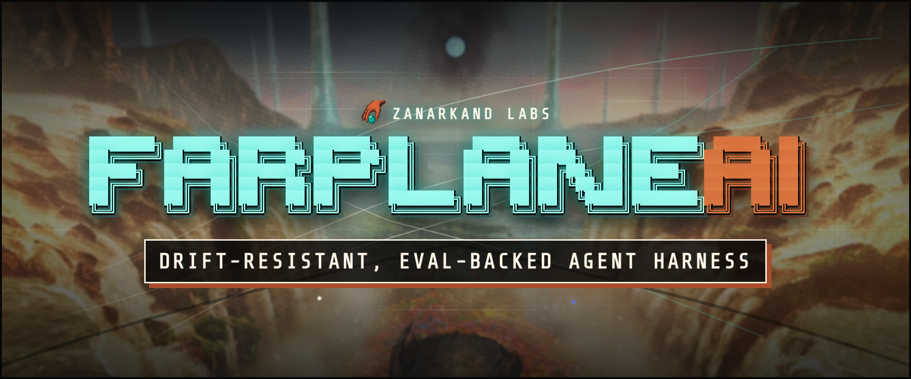
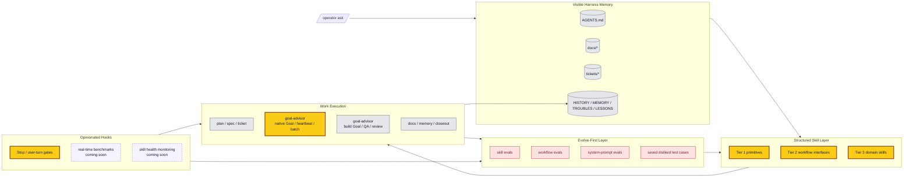

# Farplane



Farplane is the cloneable AI harness substrate.

Clone this repo when you want to build and maintain your own operating harness
for AI work: standards, skills, evals, templates, tickets, automations, runtime
adapters, goals, guardrails, graph projections, review loops, and
self-improvement machinery. Farplane Core is the durable substrate; Farplane UI
is the cockpit that makes the substrate visible and steerable.

The product has two operating scopes:

- **Global harness scope**: inspect and maintain the harness itself, including
  skills, evals, templates, rollout, graph/lifecycle maps, runtime settings,
  and user communication surfaces.
- **Project/company scope**: treat each project as an autonomous company with
  goals, teams, agents, board state, files, memory, evidence, metrics, and
  review loops.

Farplane is broader than tickets. The ticket-first autonomous coding loop is
one important feature, but the larger purpose is to keep an AI harness learning
without letting it silently sprawl, forget, or self-approve weak work.

## Five Developer-Facing Differences

Farplane is for developers who want Codex to do serious work without turning
their repo into a haze of prompts, chat memory, and unverifiable claims.

1. **A local control plane for agent work.** Farplane keeps plans, tickets,
   runtime state, memories, specs, and proof in files that developers can diff,
   review, and repair.
2. **Goal loops that do not drift.** Project goals live in
   `farplane/goals.md`; Goal Packets give selected long-running work a
   `ticket.md`, `program.md`, and `progress.md` so a business, product, or
   multi-agent loop can keep a longer horizon without becoming one giant
   prompt.
3. **Completion that requires evidence.** QA, reviewer lanes, browser proof,
   maintainability review, Stop-hook checks, and Done / Proof contracts make
   "done" inspectable instead of self-reported.
4. **Skills that improve like software.** Farplane skills carry checklists,
   references, examples, evals, registries, validators, and maintenance scripts,
   so repeated workflows get better without bloating the global prompt.
5. **Harness health as a product surface.** Harness Map, Skill OS, Eval OS,
   Rollout, Template Tracking, and Mighty Guard-style checks turn weak skills,
   stale docs, failing evals, drift, telemetry, nudges, and maintenance
   findings into visible operator workflows.

## Product Shape

Farplane has a simple source-of-truth split:

- **Farplane Core** is this repo. It owns harness contracts, project framework
  files, skills, evals, templates, tickets, review gates, proof contracts,
  graph/projection payloads, repo memory, and install/runtime policy.
- **Farplane UI** is the sibling cockpit repo. It owns the browser-facing
  global harness modules and project/company views that make the harness useful
  day to day.
- **Runtime adapters** such as Codex and OpenClaw stay adapters. They run or
  expose agent work; Farplane gives that work a visible harness.

Farplane Core also owns the global `farplane` CLI. App-specific commands stay
with their owning module repos, but install, hooks, doctor checks, UI linking,
UI start, and local delegation all route through this Core-owned command.

Current repo shape:

| Surface | Path | Owns |
| --- | --- | --- |
| Farplane Core | `Farplane/` | Harness contracts, skills, hooks, evals, tickets, review, proof, and repo memory |
| Farplane UI | `Farplane-UI/` | Operator cockpit, global harness entrypoints, project/company surfaces, visual office, state bridge, and settings |
| Runtime adapters | external / optional | Codex by default for local project/thread visibility; OpenClaw where persistent gateway/agent customization is needed |

Other app ideas should graduate into Core contracts, UI modules, skill-owned
viewers, or archived experiments instead of becoming new centers of gravity.


The product rule is:

- **One cloneable harness:** Farplane owns the parent story while Core and UI
  keep clean source-of-truth boundaries.
- **Core owns proof:** Farplane Core owns harness semantics, skills, hooks,
  evals, tickets, review, memory, runtime state, and Done / Proof contracts.
- **UI owns operation:** Farplane UI owns the cockpit: global harness modules,
  project/company views, visual office entrypoints, and operator settings.
- **Skill-owned UI incubation:** a skill may ship a small viewer, panel, or URL
  binding before the workflow is productized.
- **Roll-up when proven:** useful skill UIs graduate into Farplane UI modules
  while keeping a skill binding back to the owning workflow.
- **Adapters stay adapters:** OpenClaw, Telegram paths, external CLIs, and
  future runtimes connect to the engine without becoming the product core.
- **State is Farplane-native:** project-local product/runtime state lives under
  `.farplane/`; global product state can live under `~/.farplane/` when the
  multi-project shell needs it.

## Architecture



## Operating Loop

Farplane turns each material request into a visible loop:

```text
ask -> ground -> choose the owner -> act -> prove -> learn
```

The global prompt stays lean; durable behavior lives in skills, specs, tickets,
validators, subagents, evals, and review gates. When work fails, the correction
can become a lesson, hardcase, eval row, skill update, or harness-placement
decision instead of disappearing into chat history.

## Improvement Loop

```mermaid
flowchart LR
  classDef input fill:#dbeafe,stroke:#2563eb,color:#111827
  classDef surface fill:#e5e7eb,stroke:#4b5563,color:#111827
  classDef proof fill:#fee2e2,stroke:#b91c1c,color:#7f1d1d
  classDef learn fill:#ccfbf1,stroke:#0f766e,color:#111827

  ask[/operator ask or correction/]:::input --> ground["reference grounding<br/>local + world evidence"]:::surface
  ground --> decide["advise / placement<br/>choose owning surface"]:::surface
  decide --> change["skill, prompt, doc,<br/>validator, ticket, or agent"]:::surface
  change --> verify["tests, evals,<br/>QA, review"]:::proof
  verify --> capture["lessons, hardcases,<br/>feature registry"]:::learn
  capture --> evals["regression evals<br/>or behavior tests"]:::proof
  evals --> change
```



## Repo Index

| Path | Contains |
| --- | --- |
| `AGENTS.md` | Project-local operating contract for developing Farplane itself. |
| `ARCHITECTURE.md` | Deeper system map, ownership boundaries, and read order. |
| `agents/` | Bounded specialist role configs. |
| `assets/` | Repo-level media and generated assets. |
| `bin/` | Hooks, runtime helpers, compatibility validator wrappers, launchers, and sync scripts. |
| `bin/validators/` | Testable repo-wide validators for docs, harness invariants, skills, tiers, and registries. |
| `docs/` | Specs, feature inventory, history, memory, troubles, lessons, and research. |
| `docs/features/` | Structured feature registry and feature metadata. |
| `docs/fundamentals/` | Harness theory, doctrine, and cross-surface best practices. |
| `docs/specs/` | Buildable behavior contracts, lifecycle specs, runtime adapters, and proof gates. |
| `experiments/` | Smoke runs, eval artifacts, prototypes, and temporary proof. |
| `.farplane/` | Ignored project-local runtime, generated, event, and product state. |
| `qa/` | QA cookbook, browser proof paths, and reusable test-entry guidance. |
| `rules/` | Machine-readable local rule files. Durable best-practice docs live under `docs/specs/`. |
| `skills/` | Farplane skill packages, references, scripts, and templates. |
| `templates/` | Install-time global Codex templates and config scaffolding. |
| `tickets/` | Active task board, ticket template, artifacts, and archive. |

## Start Here

- Install / onboarding: [Local CLI Onboarding](#local-cli-onboarding)
- Architecture map: [ARCHITECTURE.md](ARCHITECTURE.md)
- Fundamentals: [docs/fundamentals/README.md](docs/fundamentals/README.md)
- Specs index: [docs/specs/README.md](docs/specs/README.md)
- Harness algebra: [docs/fundamentals/harness-algebra.md](docs/fundamentals/harness-algebra.md)
- Prompt engineering: [docs/fundamentals/prompt-engineering.md](docs/fundamentals/prompt-engineering.md)
- Self-growing harness map: [docs/specs/harness-techniques.md](docs/specs/harness-techniques.md#self-growing-harness-map)
- Feature inventory: [harness-techniques.md](docs/specs/harness-techniques.md)
- Structured feature registry: [docs/features/README.md](docs/features/README.md)
- Feature registry data: [docs/features/registry.jsonl](docs/features/registry.jsonl)
- Skill guide: [docs/skills/README.md](docs/skills/README.md)
- Skill best practices: [docs/skills/best-practices.md](docs/skills/best-practices.md)
- Ticket contract: [tickets/README.md](tickets/README.md)
- Goal loop contract: [docs/specs/goal-loop-contract.md](docs/specs/goal-loop-contract.md)
- QA cookbook surface: [qa/README.md](qa/README.md)
- Review scoring: [skills/review/README.md](skills/review/README.md)
- Maintainability code review: [skills/code-review/README.md](skills/code-review/README.md)
- Active queue: [tickets](tickets)

## Local CLI Onboarding

Use this path when Farplane Core is already installed locally and you want to
attach the optional Farplane-UI office checkout.

```bash
cd /path/to/Farplane
bash install.sh
farplane doctor
farplane hooks doctor
farplane ui link /path/to/Farplane-UI
farplane ui start
```

What Core owns:

- `farplane install`: reruns this repo's install flow, renders Codex config,
  links hooks, and refreshes the global CLI link.
- `farplane doctor`: checks Core install, hook links, rendered config, and the
  linked UI repo.
- `farplane hooks install`: refreshes the hook install through Core.
- `farplane hooks doctor`: verifies the Core-owned hook links and rendered
  telemetry config.
- `farplane skills rollout scan --json`: emits a read-only skill rollout
  projection for Farplane UI and local status checks.
- `farplane ui link /path/to/Farplane-UI`: stores the UI checkout in
  `~/.farplane/farplane-cli.json`.
- `farplane ui start`: starts the linked UI checkout.
- `farplane office ...`, `farplane team ...`, `farplane agent ...`,
  `farplane onboarding`, `farplane status`, and `farplane whoami`: delegate to
  the linked Farplane-UI module CLI while that implementation still lives there.

Farplane runtime configuration is TOML-backed and Settings-first when Farplane
UI is linked. `config.toml.example` renders the installed `~/.codex/config.toml`
with its `[env]` table; Farplane Core reads that rendered TOML for delegated
commands and hooks. The UI writes local settings inputs to
`~/.farplane/config.json` and `~/.farplane/secrets.json`, and Core uses those
saved settings to override rendered TOML values during commands, hooks, and
`install.sh` `config.toml` rendering. `~/.codex/config.local.env` remains a
legacy fallback for values not yet managed by the UI.

Override the linked UI checkout for one shell with `FARPLANE_UI_REPO=/path/to/Farplane-UI`.
Use `FARPLANE_CLI_LINK_DIR=/custom/bin bash install.sh` if your preferred
global executable directory is not `~/.local/bin`.

## Current Boundary

Farplane is installed into normal Codex and uses visible repo artifacts as the
control plane. It is not a hidden daemon, hosted scheduler, or parallel
multi-agent dispatcher today. Background hooks for live skill-health benchmarks
and saved disliked-case feedback loops are planned harness surfaces, not fully
shipped behavior yet.

Offline evals and human-marked failure capture are the shipped improvement
primitives today. Broader live skill-health benchmarks remain future work.
