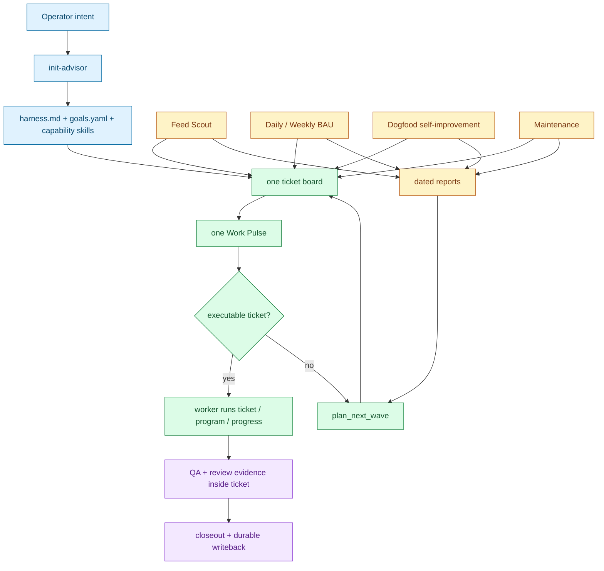

# Farplane Lifecycle

Farplane is a file-backed operating system for agent-run projects. Its center
is deliberately small:

```text
project(program, progress)
  -> goals + stable policy + reusable capability skills
  -> one ticket board
  -> one Work Pulse executes tickets or plans a bounded BAU wave
  -> scheduled sources add reports and bounded ticket classes
  -> ticket programs, progress, QA, and review preserve proof
  -> durable outcomes flow back to docs, goals, and skills
```

Files carry durable state, skills carry reusable workflows, tickets carry work
contracts, and native Codex Goals carry material continuation. A capability
skill may produce an important recurring artifact, but it does not receive its
own planner, worker pool, strategy file, or heartbeat.

## Quick Start

1. Run `init-advisor` to create or migrate the project substrate.
2. Read `farplane/harness.md` for stable policy and capability references.
3. Read `farplane/goals.yaml` for value direction, KPI IDs, current milestone,
   and holds.
4. Read the ticket board for executable commitments and proof.
5. Use `horizon-advisor` only when the goal contract needs a material change.
6. Use `goal-advisor` when a selected material ticket needs a Goal Packet.
7. Activate exactly one Work Pulse heartbeat after the board and proof surfaces
   are ready. Feed Scout, BAU reports, Dogfood, and maintenance are
   separate cron or manual automations.

The deeper bootstrap path is [Init Advisor Critical Path](init-advisor-critical-path.md).
The file-by-file reference is [Project Files](project-files.md).

## Lifecycle Map



## The Minimal Work Loop

```text
pulse(tickets, worker_limit, review_wip, wave_size)
  -> do(admitted_ticket)
   | plan_next_wave(harness, goals, ticket_history, current_context, wave_size)
```

Work Pulse is the only execution heartbeat. On each beat it:

1. reconciles worker and review outcomes;
2. derives due check-in eligibility from ticket Reward rows;
3. admits executable tickets under worker and review capacity;
4. hands workers the original ticket Goal Packet and proof contract;
5. asks the BAU-only planner for a bounded wave only when the admitted board is
   empty and refill is allowed;
6. writes a dated receipt.

It does not run separate capability controllers or perform long-horizon
strategy review. The planner may call capability skills when a proposed ticket
needs them.

## Scheduled Sources

Scheduled automations are ticket sources or report producers, not additional
heartbeats:

| Source | Reads | Writes | May create |
| --- | --- | --- | --- |
| Feed Scout | configured feeds and prior source reports | source report | bounded source-backed opportunity tickets |
| Daily / Weekly BAU | bounded project window and prior finalized evidence | Problems ledger | bounded already-evidenced maintenance tickets |
| Dogfood | active and recent archived experiments plus prior report | portfolio learning report | bounded non-interfering experiment Goal Packets |
| Maintenance | registries, docs, skills, validators | maintenance report | explicit repair tickets when its contract allows |

Daily and Weekly do not invent new direction. Feed Scout does not execute its
opportunities. Dogfood does not implement or check in experiments. Every
executable commitment returns to the shared board.

## Goal Packets And Check-Ins

Material or resumable work uses:

```text
tickets/TASK-XXXX/
  ticket.md    # scope, Reward, Done / Proof, QA/review contract
  program.md   # loop, budgets, stop rules, executable Check-In Program
  progress.md  # append-only observations and decisions
  artifacts/   # implementation, QA, review, and supporting evidence
```

For delayed Reward rows, Work Pulse derives readiness and resumes the original
ticket. The worker reads `program.md` first and executes its `Check-In Program`.
It updates only matured rows and decides `accept | kill | iterate | monitor` as
the program permits. Future rows remain dormant. Pulse dispatches this work; it
does not reconstruct or independently score the experiment policy.

## State Ownership

| State | Durable owner |
| --- | --- |
| Human thesis, non-tradeoffs, authority, stable capability refs | `farplane/harness.md` |
| North star, value function, goals, KPI IDs, milestone, holds | `farplane/goals.yaml` |
| Provider-independent metric meaning | `farplane/metrics.yaml` |
| Recurring workflow | reusable `skills/*` or project-local `.agents/skills/*` |
| Executable commitment and all QA/review evidence | owning ticket and `artifacts/` |
| Goal/check-in loop policy | ticket `program.md` |
| Append-only task or experiment observations | ticket `progress.md` |
| Desired automation topology and prompts | `farplane/automations.toml` |
| Provider coordinates and metric refresh bindings | `farplane/bindings.yaml` |
| Runtime receipts and derived context | `.farplane/reports/**` and other generated `.farplane/**` projections |

Reports help the next reader plan, but are not a second source of executable
state. Generated indexes are projections over these owners, not hand-maintained
strategy ledgers.

## Capability Skills

Important recurring outputs should have callable skills:

```text
capability_skill(ticket, goals, current_context)
  -> artifact + evidence + ticket_state_delta
```

Use a root `skills/<name>/` package when the workflow is reusable across
projects. Use `.agents/skills/<name>/` when it is company- or project-specific.
Promote only after repeated evidence. A skill owns how to produce the artifact;
`goals.yaml` owns why it matters; the ticket owns the current commitment and
proof.

## Minimum Autonomous Instruction Set

A project needs:

- `farplane/harness.md` with stable policy, authority, and capability refs;
- `farplane/goals.yaml` with value direction, KPI IDs, and current milestone;
- `farplane/metrics.yaml` with definitions for those KPI IDs;
- `farplane/automations.toml` with exactly one Work Pulse heartbeat and bounded
  scheduled sources;
- `farplane/bindings.yaml` for non-secret provider coordinates;
- reusable or project-local capability skills for recurring workflows;
- tickets with Reward, Done / Proof, and ticket-owned QA/review evidence;
- dated reports as derived context.

If required context is missing, write a source gap, planning request, or
bounded instrumentation ticket instead of guessing or rebuilding a controller
layer.

## Durable Learning

Closeout and scheduled maintenance compress useful outcomes back to the
smallest owner:

- strategy evidence can propose a `goals.yaml` delta;
- stable policy evidence can propose a human-reviewed `harness.md` delta;
- repeated workflow evidence can harden or refine the owning skill;
- unresolved executable work remains a ticket;
- raw run detail stays in ticket artifacts or dated reports.

This preserves `program + progress` without turning every observation into a
new schema or global ledger.
