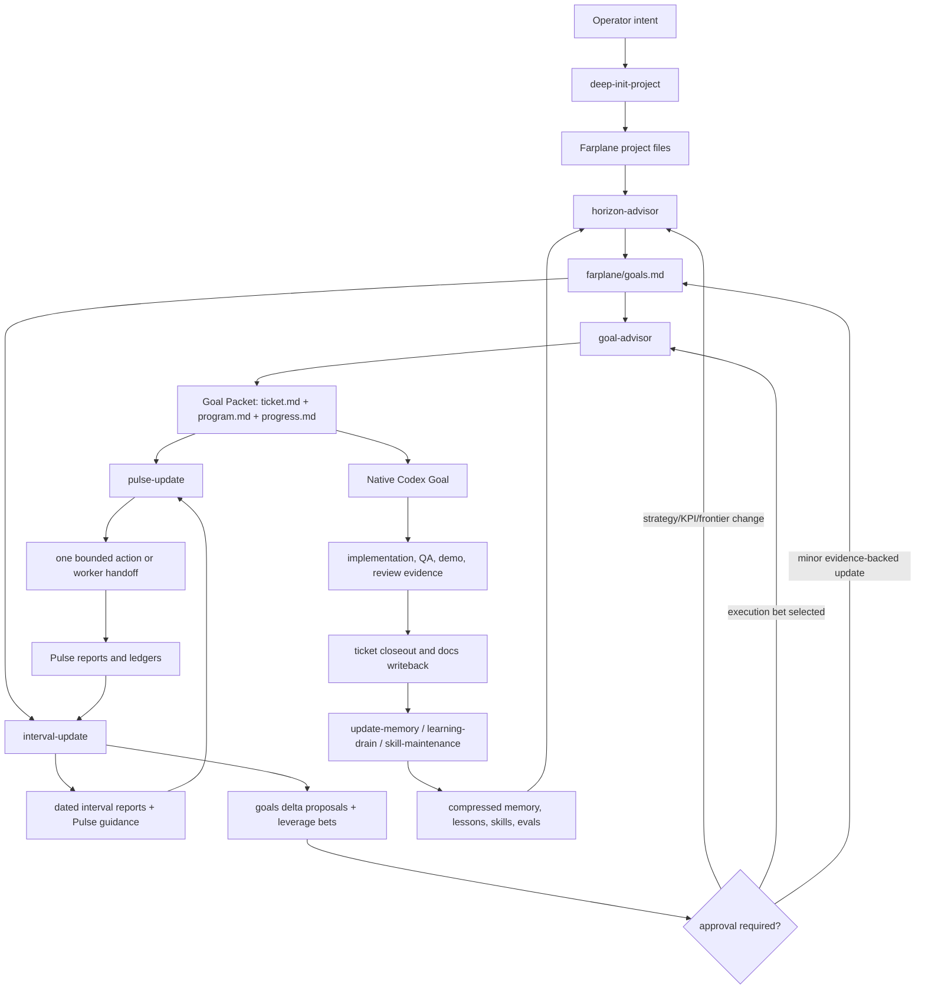

# Farplane Lifecycle

Farplane is a file-backed operating system for agent-run projects. The shortest
mental model is:

```text
init_project(intent)
  -> visible project files
  -> goals and current frontier
  -> ticket-backed Goal Packets
  -> Pulse acts and intervals plan
  -> weekly reports propose goals deltas and leverage bets
  -> drains compress outcomes back into docs, memory, skills, and tickets
```

The framework is intentionally boring at the center. Files carry durable state,
skills carry reusable workflows, tickets carry work contracts, native Codex
Goals carry uninterrupted execution, and hooks stay small enough to observe or
gate without becoming another hidden brain.

## Why This Shape

Farplane uses visible files because agents need shared memory that survives
outside one chat transcript. It uses Goal Packets because material work needs a
small contract, loop configuration, and progress log that can be reviewed or
resumed. It uses explicit automation loops because planning and acting have
different context needs: interval automations compress and replan, while Pulse
chooses one bounded move. It requires proof because autonomous progress is only useful when
the next human or agent can audit what changed. It uses drains because raw
reports, troubles, lessons, and eval results become noise unless they are
periodically routed to their owning docs, skills, tickets, or memory files.

## Quick Start

If you are setting up a project with Codex, start from a plain request:

```text
Use deep-init-project for this repo: <project intent>. Create the Farplane
project files, first ticket, QA/proof surfaces, and framework config. Stop for
secrets, spend, deploys, destructive actions, or unclear product decisions.
```

Then inspect the created files:

1. Open `farplane/README.md` for the project-local framework overview.
2. Open `farplane/harness.md` for mission, values, systems, and skill bindings.
3. Open `farplane/goals.md` for strategy, current milestone, KPIs, and holds.
4. Open `tickets/TASK-0001/ticket.md` for the first planning or discovery
   handoff.
5. Run or ask for `horizon-advisor` only when `farplane/goals.md` is missing,
   stale, or too broad.
6. Run or ask for `goal-advisor` only after the current milestone is concrete
   enough to become a ticket-backed Goal Packet.
7. Activate Pulse, Daily Interval, and Weekly Interval only after goals,
   reviewed automation prompts, visible work, and proof surfaces exist.

The deeper bootstrap path is [Deep Init Critical Path](deep-init-critical-path.md).
The file-by-file reference is [Project Files](project-files.md).

## Lifecycle Map



## Files First

Farplane divides project state by lifecycle:

```text
farplane/   tracked framework config and project strategy
.farplane/  ignored runtime reports, automation ledgers, logs, eval runs
tickets/    work contracts, Goal Packets, progress, proof artifacts
docs/       durable memory, specs, lessons, troubles, and reader docs
skills/     reusable workflows with declared reads, writes, routes, and gates
hooks.json  small Codex hook entry points
```

This split comes from the memory rule that native Codex Goal mode is the only
formal semantic continuation loop. Farplane adds visible files around it:
`ticket.md` for the task contract, `program.md` for loop configuration, and
`progress.md` for append-only observed execution.

## Init To Goals

`deep-init-project` turns an empty or existing repo into a Farplane-shaped
project. It creates or preserves local policy, project docs, ticket templates,
QA entrypoints, framework config, and ignored runtime folders.

The init step does not pretend that file creation is the same as project
understanding. When the project intent is not grounded, it reports
`needs_goal_intake` and routes to `horizon-advisor`.

`horizon-advisor` shapes `farplane/goals.md`. It names the north star, value
function, KPIs, anti-metrics, strategy axes, and current frontier. It expands
only the first branch that can produce useful evidence now, then hands
executable work to `goal-advisor`.

## Goals To Native Codex Goal

`goal-advisor` is the execution compiler. For material work it creates or
attaches to a Goal Packet:

```text
ticket.md    task contract, scope, map, Done / Proof
program.md   loop config, metric, budgets, review/QA policy
progress.md  append-only execution log and drift evidence
```

The generated `/goal` prompt lists the packet files and current proof policy.
It is runtime input, not the source of truth. The files remain the durable
contract that future turns, reviewers, Pulse, interval automations, and closeout can inspect.

Within a coding Pulse or native Goal, the normal leaf workflow is:

```text
ticket implementation plan
  -> goal-advisor execution prompt
  -> native Codex Goal
  -> build
  -> QA
  -> demo when required
  -> documentation and memory writeback
```

`impl-plan` may be used before execution when the selected ticket needs a
focused implementation plan, test strategy, and proof contract. Once the Goal
Packet is approved, Goal execution should land the whole ticket unless a real
blocker or proof boundary makes narrower scope necessary.

## Pulse And Intervals

Farplane autonomous operation uses explicit Codex automation loops:

```text
pulse_update(project_root, extensions?, pulse_policy?)
  -> one bounded action + decision state

interval_update(project_root, interval_id, review_window, planning_window,
                context_refs?, report_workflows?, planning_policy?,
                write_policy?, now?)
  -> dated interval report + next-window plan + Pulse guidance
```

Pulse is the fast actor loop. It reads current goals, recent interval guidance,
ticket state, action arms, rewards, and ledgers. It selects one bounded board
move, optionally spawns a worker, writes a dated Pulse report, and updates
decision/reward state.

Daily Interval reviews the last 24 hours and plans the next 24 hours. Weekly
Interval reviews the last week, checks drift against `farplane/goals.md`, and
plans the next week. Both call `interval-update`, write dated reports under
`.farplane/reports/interval/`, and give Pulse guidance.

The important design choice is that Pulse does not become long-horizon
strategy, and interval automations do not become fast action dispatchers. They
share files, not hidden transcript memory.

## Self-Update Loop

Weekly Interval is the default self-update loop. It reviews the last week,
compares work against goals, scores compounding leverage opportunities, chooses
1-3 next-week bets, and writes proposals before any durable strategy mutation.
Signals come from existing artifacts: reports, tickets, lessons, troubles,
skill/feature registry changes, evals, feedback, metrics, opportunity refs, or
supplied external source refs. Weekly Interval owns clustering, rejection,
selection, and decision logging inside the dated interval report.

```text
weekly_interval_report
  -> goals_delta_candidates
   + lever_inventory
   + next_week_bets
   + pulse_guidance
   + goal_advisor_handoffs
   + reward_signals_to_check_next_week
```

Goals deltas have three outcomes:

- `auto_apply`: small evidence-backed updates such as source refs, stale
  labels, current-signal notes, or minor milestone wording when policy allows.
- `approval_required`: north star, KPI, strategy axis, project priority, hold,
  stop condition, quarterly/yearly goal, or durable milestone changes. These
  stay in the weekly report until the operator accepts them or asks
  `horizon-advisor` to apply the strategy delta.
- `rejected_source_gap`: insufficient evidence. The interval should create an
  instrumentation, access, feedback, research, or ticket-delta proposal instead
  of rewriting strategy.

The advisor boundaries are:

- `horizon-advisor` owns long-horizon strategy: value function, KPI tree,
  strategy axes, current frontier, and material `farplane/goals.md` deltas.
- `leverage-advisor` scores how an existing feature, workflow, capability, or
  artifact can compound value.
- `harness-advisor` decides which harness surface should own a selected
  improvement: docs, skill, ticket contract, validator, hook, automation
  prompt, subagent, or template.
- `proof-advisor` owns proof selection and proof-case design. It decides
  whether a claim needs deterministic tests, validators, skill evals, policy
  evals, e2e workflow evals, QA, visual QA, agent QA, review, or a source-gap
  ticket before handing execution to the owning proof surface.
- `eval` executes runnable eval rows, judges, hardcases, and eval-run proof
  after `proof-advisor` or the caller has selected eval as the right surface.
- `skill-creator` creates or meaningfully reshapes a reusable skill only when
  the trigger is stable, the workflow should repeat, and no existing skill owns
  the behavior.
- `skill-maintenance` hardens or refines existing skills: eval-to-QA sync,
  lesson/trouble backpropagation, gotchas, checklist guardrails, registry sync,
  audits, and skill-package proof.
- `impl-plan` is the default coding-ticket planner when a selected bet needs a
  material implementation plan and proof contract before execution.
- `goal-advisor` compiles selected execution bets into ticket-backed Goal
  Packets or heartbeat prompts.
- `optimize-harness` is the umbrella improvement loop when the observed
  behavior gap itself is the task: diagnose the gap, place the lever, choose
  proof, route the change or experiment, and require review.
- `pulse-update` executes one bounded action and records immediate outcomes.

Use this matrix when the weekly self-update report routes work:

| Question | Owner | Output |
| --- | --- | --- |
| Are we optimizing the right goal, KPI, frontier, or constraint? | `horizon-advisor` | goals delta or strategy packet |
| Which existing capability would compound fastest? | `leverage-advisor` | ranked leverage play and first proof step |
| Where should this harness change live? | `harness-advisor` | primary owner surface and rejected surfaces |
| How do we prove the behavior changed? | `proof-advisor` | proof plan, selected cases, proof-surface map, and execution handoff |
| Is this a new reusable skill? | `skill-creator` | new or reshaped skill package with proof |
| Does an existing skill need backpropagation? | `skill-maintenance` | skill hardening/refinement, eval/checklist sync |
| Does the bet need a coding plan? | `impl-plan` | ticket plan and proof contract |
| Is the selected frontier ready to run? | `goal-advisor` | Goal Packet, native Goal prompt, or heartbeat prompt |
| Is the whole harness behavior wrong? | `optimize-harness` | accepted change, experiment plan, or blocked report |

The weekly plan should not become a giant roadmap. It names a leverage table,
then selects a small number of bets:

```text
| Lever | Surface | Loss term | Evidence | Compounding value | Cost/risk | Experiment | Reward signal | Next owner |
```

After approval, a material strategy delta returns to `horizon-advisor`; an
execution bet goes to `goal-advisor`; small ticket or Pulse guidance goes to
the board and Pulse. The next daily and weekly intervals read the resulting
reports and reward signals.

The weekly report should reason over scores rather than pretending scores are
objective telemetry too early. Each selected bet should name:

```text
loss_term -> lever -> evidence -> expected_reward_signal
          -> owner_skill -> proof_route -> accept | continue | kill | resize
```

For Farplane itself, the main self-evolution metric is:

```text
validated meaningful improvement cycles per human intervention hour
```

Supporting signals are accepted output, accepted agent-hours, false-completion
incidents, context-isolation failures, source-gap rate, proof-closure rate, and
skill-backpropagation events. These are not a single blind score; the weekly
interval summarizes them as evidence and uses the score only to guide the
reasoned choice of 1-3 bets.

Urgent leverage escalation is a narrow bypass, not a second scheduler. It is
allowed only for high-confidence signals that would lose meaningful value
before the next weekly interval and that include an evidence ref, loss term,
review-by date, and next owner route.

## Hooks And Runtime

Codex hooks are boundary tools, not orchestration engines. In this repo,
`UserPromptSubmit` captures current-turn user intent and sends a console
heartbeat. `Stop` runs mechanical completion checks and sends a stop heartbeat.

Hooks may detect, capture, gate, or route. They should not rewrite durable
memory, optimize documentation, or silently decide project strategy. When a
hook finds something judgment-heavy, it should hand off to a ticket, skill,
review, or drain workflow.

The hook contract is described in [Hooks and Runtime](hooks-and-runtime.md).

## Drains And Compression

Farplane keeps information useful by compressing it into the right owner:

- `update-memory` refreshes project context across README, docs, memory,
  history, lessons, troubles, tickets, and reports when an owning path and
  approval are explicit.
- `learning-drain` dedupes recent troubles and lessons, writes processed state,
  and routes durable skill hardening or eval follow-up.
- `skill-maintenance` turns behavior deltas and lesson hardening into owner
  skill edits, evals, registry sync, audit proof, and review.
- `knowledge-tidier` ranks bloated knowledge artifacts and routes keep, cut,
  archive, or owner-specific handoffs.
- `eval` converts agent, prompt, or skill behavior into repeatable tasks,
  judge results, run artifacts, and verdicts.

Compression is not deletion by default. The filesystem lifecycle rule is:
raw signal goes to raw ledgers, distilled rules go to durable ledgers or owner
skills, proof stays near the ticket or experiment, and stale material is
archived, marked superseded, or deleted only with an owner.

## Programmatic Lifecycle Graph

The lifecycle can also be generated as a graph. The graph combines:

- skill signatures such as `state: reads(...)`, `writes(...)`, `routes:`, and
  `gates:`
- framework file nodes from `farplane/`, `.farplane/`, `tickets/`, `docs/`,
  `skills/`, and `hooks.json`
- hook command nodes from Codex hook config
- curated lifecycle edges for the framework-critical path
- finite state projections for init, automation activation, ticket-to-Goal
  execution, and drain/update upkeep

The default artifact is intentionally flattened. Tickets are represented as
`tickets/TASK-*` file shapes rather than individual ticket IDs, and noisy
details such as gate nodes, FSA state nodes, and abstract prose-derived state
are omitted unless the generator is run in full/detail mode.

The graph contract lives in [Graph Contract](graph-contract.md). The generated
artifacts live at
`skills/skill-maintenance/graph/farplane-lifecycle-graph.json` and
`skills/skill-maintenance/graph/farplane-lifecycle-graph.js`.
