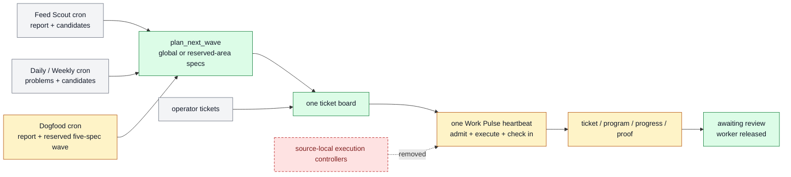

# Work Pulse And Scheduled Ticket Sources

Farplane uses one project Work Pulse heartbeat for fast admission, execution,
and due check-ins. Feed Scout, Daily, Weekly, Dogfood self-improvement, and
low-frequency maintenance run as separate bounded automations.

```text
work_pulse(project_root, wave_size, worker_limit, review_wip,
           review_chase_limit, ready_low_watermark)
  -> reconciliation + ticket_deltas? + worker_handoffs? + review_requests?
   + dated_report + next_wake?

plan_next_wave(harness_areas, objective_contract, metric_goals?, metric_state,
               ticket_history_query, current_context?, world_memory?, taste_evidence?, wave_size,
               planning_scope = global | reserved_area:<area_id>)
  -> ranked_ticket_specs[0..wave_size] + gaps + duplicate_rejections

interval_update(project_root, interval_id, review_window,
                context_refs?, maintenance_ticket_limit = 1)
  -> dated_report + problems + candidate_interventions[] + recovery_tickets[]

dogfood_review(project_root, window, active_experiments,
               recent_archived_experiments, previous_report?, registry_refs?,
               weekly_ticket_target = 5,
               max_concurrent_live_delayed = 5)
  -> dogfood_report + outcome_ledger + experiment_decisions
   + admitted_experiment_specs[0..5] + pulse_ticket_paths[]
```

`harness_areas` is the complete `harness.areas` map, not a list of IDs. Every
scope-relevant record contributes its canonical
`harness.areas.<area_id>.icp` and
`harness.areas.<area_id>.planner_instruction`; the planner returns one
instruction-use receipt per applied area before ranking.

Feed Scout maintains one configured Markdown memory after each daily report.
Pulse loads it once and passes relevant entry refs, freshness/confidence, source
gaps, and a content hash. Outward-facing specs use those refs to name a
baseline and intended belief/workflow delta; memory never overrides metric,
ticket-history, authority, or admission evidence.

## Ownership

```text
plan_next_wave -> one planner; global ranking or explicit reserved-area allocation
Feed Scout     -> source report + candidates + bounded direct recovery
Daily/Weekly   -> problem reports + candidates + bounded direct recovery
Dogfood        -> experiment review + reserved five-spec self-improvement wave
operator       -> explicit tickets and corrections
Work Pulse     -> exploratory admission, spec materialization, dispatch, execution,
                  due reward check-ins, review requests, receipts
worker         -> ticket/program/progress/proof execution
```

Scheduled sources feed candidate context to the one planner. Dogfood is the
explicit exception for reserved weekly self-improvement capacity: after its
report it may request five admitted experiment specs and send them to Pulse's
bounded materialization route. Other scheduled sources may create only bounded
direct recovery tickets for evidenced existing failures with known fixes.
None create their own worker/planner controllers. Direct operator,
customer, and incident tickets still enter the shared board as obligations.

## System Flow



## Work Pulse Contract

Work Pulse performs five bounded phases in one wake:

1. Reconcile ticket, worker, outcome, blocker, and review state.
2. Derive matured Reward rows from original tickets and their Goal Packets.
3. Dispatch eligible existing or due-check-in tickets within `worker_limit`.
4. Request review once, mark the ticket awaiting review, release the worker,
   and execute the bounded binding-owned Telegram-to-phone chase ladder.
5. When ready supply after dispatch is below its low watermark, ask one adaptive
   `plan_next_wave` for a bounded globally ranked wave, materialize accepted
   specs, and dispatch within remaining capacity. Human-active tickets stay unavailable
   but do not consume Pulse worker capacity.

```text
due_reward_rows(ticket, now)
  = Reward.kpi_rewards[] where check_in_at <= now
    and decision in [empty, monitor]

eligible = ordinary_executable_tickets + tickets_with_due_reward_rows
```

A due check-in resumes the original ticket. Work Pulse never creates a ticket
whose only job is to check another ticket.

### Capacity Parameters

| Parameter | Controls | Does not control |
| --- | --- | --- |
| `wave_size` | Maximum specs materialized in one low-watermark refill | Concurrent workers |
| `worker_limit` | Maximum Pulse-owned active worker threads | Human-active tickets, backlog, or experiment count |
| `review_wip` | Maximum operator-facing area review pools; full pools shift selection toward unattended-safe work | Ticket identity or worker concurrency |
| `review_chase_limit` | Maximum policy-derived Telegram/phone actions serviced in one wake | Review queue size |
| `ready_low_watermark` | Ready-supply threshold that triggers planning after dispatch | Admission quality or worker capacity |
| source candidate limit | Candidates a scheduled report may emit | Ticket admission or dispatch |

### Ticket Eligibility

Ordinary ticket eligibility requires `status: todo`, no claim, and satisfied
dependencies. Human-review states remain ineligible. Due check-ins are a
derived exception:
the ticket is admitted because a matured Reward row makes its Goal Packet ready
to resume, not because new frontmatter was added.

`human_gate` remains a final-action boundary. Local preparation and proof may
continue when execution can stop before publish, spend, deploy, external
contact, account mutation, or destructive action.

## Adaptive Planner Contract

`plan-next-wave` implements pure `plan_next_wave(...)`. It is a separate skill
from Pulse only to preserve a side-effect-free planning and proof boundary;
Pulse remains the sole ticket materializer and dispatcher:

```text
read latest N compact tickets globally
-> inspect lane/area/origin/KPI/Reward distribution
-> progressively filter or widen history only when needed
-> identify bottleneck or under-moving area
-> enumerate up to wave_size distinct candidates in every canonical lane
-> generate direct and evidence-gated self-improvement moves
-> rank by objective impact, bottleneck relief, compounding value, proof speed,
   cost, review load, and risk
-> crystallize 0..wave_size executable specs
```

In global scope, the planner records a candidate or a concrete no-candidate
reason for every objective-relevant planning area. An explicit scheduled
reserved-area allocation uses the same planner and global-first history but
ranks only that selected area. Both modes apply the canonical per-area
`planner_instruction` from `farplane/harness.yaml`; callers do not reconstruct
area policy. Areas remain retrieval lenses, not separate planners. Optional
metric-bound goals add target/date urgency and retire from prioritization when
the current metric reaches the target in its configured direction. Avoidable setup is consolidated into
at most one first-exemplar spec, and every other ordinary admitted spec must
produce an independently reviewable artifact with a direct use path. Quality,
guards, authority, dedupe, and interference remain hard gates; artifact count
never justifies filler.

Blocked or awaiting-review work owns only its intended output, target surface,
and unresolved prerequisite. It does not reserve its whole area, KPI, audience,
or objective; independent non-interfering artifacts remain eligible.

Awaiting-review tickets remain canonical distinct work items, but Pulse
projects them into bounded per-area summaries for the operator. When those
pools are full or the operator is unavailable, the planner favors safe
ablations, experiments, artifact refinements, accepted-result rollouts, and
preventive mechanisms with machine or delayed feedback. Review saturation
therefore changes strategy instead of stopping useful execution.
The board exposes active pools capped by `review_wip`, queued pools, saturation,
and a deterministic area digest while every ticket Review block and decision
remains canonical.

### Review Escalation

`farplane/bindings.yaml#operator.review_chase_policy` is the canonical review
escalation contract. Initial Telegram delivery is immediate. Unanswered Pulse
turn thresholds select bounded Telegram reminders followed by bounded Phone
Chaser calls during configured active hours. The board projection exposes the
next exact action and treats a missing/invalid Review block as repair work.
Review notification credentials are automation-owned and do not inherit the
ticket's publication, account, or credential restrictions; notifications grant
no authority beyond asking Kenji for the recorded review decision.

The planner stays in one context and does not spawn area planners.
Self-improvement can compete globally or receive explicit weekly reserved
capacity, but every admitted move still needs an observed failure, Reward
outcome, health gap, guard regression, or toy/eval proof.

## Scheduled Context Sources

### Feed Scout

Feed Scout owns external-source discovery, its dated report, and bounded
source-backed candidate interventions. It may create bounded direct recovery
for an evidenced existing project failure with a known fix and no experiment
debt; the next low-watermark planner pass compares exploratory candidates across all
areas.

### Daily And Weekly BAU Reports

Daily and Weekly use the same small Interval skill with different evidence
windows. Reports contain a Markdown `## Problems` ledger and may create bounded
direct recovery tickets when current or prior evidence proves an existing
failure and the correction is settled. Uncertain findings and new direction
remain planner context.

Interval resolves `farplane/bindings.yaml#integrations.kanban` before work-item
evidence. Filesystem bindings preserve ticket reads. Notion bindings use only a
named private handle through `ntn`, sanitize evidence before tracked output,
and fail closed with a source gap when access is unavailable. An explicit
filesystem exclusion forbids local-ticket fallback, including dedupe and
recovery admission.

Interval does not run Feed Scout, Dogfood, reward check-ins, priority planning,
native Goals, or workers.

### Dogfood Self-Improvement

Dogfood Review is the weekly self-improvement portfolio learner and reserved
allocator. It reads
active Goal Packets, recent archived packets, the
previous Dogfood report, Core ticket-history Reward receipts, harness-health
signals, and feature/system tracking evidence.
It writes a dated report containing the derived outcome ledger, active/pending
portfolio, due-but-unscored gaps, transfer candidates, rejected patterns,
allocation, and ranked experiment candidates before planning new work.

It passes the complete `harness.areas.self_improvement` record, applies
`harness.areas.self_improvement.planner_instruction`, and calls
`plan-next-wave` with `reserved_area:self_improvement` and target wave size
five. Pulse's bounded materialization route writes admitted ticket paths;
later ordinary Pulse wakes dispatch workers and compile or resume Goal Packets:

```text
tickets/TASK-EXPERIMENT/
  ticket.md      # hypothesis, Reward rows, Done / Proof
  program.md     # executable Check-In Program + metric/wake/stop/rollout policy
  progress.md    # observations and check-in history
  artifacts/     # baseline, candidates, QA, review
```

Initial policy targets five new weekly tickets, allows at most five concurrent
live delayed experiments, and keeps one active experiment per attributable
surface. Active WIP remains visible for conflict, delayed-load, dedupe, and
review decisions but does not subtract from unrelated weekly allocation.

Dogfood does not execute or check in experiments. Work Pulse derives due rows,
resumes the original Goal Packet, and gives the worker `ticket.md`,
`program.md`, `progress.md`, matured Reward IDs, and evidence. The worker reads
`program.md` first and executes its `Check-In Program`; Pulse does not restate
or independently score the experiment policy.

### Human Feedback And Maintenance

Human-feedback improvement is a normal self-improvement Goal Packet, not a
separate controller or schedule. Dogfood may admit it through the reserved
planner scope, Pulse materializes and later executes it,
and ticket-owned review state waits without holding a worker. Monthly registry
consolidation and other low-frequency jobs are cron automations and do not
dispatch ticket work directly unless their explicit skill contract permits
bounded ticket creation.

## State Ownership

| State | Owner |
| --- | --- |
| Identity, planning areas/instructions, policy, capabilities, selected metric refs | `farplane/harness.yaml` |
| Metric direction, freshness, and guard rules | `farplane/metrics.yaml` |
| Executable commitment, Reward, QA, review | `tickets/TASK-*/ticket.md` and `artifacts/` |
| Experiment-local policy and history | ticket `program.md`, `progress.md`, Reward, and artifacts |
| Fast reconciliation/dispatch/check-in receipt | dated Pulse report |
| Problems and maintenance candidates | dated Interval report |
| Source opportunities | dated Feed Scout report |
| Cross-ticket outcome ledger and experiment candidates | dated Dogfood report |
| Desired cadence and prompts | `farplane/automations.toml` |
| Live cadence/runtime memory | Codex automation store |

## Automation Profiles

The desired project topology has exactly one `kind = "heartbeat"` record:

```text
Farplane Work Pulse -> heartbeat
Feed Scout          -> cron
Daily BAU Report    -> cron
Weekly BAU Report   -> cron
Dogfood Improvement -> cron
Monthly maintenance -> cron
```

Each record calls one owning skill with short project-specific parameters. Jobs
read the latest completed upstream report and label source gaps; correctness
does not depend on adjacent clock times.

## Proof And Maintenance

Workstream 2 must prove:

- desired and live Farplane automation state contains one heartbeat;
- each scheduled source writes its report/candidates without creating tickets;
- planner admission caps, dedupe, proof, authority, and owner boundaries hold;
- Interval cannot invent direction and Dogfood cannot execute experiments;
- one immediate and one delayed Reward case choose the correct route;
- a matured row resumes the original ticket while a future row stays dormant;
- ticket-owned QA/review evidence and independent completion review pass.

Canonical implementation and proof live in `tickets/archive/TASK-0319/`.
The capacity-based portfolio and executable check-in-program refinement lives
in `tickets/archive/TASK-0320/` after completion.

## Migration Boundaries

- Workstream 1: one Work Pulse and pure project planner; implemented by
  `TASK-0318`.
- Workstream 2: scheduled context sources, Dogfood experiment candidates, and derived
  check-ins; implemented by `TASK-0319`, with proof owned by its QA/review
  artifacts.
- Workstream 3: final project files/manifest, metrics ownership, generated
  registries, and retained product-file removal.
