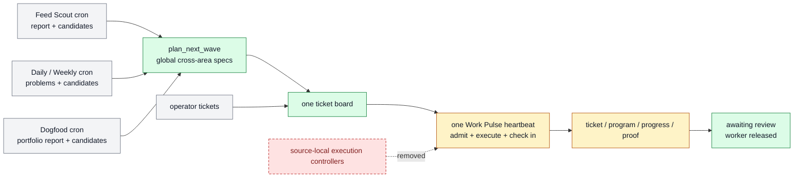

# Work Pulse And Scheduled Ticket Sources

Farplane uses one project Work Pulse heartbeat for fast admission, execution,
and due check-ins. Feed Scout, Daily, Weekly, Dogfood self-improvement, and
low-frequency maintenance run as separate bounded automations.

```text
work_pulse(project_root, wave_size, worker_limit, review_wip)
  -> reconciliation + ticket_deltas? + worker_handoffs? + review_requests?
   + dated_report + next_wake?

plan_next_wave(harness_areas, objective_contract, metric_state,
               ticket_history_query, current_context?, wave_size)
  -> ranked_ticket_specs[0..wave_size] + gaps + duplicate_rejections

interval_update(project_root, interval_id, review_window,
                context_refs?, maintenance_ticket_limit = 1)
  -> dated_report + problems + candidate_interventions[] + recovery_tickets[]

dogfood_review(project_root, window, active_experiments,
               recent_archived_experiments, previous_report?, registry_refs?,
               experiment_wip_limit = 3,
               max_concurrent_live_delayed = 1)
  -> dogfood_report + outcome_ledger + experiment_decisions
   + experiment_candidates[]
```

## Ownership

```text
plan_next_wave -> one global ranking and pure executable specs
Feed Scout     -> source report + candidates + bounded direct recovery
Daily/Weekly   -> problem reports + candidates + bounded direct recovery
Dogfood        -> experiment review + candidates + bounded direct recovery
operator       -> explicit tickets and corrections
Work Pulse     -> exploratory admission, spec materialization, dispatch, execution,
                  due reward check-ins, review requests, receipts
worker         -> ticket/program/progress/proof execution
```

Scheduled sources feed candidate context to the one planner. They may create
only bounded direct recovery tickets for evidenced existing failures with known
fixes; they do not create exploratory or experiment tickets or their own
worker/planner controllers. Direct operator,
customer, and incident tickets still enter the shared board as obligations.

## System Flow



## Work Pulse Contract

Work Pulse performs five state-changing jobs:

1. Reconcile ticket, worker, outcome, blocker, and review state.
2. Derive matured Reward rows from original tickets and their Goal Packets.
3. Dispatch eligible existing or due-check-in tickets within `worker_limit`.
4. Request review once, mark the ticket awaiting review, and release the worker.
5. When no unclaimed executable ticket exists, ask one adaptive
   `plan_next_wave` for a bounded globally ranked wave, materialize accepted
   specs, and dispatch within capacity. Human-active tickets stay unavailable
   but do not consume Pulse worker capacity.

```text
due_reward_rows(ticket, now)
  = Reward.kpi_rewards[] where check_in_at <= now
    and decision in [empty, monitor]

eligible = ordinary_executable_tickets + tickets_with_due_reward_rows
```

A due check-in resumes the original ticket. Work Pulse never creates a ticket
whose only job is to check another ticket.

### Capacity Parameters

| Parameter | Controls | Does not control |
| --- | --- | --- |
| `wave_size` | Maximum specs materialized in one empty-board refill | Concurrent workers |
| `worker_limit` | Maximum Pulse-owned active worker threads | Human-active tickets, backlog, or experiment count |
| `review_wip` | Maximum tickets waiting for human attention | Worker lifetime |
| source candidate limit | Candidates a scheduled report may emit | Ticket admission or dispatch |

### Ticket Eligibility

Ordinary ticket eligibility requires `status: todo`, no claim, and satisfied
dependencies. Human-review states remain ineligible. Due check-ins are a
derived exception:
the ticket is admitted because a matured Reward row makes its Goal Packet ready
to resume, not because new frontmatter was added.

`human_gate` remains a final-action boundary. Local preparation and proof may
continue when execution can stop before publish, spend, deploy, external
contact, account mutation, or destructive action.

## Adaptive Planner Contract

`ticket-opportunity-generator` implements pure `plan_next_wave(...)`:

```text
read latest N compact tickets globally
-> inspect area/origin/KPI/Reward distribution
-> progressively filter or widen history only when needed
-> identify bottleneck or under-moving area
-> enumerate levers
-> generate direct and evidence-gated self-improvement moves
-> rank by objective impact, bottleneck relief, compounding value, proof speed,
   cost, review load, and risk
-> crystallize 0..wave_size executable specs
```

The planner stays in one context and does not spawn area planners. Areas are
retrieval/ranking guidance, not quotas or worker pools. Self-improvement can
compete globally only when an observed failure, Reward outcome, guard
regression, or toy/eval proof supports the proposed causal change.

## Scheduled Context Sources

### Feed Scout

Feed Scout owns external-source discovery, its dated report, and bounded
source-backed candidate interventions. It may create bounded direct recovery
for an evidenced existing project failure with a known fix and no experiment
debt; the next empty-board planner compares exploratory candidates across all
areas.

### Daily And Weekly BAU Reports

Daily and Weekly use the same small Interval skill with different evidence
windows. Reports contain a Markdown `## Problems` ledger and may create bounded
direct recovery tickets when current or prior evidence proves an existing
failure and the correction is settled. Uncertain findings and new direction
remain planner context.

Interval does not run Feed Scout, Dogfood, reward check-ins, priority planning,
native Goals, or workers.

### Dogfood Self-Improvement

Dogfood Review is the weekly self-improvement portfolio learner. It reads
active Goal Packets, recent archived packets, the
previous Dogfood report, Reward results, and feature/system tracking evidence.
It writes a dated report containing the derived outcome ledger, active/pending
portfolio, due-but-unscored gaps, transfer candidates, rejected patterns,
capacity, and ranked experiment candidates.

It does not create experiment folders. When an experiment candidate wins the
global next-wave ranking, Work Pulse materializes the normal Goal Packet:

```text
tickets/TASK-EXPERIMENT/
  ticket.md      # hypothesis, Reward rows, Done / Proof
  program.md     # executable Check-In Program + metric/wake/stop/rollout policy
  progress.md    # observations and check-in history
  artifacts/     # baseline, candidates, QA, review
```

Initial policy uses `experiment_wip_limit = 3`,
`max_concurrent_live_delayed = 1`, and one active experiment per attributable
surface. A monitoring delayed experiment does not block an unrelated
immediate toy/eval proof when capacity remains.

Dogfood does not execute or check in experiments. Work Pulse derives due rows,
resumes the original Goal Packet, and gives the worker `ticket.md`,
`program.md`, `progress.md`, matured Reward IDs, and evidence. The worker reads
`program.md` first and executes its `Check-In Program`; Pulse does not restate
or independently score the experiment policy.

### Human Feedback And Maintenance

Human-feedback improvement is a normal self-improvement Goal Packet, not a
separate controller or schedule. Dogfood may propose it, the global planner may
admit it, and Work Pulse executes it,
and ticket-owned review state waits without holding a worker. Monthly registry
consolidation and other low-frequency jobs are cron automations and do not
dispatch ticket work directly unless their explicit skill contract permits
bounded ticket creation.

## State Ownership

| State | Owner |
| --- | --- |
| Identity, planning areas/instructions, policy, capabilities, selected metric refs | `farplane/harness.yaml` |
| Metric direction, freshness, and guard rules | `farplane/metrics.yaml` |
| Executable commitment, Reward, QA, review | `tickets/TASK-*/ticket.md` and `artifacts/` |
| Experiment-local policy and history | ticket `program.md`, `progress.md`, Reward, and artifacts |
| Fast reconciliation/dispatch/check-in receipt | dated Pulse report |
| Problems and maintenance candidates | dated Interval report |
| Source opportunities | dated Feed Scout report |
| Cross-ticket outcome ledger and experiment candidates | dated Dogfood report |
| Desired cadence and prompts | `farplane/automations.toml` |
| Live cadence/runtime memory | Codex automation store |

## Automation Profiles

The desired project topology has exactly one `kind = "heartbeat"` record:

```text
Farplane Work Pulse -> heartbeat
Feed Scout          -> cron
Daily BAU Report    -> cron
Weekly BAU Report   -> cron
Dogfood Improvement -> cron
Monthly maintenance -> cron
```

Each record calls one owning skill with short project-specific parameters. Jobs
read the latest completed upstream report and label source gaps; correctness
does not depend on adjacent clock times.

## Proof And Maintenance

Workstream 2 must prove:

- desired and live Farplane automation state contains one heartbeat;
- each scheduled source writes its report/candidates without creating tickets;
- planner admission caps, dedupe, proof, authority, and owner boundaries hold;
- Interval cannot invent direction and Dogfood cannot execute experiments;
- one immediate and one delayed Reward case choose the correct route;
- a matured row resumes the original ticket while a future row stays dormant;
- ticket-owned QA/review evidence and independent completion review pass.

Canonical implementation and proof live in `tickets/archive/TASK-0319/`.
The capacity-based portfolio and executable check-in-program refinement lives
in `tickets/archive/TASK-0320/` after completion.

## Migration Boundaries

- Workstream 1: one Work Pulse and pure project planner; implemented by
  `TASK-0318`.
- Workstream 2: scheduled context sources, Dogfood experiment candidates, and derived
  check-ins; implemented by `TASK-0319`, with proof owned by its QA/review
  artifacts.
- Workstream 3: final project files/manifest, metrics ownership, generated
  registries, and retained product-file removal.
