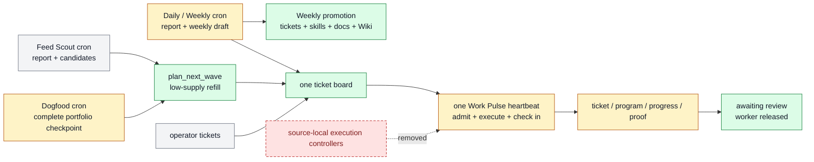

# Work Pulse And Scheduled Ticket Sources

Farplane uses one project Work Pulse heartbeat for reconciliation, execution,
low-supply refill, and due check-ins. Daily and Weekly Interval own report-first
review, one current weekly draft, and Weekly knowledge promotion. Feed Scout,
Dogfood self-improvement,
and low-frequency maintenance run as separate bounded automations.

```text
work_pulse(project_root, wave_size, worker_limit, review_wip,
           review_chase_limit, ready_low_watermark)
  -> reconciliation + ticket_deltas? + worker_handoffs? + review_requests?
   + dated_report + next_wake?

plan_next_wave(planning_skill_refs, stable_problems, harness_areas?,
               objective_metric_state, ticket_history_query,
               current_context?, scout_brief?, taste_evidence?, wave_size)
  -> ranked_skill_calls[0..wave_size] + gaps + duplicate_rejections

interval_update(project_root, interval_id, review_window,
                context_refs?)
  -> dated_report + weekly_draft_delta + candidate_sets
   + ticket_deltas[] + knowledge_receipt
   + promoted_records[]? + next_week_draft? + source_gaps

dogfood_review(project_root, window, cutoff, previous_report?, registry_refs?)
  -> dogfood_report + complete_outcome_ledger + portfolio_lessons
   + opportunity_signals + planner_context_ref + source_gaps
```

`planning_skill_refs` is the only active work allowlist. Each referenced skill
declares a `planner_contract` with required arguments; Plan Next Wave may bind
those arguments but cannot invent a workflow. `harness_areas` contributes
optional ICP, evidence-bar, capability, and metric context only. Retired
project-level goals and product-bet portfolios are not planner inputs.

Feed Scout maintains one configured Markdown Scout Brief after each daily
report. Pulse loads it once and passes complete relevant source-backed facts,
freshness/confidence, source refs, and source gaps. Outward-facing calls copy
those facts into ticket `audience_context` beside the baseline and intended
belief/workflow delta; Scout Brief never overrides metrics, ticket history,
authority, or admission evidence.

## Ownership

```text
plan_next_wave -> one planner; low-supply refill generation and ranking only
Feed Scout     -> source report + candidates + bounded direct recovery
Daily/Weekly   -> report-first evidence review + grounded ticket deltas
                  + Daily draft staging + Weekly selective promotion
Dogfood        -> complete self-improvement checkpoint + planner context
operator       -> explicit tickets and corrections
Work Pulse     -> generic ticket materialization, dispatch, execution,
                  due reward check-ins, review requests, receipts
worker         -> ticket/program/progress/proof execution
```

Scheduled sources feed reports and context to the board loop. Dogfood has no
reserved allocation or materialization path; its report is optional
`current_context` for normal refill. Interval may admit only grounded ticket
deltas or decision-changing investigations after the report is written. None
create their own worker/planner controllers. Direct operator, customer, and
incident tickets still enter the shared board as obligations.

## System Flow



## Work Pulse Contract

Work Pulse performs five bounded phases in one wake:

1. Reconcile ticket, worker, outcome, blocker, and review state.
2. Derive matured Reward rows from original tickets and their Goal Packets.
3. Dispatch eligible existing or due-check-in tickets within `worker_limit`,
   sorted by priority, earliest valid `due_at` with missing deadlines last,
   then ticket ID.
4. Request review once, mark the ticket awaiting review, release the worker,
   and execute the bounded binding-owned Telegram-to-phone chase ladder.
5. When ready supply after dispatch is below its low watermark, ask one adaptive
   `plan_next_wave` for a bounded globally ranked wave, materialize admitted
   skill calls, and dispatch within remaining capacity. Human-active tickets stay unavailable
   but do not consume Pulse worker capacity.

```text
due_reward_rows(ticket, now)
  = Reward.kpi_rewards[] where check_in_at <= now
    and decision in [empty, monitor]

eligible = ordinary_executable_tickets + tickets_with_due_reward_rows
```

A due check-in resumes the original ticket. Work Pulse never creates a ticket
whose only job is to check another ticket.

### Capacity Parameters

| Parameter | Controls | Does not control |
| --- | --- | --- |
| `wave_size` | Maximum skill calls materialized in one low-watermark refill | Concurrent workers |
| `worker_limit` | Maximum Pulse-owned active worker threads | Human-active tickets, backlog, or experiment count |
| `review_wip` | Maximum operator-facing area review pools; full pools shift selection toward unattended-safe work | Ticket identity or worker concurrency |
| `review_chase_limit` | Maximum policy-derived Telegram/phone actions serviced in one wake | Review queue size |
| `ready_low_watermark` | Ready-supply threshold that triggers planning after dispatch | Admission quality or worker capacity |
| source candidate limit | Candidates a scheduled report may emit | Ticket admission or dispatch |

### Ticket Eligibility And Ordering

Ordinary ticket eligibility requires `status: todo`, no claim, and satisfied
dependencies. Human-review states remain ineligible. Due check-ins are a
derived exception:
the ticket is admitted because a matured Reward row makes its Goal Packet ready
to resume, not because new frontmatter was added.

`due_at` is an optional delivery deadline on the ticket frontmatter. It affects
ordinary executable-board ordering only after priority. `Reward.check_in_at`
remains delayed outcome-evaluation timing for Goal Packets and never sorts the
ordinary ticket board.

`human_gate` remains a final-action boundary. Local preparation and proof may
continue when execution can stop before publish, spend, deploy, external
contact, account mutation, or destructive action.

## Adaptive Planner Contract

`plan-next-wave` implements pure `plan_next_wave(...)`. It is a separate skill
from Pulse only to preserve a side-effect-free planning and proof boundary;
Pulse remains the sole ticket materializer and dispatcher:

```text
read latest N compact tickets globally
-> inspect skill/area/origin/KPI/Reward distribution
-> progressively filter or widen history only when needed
-> identify the strongest configured skill calls
-> bind every skill's required arguments from current evidence
-> rank by objective impact, bottleneck relief, compounding value, proof speed,
   cost, review load, and risk
-> admit 0..wave_size executable skill calls
```

The planner compares every configured planning skill in one global ranking.
Areas remain optional retrieval lenses, not planners or allocation scopes.
Stable problems, selected objective metric movement, report context, Scout
Brief, and ticket history provide refill context; retired project-level goals
and product bets do not. Avoidable setup is consolidated into a useful
first-exemplar call, and every admitted call must produce an independently
reviewable artifact with a direct use path. Quality, guards, authority,
dedupe, and interference remain hard gates; artifact count never justifies
filler.

Blocked or awaiting-review work owns only its intended output, target surface,
and unresolved prerequisite. It does not reserve its whole area, KPI, audience,
or objective; independent non-interfering artifacts remain eligible.

Awaiting-review tickets remain canonical distinct work items, but Pulse
projects them into bounded per-area summaries for the operator. When those
pools are full or the operator is unavailable, the planner favors safe
ablations, experiments, artifact refinements, accepted-result rollouts, and
preventive mechanisms with machine or delayed feedback. Review saturation
therefore changes strategy instead of stopping useful execution.
The board exposes active pools capped by `review_wip`, queued pools, saturation,
and a deterministic area digest while every ticket Review block and decision
remains canonical.

### Review Escalation

`farplane/bindings.yaml#operator.review_chase_policy` is the canonical review
escalation contract. Initial Telegram delivery is immediate. Unanswered Pulse
turn thresholds select bounded Telegram reminders followed by bounded Phone
Chaser calls during configured active hours. The board projection exposes the
next exact action and treats a missing/invalid Review block as repair work.
Review notification credentials are automation-owned and do not inherit the
ticket's publication, account, or credential restrictions; notifications grant
no authority beyond asking Kenji for the recorded review decision.

The planner stays in one context and does not spawn area planners.
Self-improvement competes globally through its configured skill, and every
admitted move still needs an observed failure, Reward
outcome, health gap, guard regression, or toy/eval proof.

## Scheduled Context Sources

### Feed Scout

Feed Scout owns external-source discovery, its dated report, and bounded
source-backed candidate interventions. It may create bounded direct recovery
for an evidenced existing project failure with a known fix and no experiment
debt; the next low-watermark planner pass compares exploratory candidates across all
areas.

### Daily And Weekly Control-Loop And Knowledge Reviews

Daily and Weekly use the same evidence-quality, extraction, and dedupe rules but
different write authority. Daily reads only its current window, writes an
immutable report, and upserts progress, problem, decision, SOP, resource,
entity, documentation-quality, completeness, and follow-up findings into
`.farplane/reports/interval/weekly/<YYYY-Www>/draft.md`. Fingerprints combine
stable source locator, intended owner, and content digest.

Daily promotes no durable knowledge and creates no new problem ticket. It may
update only explicitly supported mutable task progress through the configured
provider. Raw transcripts never become durable output.

Weekly reads the draft and completed Daily receipts instead of replaying the
raw week. It assigns every candidate `promoted`, `duplicate`, `monitor`,
`dismissed`, `source_gap`, or `blocked`, freezes the weekly report, and then
applies only authorized promotions. Problems route to qualified tickets, SOPs
through Skill Maintenance, project resources and decisions through Doc Advisor,
and entity facts through Manage Wiki. Chases remain proposals. The sibling
receipt records observed writes and validation; Interval then finalizes the
draft and opens the next one.

Interval resolves `farplane/bindings.yaml#integrations.kanban` before work-item
evidence. Filesystem bindings preserve ticket reads. Notion bindings use only a
named private handle through `ntn`, sanitize evidence before tracked output,
and fail closed with a source gap when access is unavailable. An explicit
filesystem exclusion forbids local-ticket fallback, including dedupe and
recovery admission.

Interval does not run Feed Scout, Dogfood, reward check-ins, Plan Next Wave,
native Goals, workers, or ticket execution. Weekly promotions grant no
deploy, publishing, spend, account, customer-contact, or destructive authority.

### Dogfood Self-Improvement

Dogfood Review is the weekly self-improvement portfolio reducer. It pages
through all exact `self_improvement` admission receipts through a cutoff,
includes every still-live earlier ticket, and reads each packet's Reward,
progress, check-in, proof, and review evidence. It writes a dated checkpoint
containing the complete outcome ledger, live work, source gaps,
portfolio-selection lessons, and qualified/deprioritized opportunity signals.

The report is bounded `current_context` for normal Plan Next Wave. Dogfood does
not create skill calls/tickets or call Pulse materialization. Later ordinary Pulse
wakes may use that context, rank configured skill calls, materialize admitted calls,
and dispatch or resume Goal Packets:

```text
tickets/TASK-EXPERIMENT/
  ticket.md      # hypothesis, Reward rows, Done / Proof
  program.md     # executable Check-In Program + metric/wake/stop/rollout policy
  progress.md    # observations and check-in history
  artifacts/     # baseline, candidates, QA, review
```

Read scope is complete and cutoff-bound. Admission remains capacity-bound in
normal Plan Next Wave; there is no weekly self-improvement ticket target.

Dogfood does not execute or check in experiments. Work Pulse derives due rows,
resumes the original Goal Packet, and gives the worker `ticket.md`,
`program.md`, `progress.md`, matured Reward IDs, and evidence. The worker reads
`program.md` first and executes its `Check-In Program`; Pulse does not restate
or independently score the experiment policy.

### Human Feedback And Maintenance

Human-feedback improvement is a normal self-improvement Goal Packet, not a
separate controller or schedule. Normal Plan Next Wave may admit it using the
Dogfood checkpoint as context; Pulse materializes and later executes it,
and ticket-owned review state waits without holding a worker. Monthly registry
consolidation and other low-frequency jobs are cron automations and do not
dispatch ticket work directly unless their explicit skill contract permits
bounded ticket creation.

## State Ownership

| State | Owner |
| --- | --- |
| Identity, planning skill allowlist, passive areas/ICP, policy, selected metric refs | `farplane/harness.yaml` |
| Metric direction, freshness, and guard rules | `farplane/metrics.yaml` |
| Executable commitment, Reward, QA, review | `tickets/TASK-*/ticket.md` and `artifacts/` |
| Experiment-local policy and history | ticket `program.md`, `progress.md`, Reward, and artifacts |
| Fast reconciliation/dispatch/check-in receipt | dated Pulse report |
| Compact current operating context and promotion candidates | current weekly Interval draft |
| Problems, movement, ticket and candidate decisions | dated Interval report |
| Candidate upserts or Weekly promotion results | sibling Interval knowledge receipt |
| Source opportunities | dated Feed Scout report |
| Cross-ticket outcome ledger, portfolio lessons, and opportunity signals | dated Dogfood report |
| Desired cadence and prompts | `farplane/automations.toml` |
| Live cadence/runtime memory | Codex automation store |

## Automation Profiles

The desired project topology has exactly one `kind = "heartbeat"` record:

```text
Farplane Work Pulse -> heartbeat
Feed Scout          -> cron
Daily BAU Report    -> cron
Weekly BAU Report   -> cron
Dogfood Improvement -> cron
Monthly maintenance -> cron
```

Each record calls one owning skill with short project-specific parameters. Jobs
read the latest completed upstream report and label source gaps; correctness
does not depend on adjacent clock times.

## Proof And Maintenance

Workstream 2 must prove:

- desired and live Farplane automation state contains one heartbeat;
- each scheduled source writes its report/candidates; Daily records zero
  promotions, while Weekly freezes its report before owner changes, receipts
  observed results, and opens the next draft;
- planner refill caps, dedupe, proof, authority, and owner boundaries hold;
- priority then due_at ticket ordering is deterministic;
- Interval cannot invent direction, fake momentum, or execute work, and Dogfood
  cannot execute experiments;
- one immediate and one delayed Reward case choose the correct route;
- a matured row resumes the original ticket while a future row stays dormant;
- ticket-owned QA/review evidence and independent completion review pass.

Canonical implementation and proof live in `tickets/archive/TASK-0319/`.
The capacity-based portfolio and executable check-in-program refinement lives
in `tickets/archive/TASK-0320/` after completion.

## Migration Boundaries

- Workstream 1: one Work Pulse and pure project planner; implemented by
  `TASK-0318`.
- Workstream 2: scheduled context sources, Dogfood experiment candidates, and derived
  check-ins; implemented by `TASK-0319`, with proof owned by its QA/review
  artifacts.
- Workstream 3: final project files/manifest, metrics ownership, generated
  registries, and retained product-file removal.
