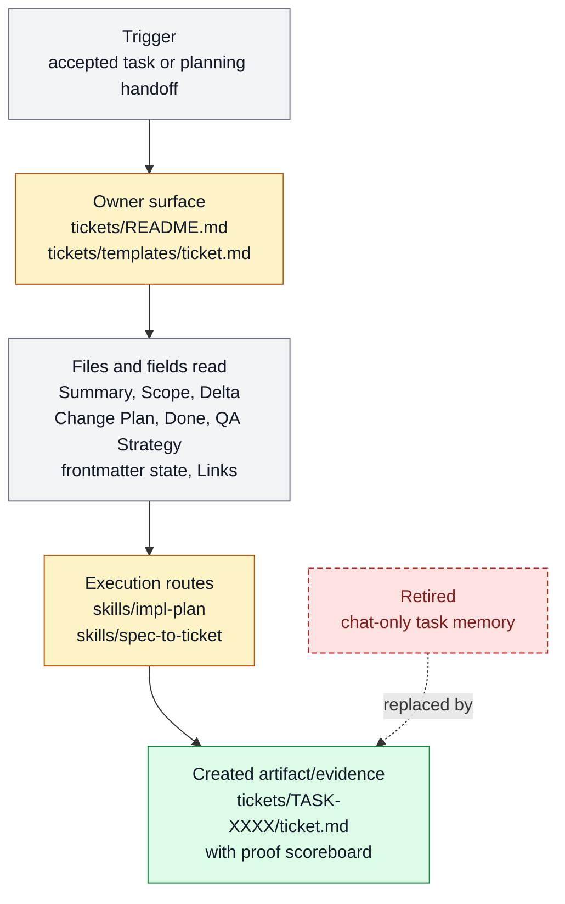

# Ticket as durable task memory

Ticket as durable task memory exists to turn a request into a visible work contract that
survives handoff, interruption, review, and closeout. It belongs to [Work
Loop](../systems/work-loop.md) and keeps `FEAT-0007` as a stable capability handle
because the behavior has an owner, proof path, and maintenance boundary.

```text
ticket_memory(intent, repo_state?) -> ticket_contract + proof_scoreboard + resume_state
```

## At A Glance

- Feature ID: `FEAT-0007`
- System: [Work Loop](../systems/work-loop.md)
- Status: `implemented`
- Category: `memory`
- Primary user: coding agent and operator
- Job: turn a request into a visible work contract that survives handoff, interruption, review, and closeout.

## Problem

Farplane agents do long, context-heavy work. If the plan only lives in chat, the next
agent cannot reliably tell what was promised, what changed, what proof is required, or
whether the task is blocked.

A ticket fixes that by making one bounded unit of work readable from the filesystem.
Chat can steer the work, but the ticket owns the durable contract.

## What It Does

- Creates or updates a `ticket.md` for each material unit of work.
- Keeps scope, delta, change plan, `Done`, `QA Strategy`, docs strategy, links, and notes in predictable sections.
- Moves bulky proof into `tickets/TASK-*/artifacts/` and links it from the ticket.
- Lets `impl-plan`, `spec-to-ticket`, Goal Packets, QA, review, and closeout all read the same task contract.
- Preserves resume state through `program.md`, `progress.md`, and artifact links when a work loop needs more than one turn.

## User Stories

- As an operator, I can open one ticket and see what the agent is trying to do, what is in scope, what proof is required, and what is blocked.
- As a coding agent, I can resume a ticket without relying on hidden transcript memory.
- As a reviewer, I can judge completion against the ticket's `Done`,
  `QA Strategy`, and linked artifacts.

## Operating Contract

A durable ticket is a small program for the next agent, not a generic task note.

- `Summary` says the job in one compact paragraph.
- `Scope` states what is in and out.
- `Delta` briefly describes the intended behavior change and problem deltas.
- `Change Plan` groups the executable program, read/write file map, operation,
  routes, proof, and failure modes by coherent change unit.
- `Done` is the completion scoreboard.
- `QA Strategy` carries proof weight, checks, delegated lanes, review gates,
  evidence, goal-advisor inputs, final checkpoint, and residual risk.
- Frontmatter carries queue state, next action, and last verification.
- `Links` points to evidence, artifacts, related specs, sidecars, and handoffs.

## Feature Flow



Legend:

- `gray = existing input, fields, or evidence read`
- `amber = owning or changed live surface`
- `green = created artifact or proof`
- `red dashed = retired or superseded path`

## Surfaces

Owner surfaces:

- `tickets/README.md`
- `tickets/templates/ticket.md`
- `skills/impl-plan`
- `skills/spec-to-ticket`
- `docs/features/FEAT-0007-ticket-as-durable-task-memory.md`

Source context:

- `docs/features/README.md`
- `docs/MEMORY.md#MEM-0058`
- `docs/MEMORY.md#MEM-0148`

Evidence:

- `docs/HISTORY.md`

## Proof And Quality

Required checks:

- `python3 docs/features/validate_features.py`
- `python3 bin/validators/check_doc_refs.py`

Acceptance signals:

- The feature remains listed under exactly one owning system.
- The owner surfaces still exist and agree with this contract.
- Evidence refs support the current status.

## Rollout And Maintenance

- Update this feature page first when the capability contract changes.
- Then update owner surfaces and regenerate feature/system registries when metadata changes.
- Preserve the feature ID while active templates, skills, tickets, or docs still reference it.
- Maintenance owner: Work Loop.

## Limits And Non-Goals

- This feature is not a project-management app.
- This feature does not make ticket existence an invocation trigger.
- This feature does not replace feature specs, system specs, review rubrics, or bulky proof artifacts.
- Known limit: Only works when agents keep the compact ticket-as-program body, ticket Links, progress logs, and artifact pointers current instead of hiding state in chat.
- Delete or merge this feature only when its current truth has moved into a clearer owner and all active refs are removed.

## Metrics

- no dedicated metric yet

## Alternatives Considered

- Keep this only as a registry row.
  Decision: reject.
  Reason: Farplane features must be readable specs, not opaque metadata entries.
- Fold this entirely into the owning system page.
  Decision: defer.
  Reason: keep the `FEAT-*` page while templates, skills, tickets, or proof surfaces need a stable capability handle.

## Change History

- 2026-06-26: Feature spec created.
- 2026-06-27: Migrated into the reader-first feature-spec shape.
- 2026-06-28: Merged Program and Map into `Change Plan` and moved body state
  duties to frontmatter, Links, and Goal progress logs.
