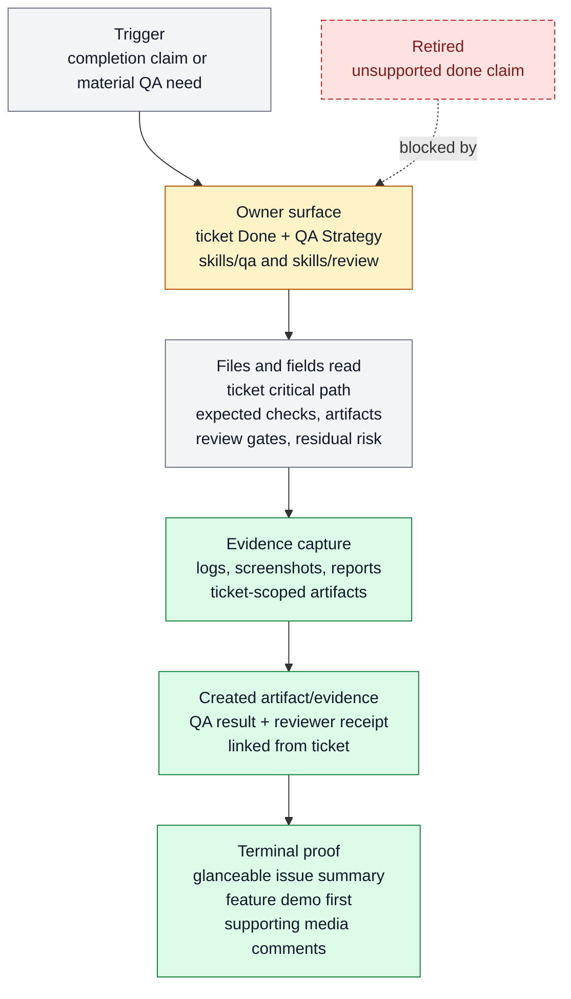

# Artifact-first QA and completion proof

Artifact-first QA and completion proof exists to make completion inspectable through
ticket proof obligations, linked artifacts, and review verdicts. It belongs to [Proof
And Review](../systems/proof-review.md) and keeps `FEAT-0008` as a stable capability
handle because the behavior has an owner, proof path, and maintenance boundary.

```text
proof_gate(work_type, ticket, artifacts) -> pass | needs_revision | blocked
```

## At A Glance

- Feature ID: `FEAT-0008`
- System: [Proof And Review](../systems/proof-review.md)
- Status: `implemented`
- Category: `proof`
- Primary user: operator, QA lane, reviewer, and coding agent
- Job: make completion inspectable through ticket proof obligations, linked artifacts, and review verdicts.

## Problem

Farplane work often spans planning, implementation, QA, review, and closeout. If
completion is declared only in chat, the next reader cannot tell which checks ran, where
the evidence lives, which risks remain, or whether a reviewer agreed with the claim.

This feature gives each task a visible scoreboard: the ticket names the required proof,
artifacts carry the evidence, and review or QA lanes judge the result against that
contract.

## What It Does

- Reads ticket `Done` conditions and `QA Strategy` as the scoreboard for checks, evidence, and review gates.
- Produces or links command output, screenshots, traces, console logs, failure captures, review reports, and QA notes.
- Routes material plans, implementations, prompts, evidence bundles, and completion claims through reviewer judgment when required.
- Uses docs-owned rubric families for domain-specific TAS judgments while the
  caller or ticket owns family selection and required gates.
- Supports an evidence-bounded ICP purchase-conviction review for one explicit
  buyer without treating reviewer simulation as observed market demand.
- Keeps Goal-backed completion mechanical and visible: implementation, QA, demo when required, and final completion review receipt.
- Preserves the final verification summary and explicitly selected screenshots
  or videos in the newly closed ticket's issue in the project's configured
  GitHub repository.
- Refuses silent completion when required evidence is missing.

## User Stories

- As an operator, I can open a ticket and see exactly what proof is required before accepting the result.
- As a QA lane, I can attach browser, command, or runtime evidence without turning the ticket body into a proof dump.
- As a reviewer, I can judge the work against named gates, hard blockers, evidence checked, and residual risk.

## Operating Contract

Proof scales with risk, blast radius, and user-facing impact.

- Ticket `Done` names completion conditions.
- Ticket `QA Strategy` names the expected checks, evidence, review gates, and acceptance signals.
- For material features, `QA Strategy` also names the critical path in flexible
  prose or bullets: the real workflow or lifecycle being claimed, smaller
  ordered sanity checks when a full end-to-end run is long, expected
  observations, evidence, and any residual risk for unrun final paths.
- Ticket-local artifacts hold bulky proof and reports.
- QA owns user-visible and runtime evidence capture.
- Reviewer owns material judgment of plans, implementations, prompts, evidence, and completion claims.
- For a new terminal close, the issue body is deliberately glanceable:
  `Before`, `After`, `Example`, `Key decisions`, and compact `Proof`. Material
  feature tickets require the passing independently reviewed `$demo` MP4 as
  the first marked browser comment; explicitly selected screenshots may follow.
- `$close-ticket` verifies the issue body and every expected media comment
  before closing the issue. Core independently re-verifies those markers and
  requires a real GitHub user-attachment URL in every selected-media comment,
  mines while the local evidence still exists, writes the compact locator, and
  only then deletes the ticket packet.
- Missing media, missing markers, an open or mismatched issue, failed mining, or
  failed locator write blocks cleanup and keeps the local proof available for
  retry.
- `docs/review/rubrics` owns family definitions, stable checks, TAS calibration,
  and evidence limits; tickets and caller workflows own rubric routing.
- Purchase-conviction review requires one explicit buyer, a credible product or
  offer, the current alternative, price or equivalent commitment, and material
  adoption constraints. Buying groups are reviewed one role at a time.
- Completion claims must name the checks and evidence used.

## Feature Flow



Legend:

- `gray = existing input, fields, or evidence read`
- `amber = owning or changed live surface`
- `green = created artifact or proof`
- `red dashed = retired or superseded path`

## Surfaces

Owner surfaces:

- `tickets/README.md`
- `tickets/templates/ticket.md`
- `skills/qa`
- `skills/review`
- `skills/close-ticket`
- `docs/review/rubrics`
- `docs/features/FEAT-0008-artifact-first-qa-and-completion-proof.md`

Source context:

- `docs/MEMORY.md#MEM-0048`
- `docs/MEMORY.md#MEM-0064`
- `docs/MEMORY.md#MEM-0148`

Evidence:

- `docs/HISTORY.md`

## Proof And Quality

Required checks:

- `python3 docs/features/validate_features.py`
- `python3 bin/validators/check_doc_refs.py`

Acceptance signals:

- The feature remains listed under exactly one owning system.
- The owner surfaces still exist and agree with this contract.
- Evidence refs support the current status.
- Selected rubric families are discoverable from the canonical index and keep
  their claims within the supplied evidence.
- New closes do not delete local evidence until the closed issue and every
  selected media marker are verified and completion mining succeeds.

## Rollout And Maintenance

- Update this feature page first when the capability contract changes.
- Then update owner surfaces and regenerate feature/system registries when metadata changes.
- Preserve the feature ID while active templates, skills, tickets, or docs still reference it.
- Maintenance owner: Proof And Review.

## Limits And Non-Goals

- This feature does not make every task heavyweight.
- This feature does not require proof to live inside the ticket body.
- This feature does not replace ticket scope or specs.
- Terminal media selection is explicit; this feature does not automatically
  choose, redact, edit, transcode, or upload every ticket artifact.
- GitHub Releases, downloadable evidence bundles, remote restore, and migration
  of legacy local archives are future work and outside this proof contract.
- Review verdicts do not substitute for observed customer behavior, market
  validation, willingness-to-pay evidence, or product-market-fit evidence.
- Known limit: Depends on compact `Done` conditions, `QA Strategy`, linked artifacts, progress logs, and reviewer gates, not ticket-body proof theater.
- Delete or merge this feature only when its current truth has moved into a clearer owner and all active refs are removed.

## Metrics

- no dedicated metric yet

## Alternatives Considered

- Keep this only as a registry row.
  Decision: reject.
  Reason: Farplane features must be readable specs, not opaque metadata entries.
- Fold this entirely into the owning system page.
  Decision: defer.
  Reason: keep the `FEAT-*` page while templates, skills, tickets, or proof surfaces need a stable capability handle.

## Change History

- 2026-08-02: Clarified that closeout uses `integrations.github.repo` directly;
  repository visibility does not alter the proof contract.
- 2026-08-01: Added verified GitHub-issue closeout for new tickets: completion
  text in the issue body, selected final media in marked comments, and a hard
  retain-local gate until mining and locator write succeed.
- 2026-07-27: Added docs-owned rubric-family selection and an evidence-bounded
  ICP purchase-conviction review contract.
- 2026-06-26: Feature spec created.
- 2026-06-27: Migrated into the reader-first feature-spec shape.
- 2026-06-28: Split completion obligations into `Done` conditions and `QA Strategy`.
