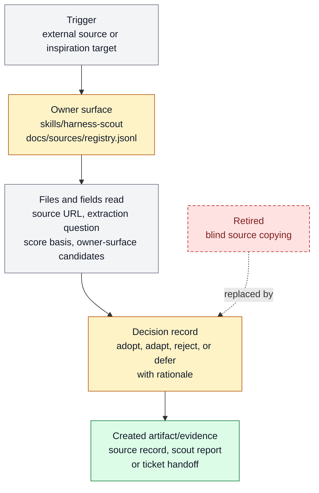

# Harness scout source ingestion

Harness scout source ingestion exists to turn external agent, workflow, and product
sources into scored Farplane improvement candidates. It belongs to [Source And Sidecar
Systems](../systems/source-sidecar-systems.md) and keeps `FEAT-0011` as a stable
capability handle because the behavior has an owner, proof path, and maintenance
boundary.

```text
scout_source(source, question) -> adopt | adapt | reject | defer + evidence
```

## At A Glance

- Feature ID: `FEAT-0011`
- System: [Source And Sidecar Systems](../systems/source-sidecar-systems.md)
- Status: `implemented`
- Category: `source-ingestion`
- Primary user: researching agent and harness maintainer
- Job: turn external agent, workflow, and product sources into scored Farplane improvement candidates.

## Problem

Farplane needs to learn from useful outside systems without importing them as live
dependencies or scattering source notes across chat.

Harness scout source ingestion gives each source a repeatable path: capture the source,
score the relevant pattern, dedupe it against existing work, and turn it into a feature
candidate, ticket, or rejection note.

## What It Does

- Ingests high-signal external sources into a local harness-scout run directory.
- Scores variants with a manual decision matrix instead of treating every source as automatically useful.
- Classifies findings as adopt, adapt, reject, or defer.
- Dedupes candidates against existing features, docs, skills, and tickets.
- Links accepted patterns to feature specs, source records, or ticket work rather than leaving them as loose research.

## User Stories

- As a maintainer, I can see why an external pattern was accepted or rejected.
- As a researching agent, I can turn one source into a bounded decision artifact.
- As a future agent, I can trace a feature idea back to the evidence that inspired it.

## Operating Contract

Source ingestion is evidence intake, not automatic product direction.

- Every run names the source, extraction question, score basis, and recommendation.
- Accepted patterns must identify the Farplane owner surface they would change.
- Rejected or deferred patterns must say why so the same source is not re-litigated blindly.
- Research artifacts stay in local `.farplane` state or source records until distilled into a feature, skill, ticket, or doc owner.

## Feature Flow



Legend:

- `gray = existing input, fields, or evidence read`
- `amber = owning or changed live surface`
- `green = created artifact or proof`
- `red dashed = retired or superseded path`

## Surfaces

Owner surfaces:

- `skills/harness-scout`
- `docs/features/registry.jsonl`

Source context:

- `docs/HISTORY.md`

External context:

- `https://www.youtube.com/watch?v=2zhchG0r6iI`

Evidence:

- `skills/harness-scout/SKILL.md`
- `docs/sources/registry.jsonl`
- `docs/HISTORY.md`

## Proof And Quality

Required checks:

- `python3 docs/features/validate_features.py`
- `python3 bin/validators/check_doc_refs.py`

Acceptance signals:

- The feature remains listed under exactly one owning system.
- The owner surfaces still exist and agree with this contract.
- Evidence refs support the current status.

## Rollout And Maintenance

- Update this feature page first when the capability contract changes.
- Then update owner surfaces and regenerate feature/system registries when metadata changes.
- Preserve the feature ID while active templates, skills, tickets, or docs still reference it.
- Maintenance owner: Source And Sidecar Systems.

## Limits And Non-Goals

- This feature is not a cron poller.
- This feature does not make external repos or videos live dependencies.
- This feature does not replace product judgment or ticket planning.
- Known limit: Manual scorecard and dedupe workflow only; no cron polling, OpenClaw integration, or async Codex benchmark runner.
- Delete or merge this feature only when its current truth has moved into a clearer owner and all active refs are removed.

## Metrics

- `decision_matrix_quality`
- `manual_variant_score_1_to_10`

## Alternatives Considered

- Keep this only as a registry row.
  Decision: reject.
  Reason: Farplane features must be readable specs, not opaque metadata entries.
- Fold this entirely into the owning system page.
  Decision: defer.
  Reason: keep the `FEAT-*` page while templates, skills, tickets, or proof surfaces need a stable capability handle.

## Change History

- 2026-06-26: Feature spec created.
- 2026-06-27: Migrated into the reader-first feature-spec shape.
