# Skill tier leverage classes

Skill tier leverage classes exists to separate universal phases, primitive skills,
workflow skills, and domain skills without bloating first-load context. It belongs to
[Skill System](../systems/skill-system.md) and keeps `FEAT-0022` as a stable capability
handle because the behavior has an owner, proof path, and maintenance boundary.

```text
classify_skill(skill, evidence) -> tier + loading_contract + validator_signal
```

## At A Glance

- Feature ID: `FEAT-0022`
- System: [Skill System](../systems/skill-system.md)
- Status: `implemented`
- Category: `skills`
- Primary user: skill maintainer and coding agent
- Job: separate universal phases, primitive skills, workflow skills, and domain skills without bloating first-load context.

## Problem

Farplane has many skills, but not every skill should be loaded, linked, or maintained
the same way.

Without leverage classes, agents either over-load the prompt with every procedure or
under-load important primitives that many workflows depend on.

## What It Does

- Defines Tier 0 as the universal work phase protocol rather than a skill tier.
- Classifies Tier 1 primitives such as advise, reference-grounding, and prototyping as high-leverage base moves.
- Keeps Tier 2 workflow surfaces such as research, planning, review, and harness-advisor as reusable interfaces.
- Keeps Tier 3 domain skills focused on concrete application work.
- Uses validators and skill-maintenance checks to keep todo links, tiers, and phase boundaries coherent.

## User Stories

- As a skill maintainer, I can decide whether a new workflow belongs as a primitive, interface, or domain skill.
- As a coding agent, I can load the smallest useful skill chain.
- As a reviewer, I can catch tier drift before it becomes global prompt bloat.

## Operating Contract

Tiers describe compounding leverage and loading boundaries; they are not execution
phases.

- Tier 0 remains the native phase protocol: ground, plan or act, execute, verify, review, write back.
- Tier 1 primitives are created only when multiple Tier 2 interfaces need the move.
- Tier 2 workflow skills may link to Tier 1 primitives but should not duplicate their full rules.
- Tier 3 skills own concrete domains and may hand off to peers intentionally.
- Deprecated wrappers such as `execute` are not promoted into normal dependencies.

## Feature Flow

```mermaid
flowchart LR
  classDef keep fill:#f3f4f6,stroke:#6b7280,color:#111827
  classDef changed fill:#fef3c7,stroke:#b45309,color:#111827
  classDef added fill:#dcfce7,stroke:#15803d,color:#111827
  classDef retired fill:#fee2e2,stroke:#b91c1c,color:#7f1d1d,stroke-dasharray: 5 3

  edit["Skill edit<br/>skills/*/SKILL.md"]:::keep
  system["Skill System<br/>tier + loading decision"]:::changed
  contract["docs/skills/system.md<br/>Tier 0, Tier 1/2/3<br/>loading_contract"]:::added
  validators["validators<br/>check_skill_todo_tiers.py<br/>check_tier0_phase_protocol.py"]:::changed
  registry["docs/skills/README.md<br/>registry sync"]:::added
  history["docs/HISTORY.md<br/>tier doctrine evidence"]:::added

  edit --> system
  system --> contract
  contract --> validators
  validators --> registry
  registry --> history
```



Gray is existing input, amber is changed tier behavior, and green is the owned documentation or evidence output.

## Surfaces

Owner surfaces:

- `templates/global/AGENTS.md`
- `docs/skills/system.md`
- `skills/plan`
- `skills/reference-grounding`
- `skills/prototyping`
- `skills/research`
- `skills/review`
- `docs/review/rubrics`
- `docs/skills/README.md`
- `bin/validators/sync_skill_registry.py`
- `bin/validators/check_skill_todo_tiers.py`
- `bin/validators/check_tier0_phase_protocol.py`

Source context:

- `docs/MEMORY.md#MEM-0098`
- `docs/features/README.md`

Evidence:

- `docs/HISTORY.md`

## Proof And Quality

Required checks:

- `python3 docs/features/validate_features.py`
- `python3 bin/validators/check_doc_refs.py`

Acceptance signals:

- The feature remains listed under exactly one owning system.
- The owner surfaces still exist and agree with this contract.
- Evidence refs support the current status.

## Rollout And Maintenance

- Update this feature page first when the capability contract changes.
- Then update owner surfaces and regenerate feature/system registries when metadata changes.
- Preserve the feature ID while active templates, skills, tickets, or docs still reference it.
- Maintenance owner: Skill System.

## Limits And Non-Goals

- This feature does not require every task to call a planning skill.
- This feature does not make tiers a hierarchy of importance for users.
- This feature does not turn coding-ticket skills into universal workflow owners.
- Known limit: Depends on skill maintainers keeping Markdown links accurate; numeric tiers describe compound upgrade priority while first-load todo links enforce loading boundaries; Tier 0 is a universal phase protocol rather than a skill tier, plan is a planning prompt-template rather than the phase itself, execute remains a deprecated compatibility wrapper, and concrete coding skills such as spec-to-ticket, impl-plan, goal-advisor, and close-ticket must not be treated as universal generic workflows.
- Delete or merge this feature only when its current truth has moved into a clearer owner and all active refs are removed.

## Metrics

- no dedicated metric yet

## Alternatives Considered

- Keep this only as a registry row.
  Decision: reject.
  Reason: Farplane features must be readable specs, not opaque metadata entries.
- Fold this entirely into the owning system page.
  Decision: defer.
  Reason: keep the `FEAT-*` page while templates, skills, tickets, or proof surfaces need a stable capability handle.

## Change History

- 2026-06-26: Feature spec created.
- 2026-06-27: Migrated into the reader-first feature-spec shape.
