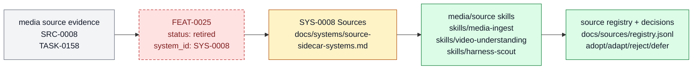

# Retired video-to-skill source reconstruction

Video-to-skill source reconstruction is retired as a feature handle. The active capability is a generic source-ingestion workflow implemented by skills, not a distinct Farplane product UX. It belongs to [Source And Sidecar
Systems](../systems/source-sidecar-systems.md) and keeps `FEAT-0025` as a stable
capability handle because the behavior has an owner, proof path, and maintenance
boundary.

```text
reconstruct_skill_source(media, target_capability) -> source_notes + skill_delta + proof_case
```

## At A Glance

- Feature ID: `FEAT-0025`
- System: [Source And Sidecar Systems](../systems/source-sidecar-systems.md)
- Status: `retired`
- Category: `source-ingestion`
- Primary user: researching agent and skill maintainer
- Job: turn useful videos or media sources into grounded skill improvements without copying noise.

## Problem

Some of the best workflow evidence arrives as videos, demos, or informal media rather
than clean written specs.

This feature gives Farplane a path to reconstruct the useful procedure, compare it to
current skills, and extract only the parts worth adopting.

## What It Does

- Extracts transcript, frames, or representative notes from a source video.
- Identifies the operational pattern the source demonstrates.
- Maps the pattern to an existing skill, feature, or sidecar system.
- Produces an evidence-backed adopt, adapt, reject, or defer decision.
- Turns accepted findings into a skill delta, eval case, checklist item, or ticket.

## User Stories

- As a maintainer, I can use a video as evidence without letting it become vague inspiration.
- As a skill author, I can see which part of a source changes the skill and how to test it.
- As a reviewer, I can trace the proposed skill change back to source evidence.

## Operating Contract

Video reconstruction must end in a local owner and proof path.

- Source extraction records the target capability and evidence used.
- Findings are deduped against existing skills and feature specs.
- Accepted changes include an owner surface and validation plan.
- Rejected findings preserve the reason to avoid repeated rework.

## Feature Flow



The retired video-specific feature now routes source reconstruction through `SYS-0008`, media skills, and source registry evidence.

## Surfaces

Owner surfaces:

- `skills/harness-scout`
- `skills/media-ingest`
- `skills/video-understanding`

Source context:

- `SRC-0008`
- `tickets/archive/TASK-0158/ticket.md`

External context:

- `https://www.instagram.com/p/DYijhcetmBP/`

Evidence:

- `skills/media-ingest/SKILL.md`
- `skills/video-understanding/SKILL.md`
- `tickets/archive/TASK-0158/ticket.md`
- `docs/HISTORY.md`

## Proof And Quality

Required checks:

- `python3 docs/features/validate_features.py`
- `python3 bin/validators/check_doc_refs.py`

Acceptance signals:

- The feature remains listed under exactly one owning system.
- The owner surfaces still exist and agree with this contract.
- Evidence refs support the current status.

## Rollout And Maintenance

- Update this feature page first when the capability contract changes.
- Then update owner surfaces and regenerate feature/system registries when metadata changes.
- Preserve the feature ID while active templates, skills, tickets, or docs still reference it.
- Maintenance owner: Source And Sidecar Systems.

## Limits And Non-Goals

- This feature is not a transcript archive.
- This feature does not copy creator phrasing into skill docs as policy.
- This feature does not replace harness-scout source scoring.
- Known limit: Support-skill and artifact contract only; platform fetching still depends on available local tools, public access, or user-provided exports, and transcript gaps must be recorded rather than hidden.
- Delete or merge this feature only when its current truth has moved into a clearer owner and all active refs are removed.

## Metrics

- `video_to_skill_pipeline_validation_passed`

## Alternatives Considered

- Keep this only as a registry row.
  Decision: reject.
  Reason: Farplane features must be readable specs, not opaque metadata entries.
- Fold this entirely into the owning system page.
  Decision: defer.
  Reason: keep the `FEAT-*` page while templates, skills, tickets, or proof surfaces need a stable capability handle.

## Change History

- 2026-06-26: Feature spec created.
- 2026-06-27: Migrated into the reader-first feature-spec shape.
