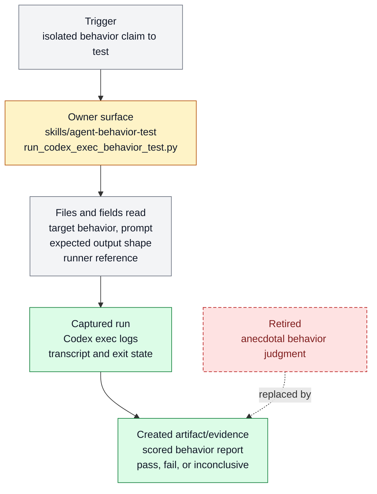

# Agent behavior test workflow

Agent behavior test workflow exists to capture one isolated child-agent run into
inspectable evidence for behavior claims. It belongs to [Proof And
Review](../systems/proof-review.md) and keeps `FEAT-0031` as a stable capability handle
because the behavior has an owner, proof path, and maintenance boundary.

```text
capture_agent_run(prompt, harness) -> logs + artifacts + behavior_score
```

## At A Glance

- Feature ID: `FEAT-0031`
- System: [Proof And Review](../systems/proof-review.md)
- Status: `implemented`
- Category: `proof`
- Primary user: agent behavior tester and reviewer
- Job: capture one isolated child-agent run into inspectable evidence for behavior claims.

## Problem

Agent behavior claims are easy to overstate when the only evidence is a final answer.

This feature records the run context, prompts, outputs, logs, artifacts, and score so
behavior tests can be reviewed and repeated.

## What It Does

- Runs one bounded agent behavior probe.
- Captures prompt, context, tool/log evidence, outputs, and artifacts.
- Scores the observed behavior against an explicit rubric or expected behavior.
- Stores evidence where QA and reviewer lanes can inspect it.
- Feeds failures into hardcases, evals, skill fixes, or lessons.

## User Stories

- As a tester, I can prove what a child agent actually did.
- As a reviewer, I can inspect logs rather than trusting a summary.
- As a maintainer, I can turn observed failures into narrow regression cases.

## Operating Contract

Behavior tests need isolated evidence, not anecdotal judgment.

- Each run has one target behavior and one expected output shape.
- Evidence includes enough context to explain pass, fail, or inconclusive.
- Scores are tied to observed behavior, not intent.
- Failures route to hardcase or eval capture when reusable.

## Feature Flow



Legend:

- `gray = existing input, fields, or evidence read`
- `amber = owning or changed live surface`
- `green = created artifact or proof`
- `red dashed = retired or superseded path`

## Surfaces

Owner surfaces:

- `skills/agent-behavior-test`
- `skills/agent-behavior-test/scripts/run_codex_exec_behavior_test.py`
- `docs/skills/registry.jsonl`

Source context:

- `docs/fundamentals/harness-engineering-doctrine.md`
- `skills/harness-advisor/references/placement-axes.md`

Evidence:

- `skills/agent-behavior-test/references/codex-exec-runner.md`
- `skills/agent-behavior-test/scripts/run_codex_exec_behavior_test.py`
- `docs/HISTORY.md`

## Proof And Quality

Required checks:

- `python3 docs/features/validate_features.py`
- `python3 bin/validators/check_doc_refs.py`

Acceptance signals:

- The feature remains listed under exactly one owning system.
- The owner surfaces still exist and agree with this contract.
- Evidence refs support the current status.

## Rollout And Maintenance

- Update this feature page first when the capability contract changes.
- Then update owner surfaces and regenerate feature/system registries when metadata changes.
- Preserve the feature ID while active templates, skills, tickets, or docs still reference it.
- Maintenance owner: Proof And Review.

## Limits And Non-Goals

- This feature is not a broad benchmark runner.
- This feature does not replace adversarial QA orchestration.
- This feature does not auto-fix the agent under test.
- Known limit: CLI JSONL runs capture visible messages, command events, final output, and usage, but not hidden chain-of-thought. Native subagent testing still depends on the subagent writing its own report artifact.
- Delete or merge this feature only when its current truth has moved into a clearer owner and all active refs are removed.

## Metrics

- `agent_behavior_test_runner_smoke_pass`

## Alternatives Considered

- Keep this only as a registry row.
  Decision: reject.
  Reason: Farplane features must be readable specs, not opaque metadata entries.
- Fold this entirely into the owning system page.
  Decision: defer.
  Reason: keep the `FEAT-*` page while templates, skills, tickets, or proof surfaces need a stable capability handle.

## Change History

- 2026-06-26: Feature spec created.
- 2026-06-27: Migrated into the reader-first feature-spec shape.
