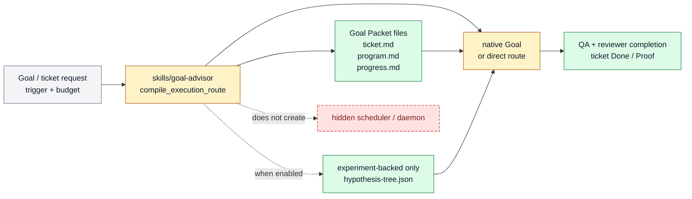

# Goal Advisor execution loop

Goal Advisor execution loop exists to choose the right execution mode, prepare Goal Packet state when needed, and compile
the concrete prompt for material Farplane work. It belongs to [Horizon
Loop](../systems/horizon-loop.md) and keeps `FEAT-0032` as a stable capability handle
because the behavior has an owner, proof path, and maintenance boundary.

```text
compile_execution_route(ticket, trigger, budget?, hypothesis_tree?) -> goal | heartbeat | rollout | direct
```

## At A Glance

- Feature ID: `FEAT-0032`
- System: [Horizon Loop](../systems/horizon-loop.md)
- Status: `implemented`
- Category: `execution`
- Primary user: operator and Goal-backed execution agent
- Job: choose the right execution mode, bind Goal Packet state when needed, and compile the concrete prompt for material Farplane work.

## Problem

A request can be a direct fix, native Goal, heartbeat, rollout, or feedback loop.
Choosing wrong either overcomplicates small work or under-specifies long-running work.

Goal Advisor turns the active ticket and context into a bounded execution route with
proof expectations.

## What It Does

- Reads ticket, program, optional hypothesis tree, progress, specs, and current
  trigger context.
- Chooses native Goal, heartbeat, rollout, feedback, or direct route.
- Compiles a concrete execution prompt with proof gates and continuation state.
- Compiles the ticket Contract Diagram and Change Plan into an ordered execution
  path, a consumed-reference manifest, and assertion-to-evidence completion
  closure; structurally complete but contradictory packets return revision.
- Keeps the ticket as the source of truth for scope and Done / Proof.
- For experiment-backed campaigns, binds `hypothesis-tree.json` as the sole
  current research-state owner without adding it to ordinary Goal Packets.
- Routes phases such as build, QA, and demo when the ticket requires them.

## User Stories

- As an operator, I can ask for a goal and get the right execution container.
- As a coding agent, I can follow one compiled prompt without guessing the loop shape.
- As a reviewer, I can compare route choice against the ticket and proof gates.

## Operating Contract

Goal Advisor is an execution compiler, not a replacement for the ticket.

- Material work must have a visible ticket or packet before goal-backed execution.
- Route choice names trigger mode, budget, files, and proof expectations.
- The Compiled Execution Path binds diagram nodes to owning changes and exit
  assertions. The Reference Manifest names a consumer for every non-core file.
  Completion Closure binds each Done claim to an implementation owner and
  current evidence; pending, stale, unsupported, or contradicted rows block
  `stop_complete`.
- Ordinary Goal Packets use `ticket.md`, `program.md`, and `progress.md`.
  Experiment-backed packets conditionally add `hypothesis-tree.json`; the
  [Self-Improvement And Learning system](../systems/self-improvement-learning.md)
  owns its research-search semantics.
- The compiled prompt shrinks the task rather than expanding global policy.
- Every compiled program uses `observe -> choose_next -> act -> verify ->
  write_back`. Advisor skills are conditional methods: Metric Advisor for
  setup/repair, Leverage Advisor for real multi-option judgment, and Plan Next
  Wave only outside an active Goal when the board needs refill.
- First load is bounded to full ticket/program plus the latest 80 progress
  lines, with a 300-line target and 400-line hard validation gate.
- Completion still uses the ticket's proof and review gates and requires a
  `goal-program-contract` verdict for material Goal program changes.

## Feature Flow



Gray is the incoming work request, amber is route-selection behavior, green is durable state or completion proof, and red dashed is the non-shipped hidden executor path.

## Surfaces

Owner surfaces:

- `skills/goal-advisor`
- `docs/features/FEAT-0029-goal-packet-architecture-for-native-codex-goals.md`
- `docs/features/FEAT-0007-ticket-as-durable-task-memory.md`
- `tickets/templates/goal-loop/program.md`
- `tickets/templates/goal-loop/hypothesis-tree.json`

Source context:

- `skills/goal-advisor`
- `docs/features/FEAT-0029-goal-packet-architecture-for-native-codex-goals.md`
- `docs/systems/self-improvement-learning.md`
- `tickets/archive/TASK-0196/ticket.md`

External context:

- `https://developers.openai.com/codex/use-cases/follow-goals`

Evidence:

- `skills/goal-advisor/SKILL.md`
- `skills/goal-advisor/evals/evals.json`
- `docs/HISTORY.md`
- `tickets/archive/TASK-0196/ticket.md`

## Proof And Quality

Required checks:

- `python3 docs/features/validate_features.py`
- `python3 bin/validators/check_doc_refs.py`

Acceptance signals:

- The feature remains listed under exactly one owning system.
- The owner surfaces still exist and agree with this contract.
- Evidence refs support the current status.

## Rollout And Maintenance

- Update this feature page first when the capability contract changes.
- Then update owner surfaces and regenerate feature/system registries when metadata changes.
- Preserve the feature ID while active templates, skills, tickets, or docs still reference it.
- Maintenance owner: Horizon Loop.

## Limits And Non-Goals

- This feature does not turn every task into a Goal.
- This feature does not hide state in the compiled prompt.
- This feature does not supersede proof review.
- Known limit: Skill and docs contract only; it does not implement a daemon, hidden scheduler, Codex Cloud launcher, Symphony runner, or automatic Goal manager. Former work, Ralph, and batch-work public skill surfaces are retired into Goal standards.
- Delete or merge this feature only when its current truth has moved into a clearer owner and all active refs are removed.

## Metrics

- no dedicated metric yet

## Alternatives Considered

- Keep this only as a registry row.
  Decision: reject.
  Reason: Farplane features must be readable specs, not opaque metadata entries.
- Fold this entirely into the owning system page.
  Decision: defer.
  Reason: keep the `FEAT-*` page while templates, skills, tickets, or proof surfaces need a stable capability handle.

## Change History

- 2026-06-26: Feature spec created.
- 2026-06-27: Migrated into the reader-first feature-spec shape.
- 2026-08-01: Added the conditional experiment-backed hypothesis-tree packet
  extension and linked its system owner and completion evidence.
