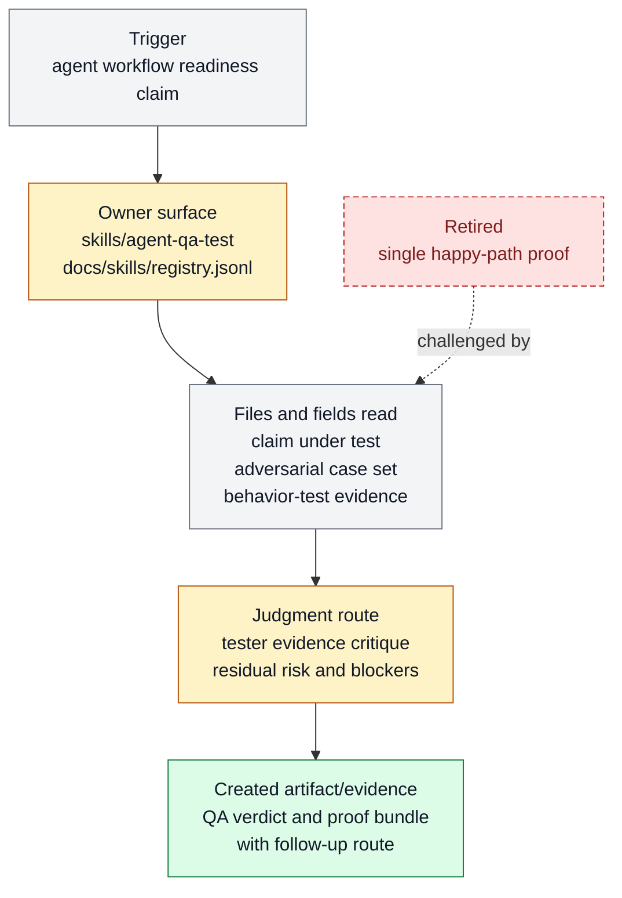

# Adversarial agent QA test skill

Adversarial agent QA test skill exists to test agent-facing workflows against
adversarial cases before treating them as ready. It belongs to [Proof And
Review](../systems/proof-review.md) and keeps `FEAT-0034` as a stable capability handle
because the behavior has an owner, proof path, and maintenance boundary.

```text
agent_qa(target, claim) -> adversarial_cases + tester_evidence + verdict
```

## At A Glance

- Feature ID: `FEAT-0034`
- System: [Proof And Review](../systems/proof-review.md)
- Status: `implemented`
- Category: `proof`
- Primary user: QA lane, reviewer, and prompt or skill maintainer
- Job: test agent-facing workflows against adversarial cases before treating them as ready.

## Problem

Skills, prompts, and agent workflows can look good on happy paths while failing on
ambiguous, adversarial, or correction-heavy cases.

This feature gives Farplane a QA orchestrator for agent behavior claims: design cases,
run or capture evidence, critique results, and publish a proof bundle.

## What It Does

- Defines adversarial cases for a skill, prompt, app behavior, or workflow claim.
- Uses behavior capture when the target behavior must be observed directly.
- Collects tester evidence, critique, findings, and residual risk.
- Produces a readiness verdict instead of a vague confidence statement.
- Routes repeated failures into hardcases, evals, or skill maintenance.
- Exposes `agent-qa-test:experiment` for independent first-principles diagnosis
  when an observation materially violates a preregistered expectation.
- Distinguishes invalid, inconclusive, challenged, refuted-in-scope, and
  supported-in-scope experimental verdicts; suspiciously strong success is
  audited before promotion.

## User Stories

- As a maintainer, I can challenge a new agent workflow before rollout.
- As a tester, I can produce evidence for hard cases rather than only happy paths.
- As a reviewer, I can distinguish pass-ready from needs-revision.

## Operating Contract

Agent QA is a proof orchestrator around behavior tests and reviewer judgment.

- Each QA run names the claim under test and the adversarial case set.
- Evidence is stored as artifacts, logs, screenshots, or reports as appropriate.
- The verdict includes blockers, residual risk, and follow-up route.
- Passing QA does not delete underlying evidence.
- Experiment execution stays with the domain owner. Agent QA owns diagnosis and
  bounded probe guidance; `scientific-evidence` review owns final inference
  readiness for material conclusions.

## Feature Flow



Legend:

- `gray = existing input, fields, or evidence read`
- `amber = owning or changed live surface`
- `green = created artifact or proof`
- `red dashed = retired or superseded path`

## Surfaces

Owner surfaces:

- `skills/agent-qa-test`
- `docs/skills/registry.jsonl`

Source context:

- `docs/fundamentals/harness-engineering-doctrine.md`
- `docs/features/registry.jsonl#FEAT-0031`

Evidence:

- `skills/agent-qa-test/SKILL.md`
- `docs/HISTORY.md`

## Proof And Quality

Required checks:

- `python3 docs/features/validate_features.py`
- `python3 bin/validators/check_doc_refs.py`

Acceptance signals:

- The feature remains listed under exactly one owning system.
- The owner surfaces still exist and agree with this contract.
- Evidence refs support the current status.

## Rollout And Maintenance

- Update this feature page first when the capability contract changes.
- Then update owner surfaces and regenerate feature/system registries when metadata changes.
- Preserve the feature ID while active templates, skills, tickets, or docs still reference it.
- Maintenance owner: Proof And Review.

## Limits And Non-Goals

- This feature is not generic unit testing.
- This feature does not make the implementer self-approve.
- This feature does not replace evals when a repeatable regression test is needed.
- This feature does not run experiments, expand compute/spend authority, or
  turn every ordinary result into a scientific audit.
- Known limit: Skill and prompt-template surface only; actual native subagent execution still depends on the invoking agent and available runtime tools.
- Delete or merge this feature only when its current truth has moved into a clearer owner and all active refs are removed.

## Metrics

- `agent_qa_test_skill_validation_pass`

## Alternatives Considered

- Keep this only as a registry row.
  Decision: reject.
  Reason: Farplane features must be readable specs, not opaque metadata entries.
- Fold this entirely into the owning system page.
  Decision: defer.
  Reason: keep the `FEAT-*` page while templates, skills, tickets, or proof surfaces need a stable capability handle.

## Change History

- 2026-06-26: Feature spec created.
- 2026-06-27: Migrated into the reader-first feature-spec shape.
- 2026-07-25: Added the risk-triggered `agent-qa-test:experiment` method,
  two-sided surprise diagnosis, bounded reruns, and scoped scientific verdicts.
