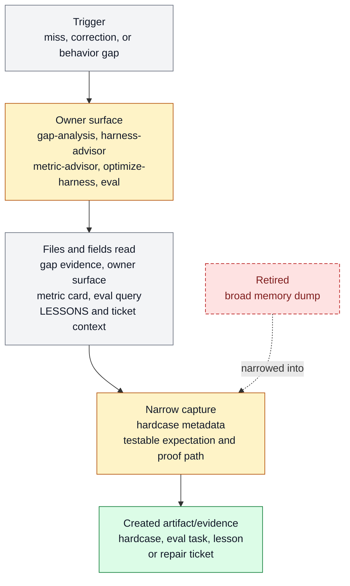

# Farplane evals

Farplane evals exist to turn repeated misses, hardcases, prompt risks, and skill behavior claims into runnable eval cases and regression evidence. It belongs to [Proof And Review](../systems/proof-review.md) and keeps `FEAT-0039` as the consolidated eval capability handle.

```text
farplane_eval(claim, evidence, owner_surface) -> eval_case + run_result + repair_signal
```

## At A Glance

- Feature ID: `FEAT-0039`
- System: [Proof And Review](../systems/proof-review.md)
- Status: `implemented`
- Category: `improvement-loop`
- Primary user: maintainer and self-improvement agent
- Job: turn behavior claims, hardcases, prompt risks, and skill-local checks into runnable eval evidence.

## Problem

When an agent misses, the correction can disappear into chat unless Farplane names the
failure, owner, and prevention surface.

This feature gives correction a small operating loop: identify the gap, bind it to an
owner, patch the smallest durable surface, and prove it with a representative case.

## What It Does

- Uses gap-analysis to describe expected versus observed behavior.
- Uses harness-advisor to choose the owner surface for a fix.
- Captures hardcases as eval metadata with input, expected behavior, observed failure, owner, tags, proof artifacts, and promotion status.
- Routes metric selection through metric-advisor before self-improvement claims.
- Promotes repeated failures into skills, evals, lessons, docs, hooks, validators, or tickets.

## User Stories

- As an operator, I can point to a miss and see what prevention surface changed.
- As a maintainer, I can avoid turning every correction into global prompt bloat.
- As a QA lane, I can promote a repeated failure into a narrow regression case.

## Operating Contract

Self-improvement must land in an owner, not a memory dump.

- Corrections name the gap, evidence, owner surface, and proof path.
- Hardcases are narrow enough to rerun or reason about.
- Local Farplane wrappers, fixtures, registries, and evals are patched before external installed skills.
- Broad migrations require proof before rollout.

## Feature Flow



Legend:

- `gray = existing input, fields, or evidence read`
- `amber = owning or changed live surface`
- `green = created artifact or proof`
- `red dashed = retired or superseded path`

## Surfaces

Owner surfaces:

- `skills/gap-analysis`
- `skills/harness-advisor`
- `skills/metric-advisor`
- `skills/optimize-harness`
- `skills/eval`
- `docs/LESSONS.md`
- `docs/features/FEAT-0039-behavior-correction-hardcase-metadata-and-narrow-eval-capture.md`

Source context:

- `docs/HISTORY.md`
- `docs/features/registry.jsonl#FEAT-0031`
- `docs/features/registry.jsonl#FEAT-0063`
- `docs/features/FEAT-0039-behavior-correction-hardcase-metadata-and-narrow-eval-capture.md`

Evidence:

- `skills/gap-analysis/SKILL.md`
- `skills/harness-advisor/SKILL.md`
- `skills/metric-advisor/SKILL.md`
- `skills/optimize-harness/SKILL.md`
- `skills/eval/SKILL.md`
- `docs/features/FEAT-0039-behavior-correction-hardcase-metadata-and-narrow-eval-capture.md`
- `tickets/archive/TASK-0228/ticket.md`
- `docs/HISTORY.md`

## Proof And Quality

Required checks:

- `python3 docs/features/validate_features.py`
- `python3 bin/validators/check_doc_refs.py`

Acceptance signals:

- The feature remains listed under exactly one owning system.
- The owner surfaces still exist and agree with this contract.
- Evidence refs support the current status.

## Rollout And Maintenance

- Update this feature page first when the capability contract changes.
- Then update owner surfaces and regenerate feature/system registries when metadata changes.
- Preserve the feature ID while active templates, skills, tickets, or docs still reference it.
- Maintenance owner: Self-Improvement And Learning.

## Limits And Non-Goals

- This feature does not train models.
- This feature does not inspect full Codex histories without a seed anchor.
- This feature does not auto-apply broad harness migrations without proof.
- Known limit: Correction is skill-and-artifact driven. Hardcase is eval metadata and legacy standalone hardcase artifacts should become runnable eval rows when the expected behavior is testable. Metric selection routes through metric-advisor before self-improve. The loop does not train models, sell data, inspect full Codex histories without a seed anchor, or auto-apply broad harness migrations without proof.
- Delete or merge this feature only when its current truth has moved into a clearer owner and all active refs are removed.

## Metrics

- `gap_packet_quality_pass`
- `harness_placement_quality_pass`
- `metric_card_traceability_pass`
- `hardcase_eval_metadata_pass`
- `narrow_regression_eval_pass`

## Alternatives Considered

- Keep this only as a registry row.
  Decision: reject.
  Reason: Farplane features must be readable specs, not opaque metadata entries.
- Fold this entirely into the owning system page.
  Decision: defer.
  Reason: keep the `FEAT-*` page while templates, skills, tickets, or proof surfaces need a stable capability handle.

## Change History

- 2026-06-26: Feature spec created.
- 2026-06-27: Migrated into the reader-first feature-spec shape.
