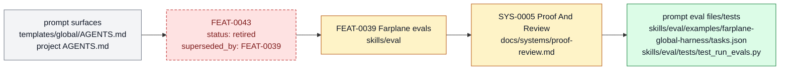

# Retired project-level system prompt eval suite

Project-level system prompt eval suite is retired as a standalone feature handle. Its current behavior is part of [FEAT-0039 Farplane evals](FEAT-0039-behavior-correction-hardcase-metadata-and-narrow-eval-capture.md). It belongs to [Proof And
Review](../systems/proof-review.md) and keeps `FEAT-0043` as a stable capability handle
because the behavior has an owner, proof path, and maintenance boundary.

```text
prompt_eval(prompt_surface, cases) -> regression_signal + repair_route
```

## At A Glance

- Feature ID: `FEAT-0043`
- System: [Proof And Review](../systems/proof-review.md)
- Status: `retired`
- Category: `proof`
- Primary user: prompt maintainer and reviewer
- Job: test project-level agent prompts against known behavior risks before and after policy changes.

## Problem

Prompt edits can quietly change autonomy, routing, proof, or communication behavior
across the repo.

This feature gives system prompt changes a regression surface so policy updates can be
judged against representative cases.

## What It Does

- Defines eval cases for project-level prompt behavior.
- Checks autonomy, planning boundaries, skill routing, doc writeback, and proof requirements.
- Uses validators or eval tasks to catch policy drift.
- Routes failures to prompt edits, skill changes, docs, or hardcases.
- Keeps prompt behavior evidence out of vague discussion.

## User Stories

- As a prompt maintainer, I can change AGENTS.md or templates with regression evidence.
- As a reviewer, I can see which behavior cases were protected.
- As an operator, I get safer harness changes without turning every prompt edit into guesswork.

## Operating Contract

Prompt policy changes need representative behavior checks.

- Cases name the expected behavior and the prompt surface under test.
- Prompt changes run the narrowest relevant eval or validator before completion.
- Failures route to a durable owner rather than a one-off apology.
- Prompt evals stay small enough to maintain.

## Feature Flow



Prompt eval behavior is no longer a standalone feature; `FEAT-0039` and `SYS-0005` own the active eval files and proof tests.

## Surfaces

Owner surfaces:

- `skills/eval/examples/farplane-global-harness/tasks.json`
- `skills/eval`
- `templates/global/AGENTS.md`

Source context:

- `skills/eval/references/eval-best-practices.md`
- `docs/HISTORY.md`

Evidence:

- `skills/eval/examples/farplane-global-harness/tasks.json`
- `skills/eval/tests/test_run_evals.py`
- `docs/HISTORY.md`

## Proof And Quality

Required checks:

- `python3 docs/features/validate_features.py`
- `python3 bin/validators/check_doc_refs.py`

Acceptance signals:

- The feature remains listed under exactly one owning system.
- The owner surfaces still exist and agree with this contract.
- Evidence refs support the current status.

## Rollout And Maintenance

- Update this feature page first when the capability contract changes.
- Then update owner surfaces and regenerate feature/system registries when metadata changes.
- Preserve the feature ID while active templates, skills, tickets, or docs still reference it.
- Maintenance owner: Proof And Review.

## Limits And Non-Goals

- This feature is not a full model benchmark.
- This feature does not replace reviewer judgment for major prompt changes.
- This feature does not require evals for trivial typo fixes.
- Known limit: Eval does not expose hidden chain-of-thought. Use Eval
  `behavior_trace` for visible CLI events/logs and Agent QA for adversarial or
  native-subagent-only evidence.
- Delete or merge this feature only when its current truth has moved into a clearer owner and all active refs are removed.

## Metrics

- `system_prompt_eval_pass_rate`

## Alternatives Considered

- Keep this only as a registry row.
  Decision: reject.
  Reason: Farplane features must be readable specs, not opaque metadata entries.
- Fold this entirely into the owning system page.
  Decision: defer.
  Reason: keep the `FEAT-*` page while templates, skills, tickets, or proof surfaces need a stable capability handle.

## Change History

- 2026-06-26: Feature spec created.
- 2026-06-27: Migrated into the reader-first feature-spec shape.
