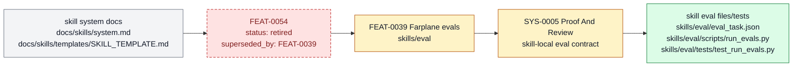

# Retired modular skill-local eval tasks

Modular skill-local eval tasks is retired as a standalone feature handle. Its current behavior is part of [FEAT-0039 Farplane evals](FEAT-0039-behavior-correction-hardcase-metadata-and-narrow-eval-capture.md). It belongs to [Skill System](../systems/skill-
system.md) and keeps `FEAT-0054` as a stable capability handle because the behavior has
an owner, proof path, and maintenance boundary.

```text
skill_eval_task(skill, claim) -> task_case + expected_behavior + local_judge
```

## At A Glance

- Feature ID: `FEAT-0054`
- System: [Skill System](../systems/skill-system.md)
- Status: `retired`
- Category: `skills`
- Primary user: skill author and eval maintainer
- Job: let individual skills carry small behavior evals near the workflow they protect.

## Problem

Central eval suites get stale when skill behavior changes locally, while skill docs can
overclaim readiness without runnable cases.

This feature keeps small eval tasks inside or near the skill package that owns the
behavior.

## What It Does

- Stores skill-local eval tasks for important workflow claims.
- Names the input, expected behavior, judging method, and evidence path.
- Lets skill-maintenance and eval workflows discover local cases.
- Promotes repeated failures into skill QA checklist items or broader eval suites when needed.
- Keeps tiny behavior checks close to the skill they protect.

## User Stories

- As a skill author, I can add a small regression case when tightening behavior.
- As a maintainer, I can discover which skills have local eval coverage.
- As a reviewer, I can ask for a relevant local eval instead of a broad harness test.

## Operating Contract

Skill-local evals protect skill claims at the owner boundary.

- Each eval task names the skill, claim, input, expected behavior, and judge.
- Local eval files stay in the skill package or documented owner path.
- Material skill behavior changes update or run relevant local evals.
- Passing evals supplement, not replace, reviewer or QA judgment.

## Feature Flow



Skill-local eval tasks remain active as eval surfaces, but `FEAT-0039` and `SYS-0005` own the consolidated feature identity.

## Surfaces

Owner surfaces:

- `skills/eval/scripts/run_evals.py`
- `skills/eval/SKILL.md`
- `skills/eval/eval_task.json`
- `docs/skills/templates/SKILL_TEMPLATE.md`
- `docs/skills/system.md`
- `docs/skills/best-practices.md`

Source context:

- `docs/MEMORY.md#MEM-0145`
- `docs/HISTORY.md`

Evidence:

- `skills/eval/eval_task.json`
- `skills/eval/tests/test_run_evals.py`
- `docs/HISTORY.md`

## Proof And Quality

Required checks:

- `python3 docs/features/validate_features.py`
- `python3 bin/validators/check_doc_refs.py`

Acceptance signals:

- The feature remains listed under exactly one owning system.
- The owner surfaces still exist and agree with this contract.
- Evidence refs support the current status.

## Rollout And Maintenance

- Update this feature page first when the capability contract changes.
- Then update owner surfaces and regenerate feature/system registries when metadata changes.
- Preserve the feature ID while active templates, skills, tickets, or docs still reference it.
- Maintenance owner: Skill System.

## Limits And Non-Goals

- This feature is not a centralized benchmark catalog.
- This feature does not require evals for every skill sentence.
- This feature does not hide eval expectations in chat.
- Known limit: The runner discovers `skills/*/eval_task.json` as a modular suite, but it does not yet enforce every skill having one or validate skill-local eval coverage quality beyond the existing task JSON schema and judge prompts.
- Delete or merge this feature only when its current truth has moved into a clearer owner and all active refs are removed.

## Metrics

- `skill_local_eval_discovery_pass`

## Alternatives Considered

- Keep this only as a registry row.
  Decision: reject.
  Reason: Farplane features must be readable specs, not opaque metadata entries.
- Fold this entirely into the owning system page.
  Decision: defer.
  Reason: keep the `FEAT-*` page while templates, skills, tickets, or proof surfaces need a stable capability handle.

## Change History

- 2026-06-26: Feature spec created.
- 2026-06-27: Migrated into the reader-first feature-spec shape.
