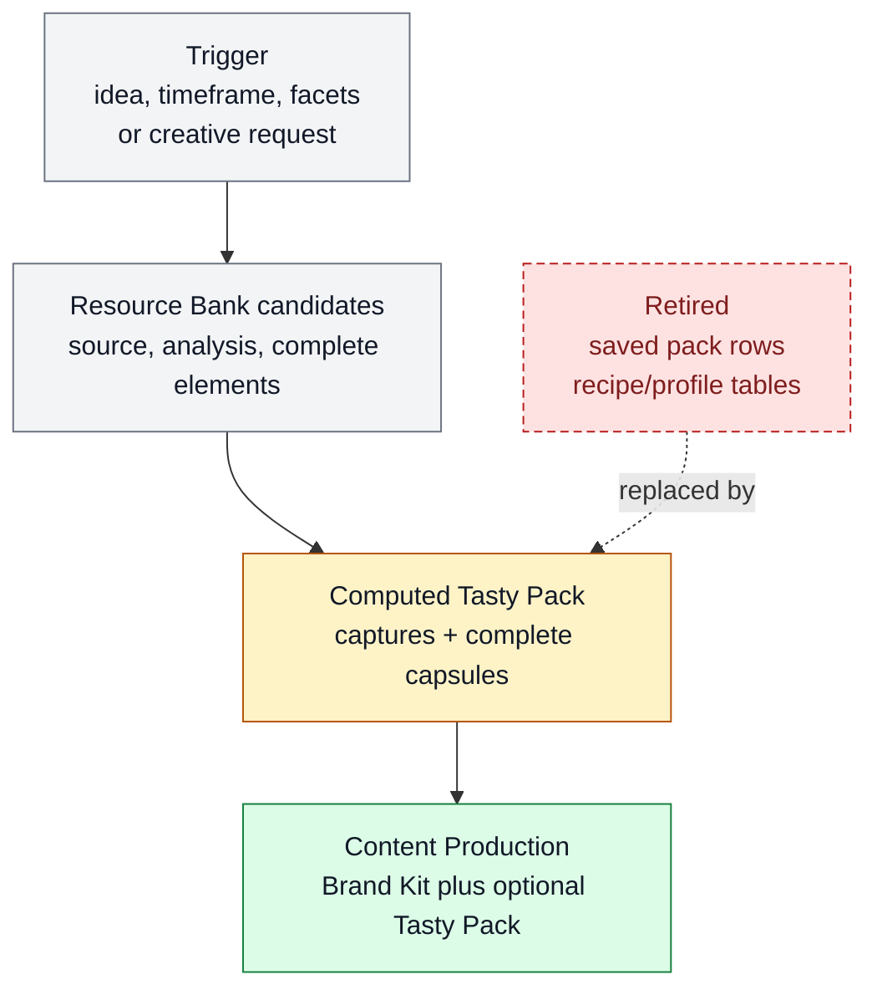

# Tasty Pack inspiration vault

Tasty Pack inspiration vault exists to retrieve reusable inspiration as complete creative elements for a specific content-production question. It belongs to [Content Production](../systems/content-production.md) and keeps `FEAT-0056` as the stable feature handle for computed Tasty Packs: ad hoc taste and trend evidence from Resource Bank candidates, not approved identity and not saved production profiles.

```text
create_tasty_pack(request, resource_bank)
  -> computed_pack(captures[], complete_elements[], meta)
```

## At A Glance

- Feature ID: `FEAT-0056`
- System: [Content Production](../systems/content-production.md)
- Status: `implemented`
- Category: `content-production`
- Primary user: researching agent, creator, and product maintainer
- Job: retrieve complete source-grounded creative elements that can augment a Brand Kit production plan.

## Problem

Useful references often arrive before Farplane knows the next artifact they should shape. Earlier Tasty Pack contracts preserved useful source analysis but allowed production consumers to receive shallow element rows, which made later renders look inspired by a source without conditioning generation on the element-specific what, why, example, or recreation prompt.

## What It Does

- Retrieves Resource Bank captures for a concrete idea, timeframe, facets, or creative request.
- Returns complete creative-element capsules without reducing them to title and description.
- Keeps Tasty Packs computed at query time; there is no saved Tasty Pack table or row.
- Treats Tasty Pack inspiration as optional production evidence that can augment a Brand Kit, not override approved identity.
- Preserves source, analysis, elements, and direct meta warnings such as pinned counts, operator-note counts, and retrieval gaps.
- Keeps raw inspiration out of long-term docs unless distilled into a feature, system, skill, ticket, source decision, or Brand Kit approval.

## User Stories

- As an operator, I can save a useful reference without deciding its final owner immediately.
- As a content planner, I can retrieve recent or relevant Tasty Pack elements and decide which ones fit the current Brand Kit and idea.
- As a maintainer, I can keep public docs free of unvalidated idea piles.

## Operating Contract

Tasty Pack retrieval is a computed inspiration surface, not durable approval.

- Resource Bank stores candidate elements. Tasty Pack retrieval returns a pack view over those candidates for the current request.
- Element kinds remain exactly `visual`, `audio`, `hook`, `storyboard`, `editing`, `copy`, `character`, `format`, and `constraint`.
- Each returned element includes `description`, `whyItWorks`, `goldenExample { assetId, description? }`, and `goldenRecipe` as one prompt string.
- `goldenExample.assetId` points to the best Resource Bank asset for that element; the optional description explains the exact visual, audio, text, edit, or behavior worth conditioning on.
- `goldenRecipe` is not a recipe object, required-input list, success-criteria list, or production-hints collection. It is one compact prompt for recreating the element's function.
- Elements may still carry source tags, pinned priority, provenance, search metadata, or anchors as storage and retrieval metadata. Those fields do not replace the semantic capsule.
- A content-production plan composes Tasty Pack elements with Brand Kit snapshots by explicit chosen/rejected role. Brand Kit constraints win when they conflict.
- Accepted inspiration must move into a feature, skill, ticket, experiment, or source decision.
- Stale inspiration is pruned or moved to temporary research.
- Vault records do not override specs or skill instructions.
- When the active Resource Bank schema changes materially and the vault is
  small, prefer snapshot/reset/reingest over long-lived compatibility fallback.
  Snapshot old records as rollback/debug evidence, then reingest keep-worthy
  sources through the current contract.

## Feature Flow



Legend:

- `gray = existing input, fields, or evidence read`
- `amber = owning or changed live surface`
- `green = created artifact or proof`
- `red dashed = retired or superseded path`

## Surfaces

Owner surfaces:

- `docs/systems/content-production.md`
- `skills/ingest-content/SKILL.md`
- `skills/media-ingest/SKILL.md`
- `skills/harness-scout/SKILL.md`

Source context:

- `docs/systems/source-sidecar-systems.md`

## Proof And Quality

Required checks:

- `python3 docs/features/validate_features.py`
- `python3 bin/validators/check_doc_refs.py`

Acceptance signals:

- The feature remains listed under exactly one owning system.
- The owner surfaces still exist and agree with this contract.
- Evidence refs support the current status.
- Tasty Pack docs do not introduce saved rows, recipe/profile tables, or new element kinds.

## Rollout And Maintenance

- Update this feature page first when the capability contract changes.
- Then update owner surfaces and regenerate feature/system registries when metadata changes.
- Preserve the feature ID while active templates, skills, tickets, or docs still reference it.
- Maintenance owner: Source And Sidecar Systems.

## Limits And Non-Goals

- This feature is not a permanent archive.
- This feature does not make raw references public docs.
- This feature does not skip source scoring when the idea becomes product work.
- This feature does not store approved identity; Brand Kit owns approved creative snapshots.
- Known limit: Tasty Packs are only as useful as the captured element capsules and the production proof that later work records.
- Delete or merge this feature only when its current truth has moved into a clearer owner and all active refs are removed.

## Metrics

- `inspiration_recall_quality`
- `creative_grounding_reuse`

## Alternatives Considered

- Keep this only as a registry row.
  Decision: reject.
  Reason: Farplane features must be readable specs, not opaque metadata entries.
- Fold this entirely into the owning system page.
  Decision: defer.
  Reason: keep the `FEAT-*` page while templates, skills, tickets, or proof surfaces need a stable capability handle.

## Change History

- 2026-06-27: Feature spec created.
- 2026-06-27: Migrated into the reader-first feature-spec shape.
- 2026-07-04: Corrected Inspiration Pack v2 direction to a minimal capture
  contract: source/ref, operator note/focus, compact analysis, creative
  elements, tags/facets, and snapshot/reset/reingest for small old vaults
  instead of long-lived legacy fallback.
- 2026-07-22: Moved Tasty Pack ownership to Content Production and narrowed the contract to computed complete-element retrieval.
