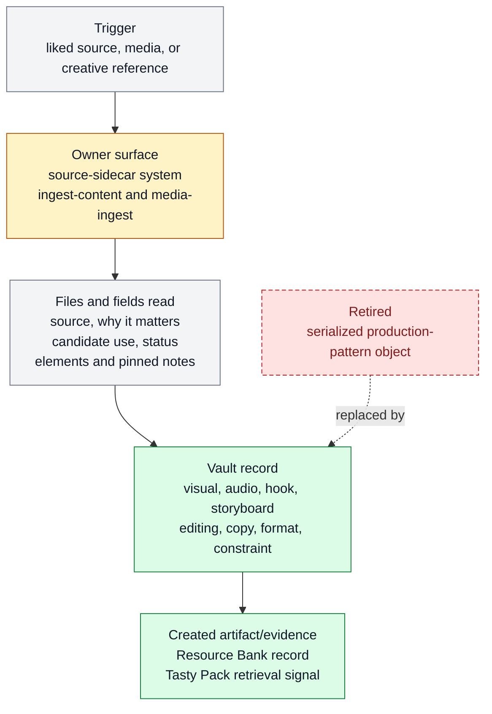

# Tasty Pack inspiration vault

Tasty Pack inspiration vault exists to hold reusable inspiration sources until they can be routed
into Tasty Packs, products, skills, or experiments. It belongs to [Source And Sidecar
Systems](../systems/source-sidecar-systems.md) and keeps `FEAT-0056` as a stable
capability handle because the behavior has an owner, proof path, and maintenance
boundary.

```text
capture_inspiration(source, use_case)
  -> capture(source, note, analysis, elements, tags/facets) + reuse_route
```

## At A Glance

- Feature ID: `FEAT-0056`
- System: [Source And Sidecar Systems](../systems/source-sidecar-systems.md)
- Status: `implemented`
- Category: `source-ingestion`
- Primary user: researching agent, creator, and product maintainer
- Job: hold reusable source elements, pinned notes, and creative grounding until they can be routed into Tasty Packs, products, skills, or experiments.

## Problem

Useful product, content, and workflow references often arrive before Farplane knows the
exact feature or skill they should change.

An inspiration vault gives those sources a temporary structured owner without pretending
they are already canonical specs.

## What It Does

- Captures high-signal references with source/ref, operator note/focus, compact
  analysis, creative elements, tags/facets, and possible reuse route.
- Separates inspiration from accepted doctrine or shipped behavior.
- Feeds harness-scout, market-learning, content, design, or skill work when a concrete question appears.
- Feeds content-production through clean Inspiration Pack/Tasty Pack captures:
  `{ request: { idea?, timeframe, startAtMs?, endAtMs?, filters },
  captures: [{ captureId, source, analysis, elements }],
  meta: { captureCount, timeframe } }`, with tags/facets on `source`.
  Production consumers bind only to `captures[].source`,
  `captures[].analysis`, `captures[].elements`, and direct `meta` counts or
  warnings such as `pinnedElementCount`, `operatorNoteCount`, and `warnings`;
  elements may carry note-backed `pinned` taste priority, and retrieval notes
  are non-core metadata.
- Allows proposed status until the pattern earns a feature, skill, ticket, or experiment owner.
- Keeps raw inspiration out of long-term docs unless distilled.

## User Stories

- As an operator, I can save a useful reference without deciding its final owner immediately.
- As a researching agent, I can retrieve inspiration by use case and turn it into a scored decision.
- As a maintainer, I can keep public docs free of unvalidated idea piles.

## Operating Contract

The vault is a waiting room for reusable signal, not canonical truth.

- Records identify source, why it matters, candidate use, and current status.
- For video/social inspiration, records should preserve compact creative
  elements rather than only prose summaries. Element kinds are `visual`,
  `audio`, `hook`, `storyboard`, `editing`, `copy`, `format`, and
  `constraint`, with optional lightweight anchors such as `0-3s` or `caption`.
  Operator-selected sub-elements use element-level `pinned`; Tasty Pack
  retrieval reports pinned counts, operator-note counts, and direct warnings.
  Do not create a separate serialized production-pattern object.
- Accepted inspiration must move into a feature, skill, ticket, experiment, or source decision.
- Stale inspiration is pruned or moved to temporary research.
- Vault records do not override specs or skill instructions.
- When the active Resource Bank schema changes materially and the vault is
  small, prefer snapshot/reset/reingest over long-lived compatibility fallback.
  Snapshot old records as rollback/debug evidence, then reingest keep-worthy
  sources through the current contract.

## Feature Flow



Legend:

- `gray = existing input, fields, or evidence read`
- `amber = owning or changed live surface`
- `green = created artifact or proof`
- `red dashed = retired or superseded path`

## Surfaces

Owner surfaces:

- `docs/systems/source-sidecar-systems.md`
- `skills/ingest-content/SKILL.md`
- `skills/media-ingest/SKILL.md`
- `skills/harness-scout/SKILL.md`

Source context:

- `docs/systems/source-sidecar-systems.md`

## Proof And Quality

Required checks:

- `python3 docs/features/validate_features.py`
- `python3 bin/validators/check_doc_refs.py`

Acceptance signals:

- The feature remains listed under exactly one owning system.
- The owner surfaces still exist and agree with this contract.
- Evidence refs support the current status.

## Rollout And Maintenance

- Update this feature page first when the capability contract changes.
- Then update owner surfaces and regenerate feature/system registries when metadata changes.
- Preserve the feature ID while active templates, skills, tickets, or docs still reference it.
- Maintenance owner: Source And Sidecar Systems.

## Limits And Non-Goals

- This feature is not a permanent archive.
- This feature does not make raw references public docs.
- This feature does not skip source scoring when the idea becomes product work.
- Known limit: Proposed product surface. `TASK-0283` is implementing the
  first production-ready Inspiration Pack v2 slice with minimal Resource Bank
  captures and content-production `creative_lock` gates.
- Delete or merge this feature only when its current truth has moved into a clearer owner and all active refs are removed.

## Metrics

- `inspiration_recall_quality`
- `creative_grounding_reuse`

## Alternatives Considered

- Keep this only as a registry row.
  Decision: reject.
  Reason: Farplane features must be readable specs, not opaque metadata entries.
- Fold this entirely into the owning system page.
  Decision: defer.
  Reason: keep the `FEAT-*` page while templates, skills, tickets, or proof surfaces need a stable capability handle.

## Change History

- 2026-06-27: Feature spec created.
- 2026-06-27: Migrated into the reader-first feature-spec shape.
- 2026-07-04: Corrected Inspiration Pack v2 direction to a minimal capture
  contract: source/ref, operator note/focus, compact analysis, creative
  elements, tags/facets, and snapshot/reset/reingest for small old vaults
  instead of long-lived legacy fallback.
