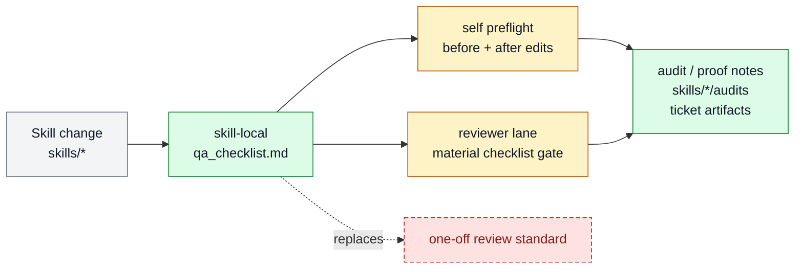

# Skill-local QA checklist artifacts

Skill-local QA checklist artifacts exists to give material skills a local QA checklist
that defines readiness, blockers, and scoring. It belongs to [Skill
System](../systems/skill-system.md) and keeps `FEAT-0057` as a stable capability handle
because the behavior has an owner, proof path, and maintenance boundary.

```text
skill_qa_checklist(skill, change) -> checklist_score + blockers + evidence
```

## At A Glance

- Feature ID: `FEAT-0057`
- System: [Skill System](../systems/skill-system.md)
- Status: `implemented`
- Category: `skills`
- Primary user: skill maintainer, implementer, and reviewer
- Job: give material skills a local QA checklist that defines readiness, blockers, and scoring.

## Problem

Skills can drift when each edit invents a new readiness standard.

Skill-local QA checklists keep recurring guardrails near the skill package so authors,
agents, and reviewers apply the same gates.

## What It Does

- Adds or maintains `qa_checklist.md` for skills that need durable QA gates.
- Names preflight checks, completion checks, blockers, and scoring rules.
- Lets material skill work apply the checklist before and after edits.
- Gives the typed `reviewer` lane concrete ammunition for harsh checklist
  judgment on material changes.
- Keeps checklist content skill-local instead of stuffing every rule into global prompt.
- Feeds skill-maintenance and review workflows with explicit quality criteria.

## User Stories

- As a skill author, I know what must stay true when I edit the skill.
- As a reviewer, I can apply the same checklist adversarially and reject
  technically valid but weak work.
- As an operator, I get more predictable skill quality across maintenance passes.

## Operating Contract

A QA checklist is the skill's local quality contract.

- Checklist items must be actionable, testable, and close to the skill's behavior.
- Material skill changes read and apply the checklist.
- Scores expose residual risk without pretending subjective checks are exact metrics.
- External skills may omit local checklists when wrapper logic belongs in callers.

## Feature Flow



Gray is the skill edit input, amber is checklist application behavior, green is the local QA/proof artifact, and red dashed is the retired ad hoc review path.

## Surfaces

Owner surfaces:

- `skills/skill-maintenance/qa_checklist.md`
- `skills/skill-maintenance`
- `skills/skill-creator`
- `docs/skills/system.md`
- `docs/skills/best-practices.md`
- `docs/skills/README.md`

Source context:

- `docs/MEMORY.md#MEM-0150`
- `docs/fundamentals/harness-algebra.md`

Evidence:

- `skills/skill-maintenance/qa_checklist.md`
- `skills/skill-maintenance/audits/2026-06-23-qa-checklist-preflight-review.md`

## Proof And Quality

Required checks:

- `python3 docs/features/validate_features.py`
- `python3 bin/validators/check_doc_refs.py`

Acceptance signals:

- The feature remains listed under exactly one owning system.
- The owner surfaces still exist and agree with this contract.
- Evidence refs support the current status.

## Rollout And Maintenance

- Update this feature page first when the capability contract changes.
- Then update owner surfaces and regenerate feature/system registries when metadata changes.
- Preserve the feature ID while active templates, skills, tickets, or docs still reference it.
- Maintenance owner: Skill System.

## Limits And Non-Goals

- This feature does not require every tiny skill to have a large checklist.
- This feature does not replace evals when repeatable behavior tests are needed.
- This feature does not duplicate global operating policy.
- Known limit: Markdown artifact standard only; no dedicated qacheck runner,
  renderer, or subagent fanout script exists yet. Agents now read skill-local
  checklists as preflight guardrails, apply them again at finish, and route
  independent typed `reviewer` lanes for material checklist conformance through
  skill-maintenance, skill-creator, and recorded audit/proof notes. Use
  `qa-tester` for runtime proof capture, not checklist acceptance judgment.
- Delete or merge this feature only when its current truth has moved into a clearer owner and all active refs are removed.

## Metrics

- `skill_qa_checklist_application_pass`

## Alternatives Considered

- Keep this only as a registry row.
  Decision: reject.
  Reason: Farplane features must be readable specs, not opaque metadata entries.
- Fold this entirely into the owning system page.
  Decision: defer.
  Reason: keep the `FEAT-*` page while templates, skills, tickets, or proof surfaces need a stable capability handle.

## Change History

- 2026-06-26: Feature spec created.
- 2026-06-27: Migrated into the reader-first feature-spec shape.
