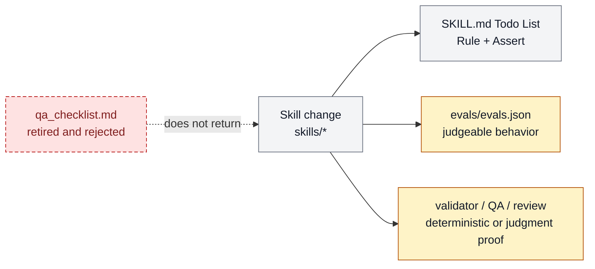

# Retired skill-local QA checklist artifacts

`qa_checklist.md` is retired as a skill-package surface. Its job was duplicated
by Golden Workflow Node `Rule`/`Assert` blocks, canonical evals, deterministic
validators, and independent review; retaining an exceptional path kept inviting
the same duplicated files back.

```text
retire_skill_qa_sidecar(package) -> Todo_List_guardrails | eval | validator | review
```

## At A Glance

- Feature ID: `FEAT-0057`
- System: [Skill System](../systems/skill-system.md)
- Status: `retired`
- Category: `skills`
- Primary user: skill author and maintainer
- Job: preserve the deletion decision and its enforcement, not a live checklist feature.

## Retirement Decision

- Decision: delete every `skills/*/qa_checklist.md` and remove `qa_checklist`
  and `eval` frontmatter fields.
- Evidence: the current skill template requires first-load Golden Workflow
  Nodes with `Rule` and `Assert`; duplicate sidecars added 4,418 lines across
  64 packages without a distinct runtime owner.
- Replacement owner: normal execution guardrails live in the owning `SKILL.md`
  Todo List; variable behavior lives in `evals/evals.json`; deterministic facts
  live in validators; material sufficiency lives in QA or review.
- Reintroduction guard: `check_skill_frontmatter.py` fails a legacy field or a
  new `qa_checklist.md`; registry and graph generation derive eval presence from
  `evals/evals.json` instead of frontmatter.

## Operating Contract

No active skill may add a `qa_checklist.md` sidecar. Put normal-path,
first-load instructions in a relevant Todo List `Rule` or `Assert`; add an eval
for repeatable behavior, a validator for a deterministic invariant, and QA or
review for material judgment. `evals/evals.json` remains optional but its
presence is derived by the registry, not duplicated in frontmatter.

## Feature Flow



Gray is the skill edit input, amber is owner-local proof behavior, and red dashed
is the retired sidecar path.

## Surfaces

Owner surfaces:

- `docs/skills/templates/SKILL_TEMPLATE.md`
- `docs/skills/system.md`
- `docs/skills/best-practices.md`
- `bin/core/skill_contract.py`
- `bin/validators/check_skill_frontmatter.py`
- `bin/validators/check_skill_surface_budget.py`

Source context:

- `docs/skills/templates/SKILL_TEMPLATE.md`

Evidence:

- `bin/validators/test_check_skill_frontmatter.py`
- `bin/validators/test_check_skill_surface_budget.py`

## Proof And Quality

Required checks:

- `python3 bin/farplane.py lint skills`
- `python3 -m unittest bin/validators/test_check_skill_frontmatter.py bin/validators/test_check_skill_surface_budget.py`

Acceptance signals:

- A new legacy field or QA sidecar fails lint with the correct replacement owner.

## Rollout And Maintenance

- The decision record stays until this reintroduction risk no longer matters.
- Maintenance owner: Skill System.

## Limits And Non-Goals

- This decision does not remove the `qa` skill, the QA tester lane, or review.
- This decision does not require every skill to have evals.
- This record does not preserve a compatibility alias or archived live template.

## Metrics

- `skill_qa_sidecar_reintroduction_blocked`

## Alternatives Considered

- Retain the sidecar as an exceptional optional package file.
  Decision: reject.
  Reason: the exception duplicated first-load rules and was repeatedly rediscovered as a valid default.
- Create a general decision registry before retiring this surface.
  Decision: reject.
  Reason: this concise retirement section is the owner record; the validator is the prevention mechanism.

## Change History

- 2026-08-24: Retired the sidecar, deleted existing instances, removed duplicate
  frontmatter/projection/budget fields, and added the reintroduction guard.
- 2026-08-21: Narrowed sidecars to exceptional use; that exception was removed
  after Golden Workflow Nodes made the duplicate owner unnecessary.
