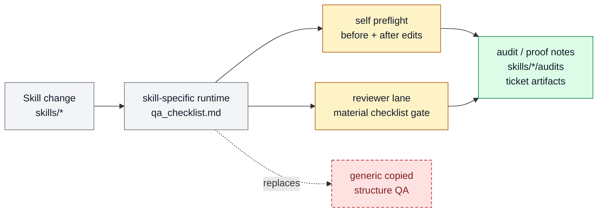

# Skill-local runtime QA guardrails

Skill-local runtime QA guardrails preserve the exceptional cases where one
skill needs repeated safety, runtime, or preflight checks. Generic authoring,
structure, and readiness judgment use Golden Workflow Nodes, evals, validators,
and the shared `skill-contract` rubric instead.

```text
skill_runtime_qa(skill, invocation) -> guard_verdicts + blockers + evidence
```

## At A Glance

- Feature ID: `FEAT-0057`
- System: [Skill System](../systems/skill-system.md)
- Status: `implemented`
- Category: `skills`
- Primary user: skill maintainer, implementer, and reviewer
- Job: keep repeated skill-specific runtime, safety, and preflight guards near their owner.

## Problem

Some skills have repeated runtime or safety failures that must be checked before
and after execution. Copying generic structure or review rules into every skill
creates noise and drift.

## What It Does

- Keeps `qa_checklist.md` only for repeated skill-specific runtime, safety, or
  preflight guards that have no clearer owner.
- Routes structure and judgment to Golden Workflow Nodes, goldens, evals,
  validators, and `skill-contract` review.
- Requires `skill-maintenance` to record `keep | migrate | delete` whenever a
  checklist is touched.

## User Stories

- As a skill author, I know what must stay true when I edit the skill.
- As a reviewer, I can apply the same checklist adversarially and reject
  technically valid but weak work.
- As an operator, I get more predictable skill quality across maintenance passes.

## Operating Contract

A retained QA checklist is the skill's local runtime/preflight guardrail.

- Checklist items must be actionable, testable, skill-specific, and close to runtime behavior.
- Material skill changes read and apply the checklist.
- Generic authoring, structure, judgment, and deterministic rules do not belong here.
- External skills may omit local checklists when wrapper logic belongs in callers.

## Feature Flow



Gray is the skill edit input, amber is checklist application behavior, green is the local QA/proof artifact, and red dashed is the retired ad hoc review path.

## Surfaces

Owner surfaces:

- `docs/skills/templates/QA_CHECKLIST_TEMPLATE.md`
- `docs/review/rubrics/skill-contract.md`
- `docs/skills/system.md`
- `docs/skills/best-practices.md`
- `docs/skills/README.md`

Source context:

- `docs/MEMORY.md#MEM-0150`
- `docs/fundamentals/harness-algebra.md`

Evidence:

- `docs/skills/templates/QA_CHECKLIST_TEMPLATE.md`
- `docs/review/rubrics/skill-contract.md`

## Proof And Quality

Required checks:

- `python3 docs/features/validate_features.py`
- `python3 bin/validators/check_doc_refs.py`

Acceptance signals:

- The feature remains listed under exactly one owning system.
- The owner surfaces still exist and agree with this contract.
- Evidence refs support the current status.

## Rollout And Maintenance

- Update this feature page first when the capability contract changes.
- Then update owner surfaces and regenerate feature/system registries when metadata changes.
- Preserve the feature ID while active templates, skills, tickets, or docs still reference it.
- Maintenance owner: Skill System.

## Limits And Non-Goals

- This feature does not make QA checklists a default skill surface.
- This feature does not replace evals when repeatable behavior tests are needed.
- This feature does not duplicate global operating policy.
- Known limit: retained checklists are Markdown guardrails; their behavioral
  value still needs runtime evidence, while structural readiness uses review.
- Delete or merge this feature only when its current truth has moved into a clearer owner and all active refs are removed.

## Metrics

- `skill_qa_checklist_application_pass`

## Alternatives Considered

- Keep this only as a registry row.
  Decision: reject.
  Reason: Farplane features must be readable specs, not opaque metadata entries.
- Fold this entirely into the owning system page.
  Decision: defer.
  Reason: keep the `FEAT-*` page while templates, skills, tickets, or proof surfaces need a stable capability handle.

## Change History

- 2026-06-26: Feature spec created.
- 2026-06-27: Migrated into the reader-first feature-spec shape.
- 2026-08-21: Narrowed QA sidecars to exceptional skill-specific runtime,
  safety, and preflight guards; centralized structure review in skill-contract.
