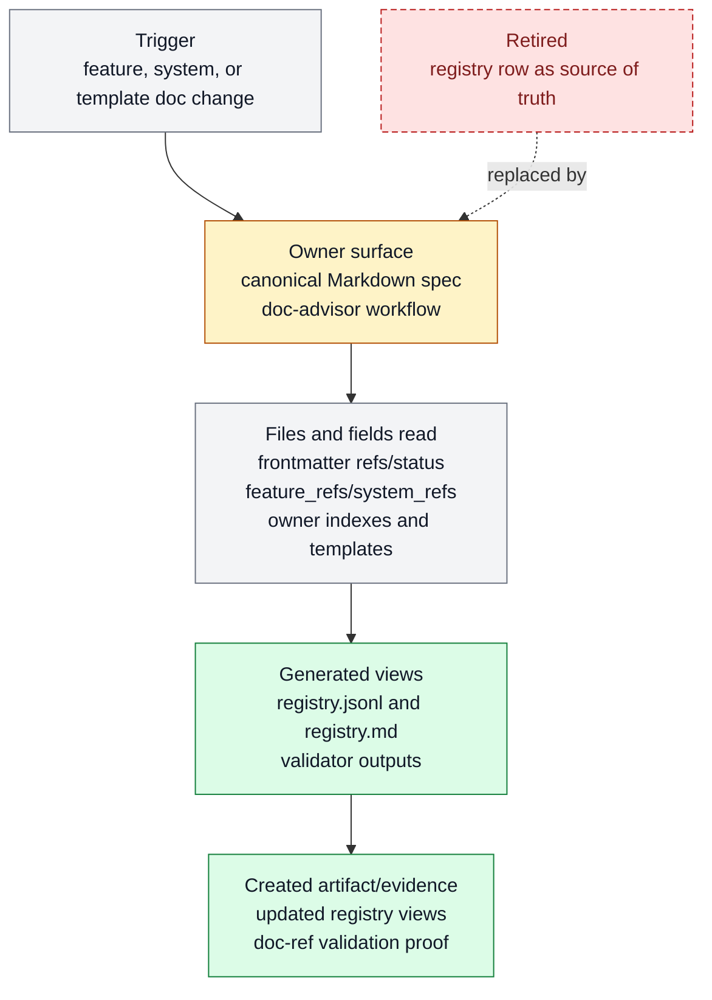

# Registry-backed documentation OS

Registry-backed documentation OS exists to make system and feature docs the source of
truth while registries stay generated outputs. It belongs to [Documentation
OS](../systems/documentation-os.md) and keeps `FEAT-0060` as a stable capability handle
because the behavior has an owner, proof path, and maintenance boundary.

```text
doc_registry_update(spec_docs) -> generated_registries + validation_report
```

## At A Glance

- Feature ID: `FEAT-0060`
- System: [Documentation OS](../systems/documentation-os.md)
- Status: `implemented`
- Category: `context-routing`
- Primary user: maintainer and documentation author
- Job: make system and feature docs the source of truth while registries stay generated outputs.

## Problem

Farplane had specs, features, future ideas, archives, registries, and templates drifting
as separate truth shelves.

This feature collapses the durable documentation model around reader-first feature and
system specs with generated registries for machine use.

Reader-first means more than correct placement. Documentation uses plain,
concrete words, names the actor or mechanism, and omits generic prose or
template structure that does not help the reader decide, act, verify, or
understand.

## What It Does

- Makes each surviving `FEAT-*` a Markdown feature spec with YAML frontmatter.
- Feature docs are the spec files.
- Makes `docs/systems/*.md` the public product-layer grouping for related features.
- Generates feature and system registries from docs instead of hand-editing JSONL rows.
- Keeps durable Markdown artifact-first and routes raw signal to tickets, experiments, or temporary research until distilled.
- Deletes or folds stale docs rather than preserving tracked archive noise.

## User Stories

- As an operator, I can understand Farplane's capabilities from specs rather than opaque registry rows.
- As a maintainer, I can edit one feature file and regenerate derived inventories.
- As a documentation agent, I know where a new doc belongs and how to prove it.

## Operating Contract

Docs are human contracts first; registries are generated views.

- Feature docs own feature behavior, surfaces, evidence, limits, and metadata.
- System docs own product-layer grouping and boundaries.
- Generated JSONL and Markdown registries are never the only source of truth.
- Stale feature rows are deleted unless they earn a clear feature spec.
- Template, feature, and system refs must validate together.
- No compatibility feature rows for capabilities that do not earn their own feature spec.

## Feature Flow



Legend:

- `gray = existing input, fields, or evidence read`
- `amber = owning or changed live surface`
- `green = created artifact or proof`
- `red dashed = retired or superseded path`

## Surfaces

Owner surfaces:

- `docs/features/README.md`
- `docs/features/TEMPLATE.md`
- `docs/features/validate_features.py`
- `docs/features/registry.jsonl`
- `docs/systems/README.md`
- `docs/systems/registry.jsonl`
- `docs/templates/registry.jsonl`
- `docs/templates/README.md`
- `rules/template-registry.toml`
- `rules/template-version-watch.toml`
- `bin/validators/sync_template_registry.py`
- `templates/global/AGENTS.md`
- `docs/systems/documentation-os.md`
- `docs/review/rubrics/documentation-quality.md`
- `skills/doc-advisor/SKILL.md`
- `skills/doc-advisor/references/doc-architecture.md`
- `skills/doc-advisor/references/metadata-and-registries.md`
- `skills/doc-advisor/references/feature-system-specs.md`
- `skills/doc-advisor/references/finish-gate.md`

Source context:

- `docs/features/README.md`
- `docs/systems/README.md`
- `docs/systems/documentation-os.md`
- `docs/review/rubrics/documentation-quality.md`
- `skills/doc-advisor/references/feature-system-specs.md`
- `docs/templates/registry.jsonl`

Evidence:

- `docs/features/validate_features.py`
- `bin/validators/test_check_doc_refs.py`
- `bin/validators/test_doc_parity.py`
- `bin/validators/test_sync_template_registry.py`
- `skills/doc-advisor/evals/evals.json`

## Proof And Quality

Required checks:

- `python3 docs/features/validate_features.py`
- `python3 bin/validators/check_doc_refs.py`
- `python3 bin/validators/check_doc_parity.py`
- `python3 skills/skill-maintenance/scripts/check_skills.py --write`

Acceptance signals:

- The feature remains listed under exactly one owning system.
- The owner surfaces still exist and agree with this contract.
- Evidence refs support the current status.

## Rollout And Maintenance

- Update this feature page first when the capability contract changes.
- Then update owner surfaces and regenerate feature/system registries when metadata changes.
- Preserve the feature ID while active templates, skills, tickets, or docs still reference it.
- Maintenance owner: Documentation OS.

## Limits And Non-Goals

- This feature does not preserve retired feature IDs for nostalgia.
- This feature does not keep permanent tracked archives by default.
- This feature does not turn raw future ideas into canonical docs before they earn an owner.
- No parallel spec-folder truth shelf.
- Known limit: Owns documentation, system, feature, and template registry coherence. It does not preserve retired feature IDs or permanent tracked archive docs just to keep historical noise searchable.
- Delete or merge this feature only when its current truth has moved into a clearer owner and all active refs are removed.

## Metrics

- `feature_registry_validation_pass`
- `template_feature_registry_validation_pass`
- `doc_reference_validation_pass`

## Alternatives Considered

- Keep this only as a registry row.
  Decision: reject.
  Reason: Farplane features must be readable specs, not opaque metadata entries.
- Fold this entirely into the owning system page.
  Decision: defer.
  Reason: keep the `FEAT-*` page while templates, skills, tickets, or proof surfaces need a stable capability handle.

## Change History

- 2026-06-26: Feature spec created.
- 2026-06-27: Migrated into the reader-first feature-spec shape.
