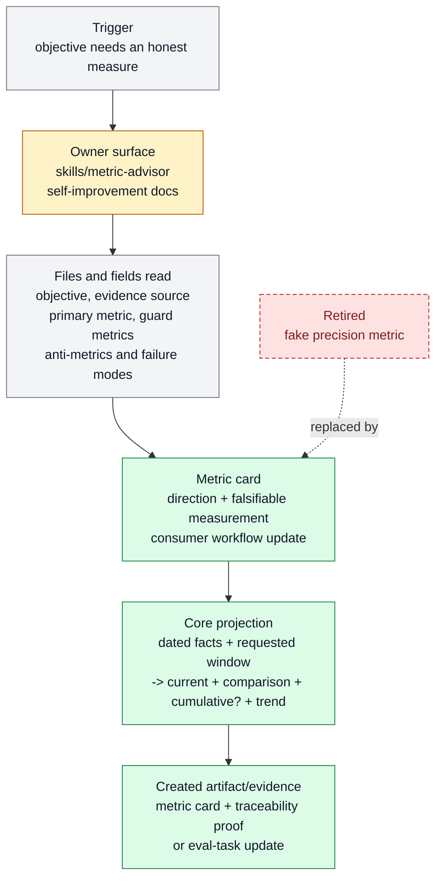

# Metric advisor cards

Metric advisor cards exists to turn fuzzy improvement goals into honest metric cards
with direction, guards, and anti-metrics. It belongs to [Self-Improvement And
Learning](../systems/self-improvement-learning.md) and keeps `FEAT-0063` as a stable
capability handle because the behavior has an owner, proof path, and maintenance
boundary.

```text
metric_card(objective, evidence)
  -> metric(type, unit, direction, refresh) + guard_metrics + anti_metrics + route
```

## At A Glance

- Feature ID: `FEAT-0063`
- System: [Self-Improvement And Learning](../systems/self-improvement-learning.md)
- Status: `implemented`
- Category: `skills`
- Primary user: operator, maintainer, and self-improvement agent
- Job: turn fuzzy improvement goals into honest metric cards with direction,
  guards, anti-metrics, and a proof route.

## Problem

Optimization work becomes sloppy when agents choose convenient numbers that do not match
the actual objective.

Metric advisor cards force the metric, guardrails, failure modes, and evidence route to
be stated before self-improvement or productization claims.

## What It Does

- Defines one primary metric for an objective, the evidence it depends on, and
  the honest optimize direction: `maximize` or `minimize`.
- Adds guard metrics and anti-metrics to prevent gaming.
- Names the measurement window, owner, and route into tickets, evals, reports, or docs.
- Keeps judgment-heavy work honest by allowing qualitative or rubric-based scores when numeric metrics would be fake.
- Leaves dated facts canonical while Core derives the requested-window value,
  preceding equal-window delta, direction-normalized trend, and cumulative
  total for flows.
- Avoids duplicate authored growth, timeframe, and cumulative metrics.
- Feeds self-improvement, documentation QA, skill maintenance, and product learning loops.

## User Stories

- As an operator, I can see what an optimization is actually trying to improve.
- As a maintainer, I can reject fake metrics before they guide work.
- As a self-improvement agent, I can route evidence into the right proof surface.

## Operating Contract

A metric card makes the measurement choice explicit and falsifiable.

- Every quantitative card names objective, primary metric, evidence source,
  direction, guard metrics, and anti-metrics.
- The card states what would make the metric misleading.
- Direction means favorable movement: a positive progress delta is favorable
  for both maximize and minimize metrics after Core normalizes the raw delta.
- Type means aggregation semantics: flows sum inside a window and across
  history; stocks select the latest known value at each window boundary and
  never emit cumulative totals.
- A `markdown` type is only one current qualitative paragraph (for example,
  project Edge), not a score: Core selects the latest valid dated paragraph and
  exposes no comparison, series, or cumulative value. It cannot declare a
  unit, direction, target, guard, or display hint.
- Judgment rubrics are allowed when they are more honest than pseudo-precision.
- Metric changes update the downstream workflow that consumes them.

## Feature Flow



Legend:

- `gray = existing input, fields, or evidence read`
- `amber = owning or changed live surface`
- `green = created artifact or proof`
- `red dashed = retired or superseded path`

## Surfaces

Owner surfaces:

- `skills/metric-advisor`
- `docs/skills/README.md`
- `docs/features/FEAT-0039-behavior-correction-hardcase-metadata-and-narrow-eval-capture.md`
- `docs/features/FEAT-0008-artifact-first-qa-and-completion-proof.md`

Source context:

- `tickets/archive/TASK-0228/ticket.md`
- `skills/best-of-worlds/references/metric-discovery.md`
- `docs/features/FEAT-0039-behavior-correction-hardcase-metadata-and-narrow-eval-capture.md`

Evidence:

- `skills/metric-advisor/SKILL.md`
- `skills/metric-advisor/evals/evals.json`
- `tickets/archive/TASK-0228/ticket.md`

## End-To-End Contract

One authored metric:

```yaml
metrics:
  revenue:
    type: flow
    unit: USD
    direction: maximize
    refresh_ref: accounting_daily

refreshers:
  accounting_daily:
    refresh: Record today's recognized revenue, or emit a source gap.
```

Canonical observations contain facts, not projections:

```json
{
  "source_id": "accounting_daily",
  "date": "2026-07-04",
  "observations": [
    {
      "metric_id": "revenue",
      "date": "2026-07-04",
      "value": 700,
      "status": "available",
      "payload": {"source_ref": "ledger:2026-07-04"}
    }
  ]
}
```

The caller asks Core for a view:

```text
project_snapshot(window_start="2026-07-03", window_end="2026-07-04",
                 timezone="Asia/Kuala_Lumpur")
  -> current.value = 1400
  -> comparison.previous_value = 1000
  -> comparison.absolute_delta = 400
  -> comparison.percent_delta = 40
  -> comparison.momentum = improving
  -> cumulative.value = 2400
```

The YAML does not contain cadence, alignment, comparison, aggregation,
cumulative, formulas, or derived `revenue_growth` metrics. The automation or UI
chooses the window. A prompt-based refresher may emit a derived business fact
such as `profit`, but it remains its own observed metric and requires no formula
language in the schema.

## Proof And Quality

Required checks:

- `python3 docs/features/validate_features.py`
- `python3 bin/validators/check_doc_refs.py`

Acceptance signals:

- The feature remains listed under exactly one owning system.
- The owner surfaces still exist and agree with this contract.
- Quantitative metrics declare `flow | stock`, unit, and `maximize | minimize`;
  projections do not replace or mutate raw observations.
- Evidence refs support the current status.

## Rollout And Maintenance

- Update this feature page first when the capability contract changes.
- Then update owner surfaces and regenerate feature/system registries when metadata changes.
- Preserve the feature ID while active templates, skills, tickets, or docs still reference it.
- Maintenance owner: Self-Improvement And Learning.

## Limits And Non-Goals

- This feature does not invent fake quantitative metrics for subjective work.
- This feature does not run experiments by itself.
- This feature does not replace evals or proof artifacts.
- Core does not manufacture zeroes for absent flow facts. The refresher must
  emit an available zero or an explicit source gap when that distinction
  matters.
- Delete or merge this feature only when its current truth has moved into a clearer owner and all active refs are removed.

## Metrics

- `metric_card_traceability_pass`
- `skill_eval_query_lint_pass`

## Alternatives Considered

- Keep this only as a registry row.
  Decision: reject.
  Reason: Farplane features must be readable specs, not opaque metadata entries.
- Fold this entirely into the owning system page.
  Decision: defer.
  Reason: keep the `FEAT-*` page while templates, skills, tickets, or proof surfaces need a stable capability handle.

## Change History

- 2026-06-26: Feature spec created.
- 2026-06-27: Migrated into the reader-first feature-spec shape.
- 2026-07-25: Required direction for quantitative metrics and documented Core
  derived movement as a projection over canonical raw observations.
- 2026-07-26: Replaced consecutive-reading movement with the lean
  flow/stock definition and equal-window current, comparison, cumulative, and
  trend projection contract.
