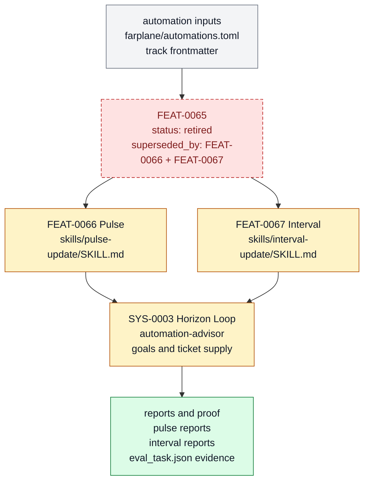

# Pulse and interval automation

Pulse and interval automation is retired as the older umbrella feature for recurring Pulse and interval behavior. Product-scoped Pulse loops and daily interval review reports now carry the active contracts under `FEAT-0066` and `FEAT-0067`.

```text
horizon_tick(window, state) -> bounded_action | report | no_op + learning_signal
```

## At A Glance

- Feature ID: `FEAT-0065`
- System: [Horizon Loop](../systems/horizon-loop.md)
- Status: `retired`
- Category: `planning`
- Primary user: operator and horizon-loop agent
- Job: preserve the old umbrella handle while successor features own active Pulse and daily interval UX.

## Problem

A business needs recurring motion, but hidden autonomy can mutate state without visible
proof or human authority.

Pulse and interval automation keeps recurring work explicit: configs, prompts,
reports, tickets, artifacts, and no-op decisions all have visible owners.

## What It Does

- Runs Pulse as a fast bounded action decision.
- Runs interval or daily updates to reconcile recent outcomes and plan the next window.
- Runs horizon updates to recalibrate goals, product bets, ticket supply, and skill hardening priorities.
- Uses adaptive backoff for polling and waits without creating hidden background queues.
- Feeds repeated unmet needs into maintenance, feature work, or sidecar systems.

## User Stories

- As an operator, I can let Farplane keep momentum without losing visibility.
- As a horizon-loop agent, I can choose one safe action or report no-op with reasons.
- As a maintainer, I can see which loops generate useful ticket supply and which should be tuned.

## Operating Contract

Longer-horizon autonomy must remain visible, ticket-backed, and proof-aware.

- Each automation has a visible full TOML config owner.
- Outputs land in tickets, reports, docs, or another durable owner.
- Repeated checks widen by backoff and reset on progress.
- Humans own ambiguous direction, destructive changes, spend, deploys, and hard-to-reverse architecture choices.
- Learning signals create ticket supply, skill maintenance, feature specs, or explicit no-op decisions.

## Feature Flow



The umbrella automation handle is retired; Pulse and Interval now split active ownership under the Horizon Loop and write visible reports.

## Surfaces

Owner surfaces:

- `farplane/automations.toml`
- `skills/pulse-update/SKILL.md`
- `skills/interval-update/SKILL.md`
- `skills/automation-advisor/SKILL.md`

Source context:

- `docs/features/FEAT-0029-goal-packet-architecture-for-native-codex-goals.md`

Evidence:

- `skills/pulse-update/eval_task.json`
- `skills/interval-update/eval_task.json`
- `skills/automation-advisor/audits/2026-06-24-automation-prompt-qa.md`

## Proof And Quality

Required checks:

- `python3 docs/features/validate_features.py`
- `python3 bin/validators/check_doc_refs.py`

Acceptance signals:

- The feature remains listed under exactly one owning system.
- The owner surfaces still exist and agree with this contract.
- Evidence refs support the current status.

## Rollout And Maintenance

- Update this feature page first when the capability contract changes.
- Then update owner surfaces and regenerate feature/system registries when metadata changes.
- Preserve the feature ID while active templates, skills, tickets, or docs still reference it.
- Maintenance owner: Horizon Loop.

## Limits And Non-Goals

- This feature does not create an invisible background queue.
- This feature does not require a bespoke sidecar before the basic ticket loop works.
- This feature does not let automation bypass human authority for risky choices.
- Known limit: Full TOML automation configs and previewable loops exist, but Farplane still avoids hidden daemons and requires visible tickets, reports, or automations as state surfaces.
- Delete or merge this feature only when its current truth has moved into a clearer owner and all active refs are removed.

## Metrics

- `pulse_action_relevance`
- `interval_report_usefulness`
- `ticket_supply_learning`

## Alternatives Considered

- Keep this only as a registry row.
  Decision: reject.
  Reason: Farplane features must be readable specs, not opaque metadata entries.
- Fold this entirely into the owning system page.
  Decision: defer.
  Reason: keep the `FEAT-*` page while templates, skills, tickets, or proof surfaces need a stable capability handle.

## Change History

- 2026-06-27: Feature spec created.
- 2026-06-27: Migrated into the reader-first feature-spec shape.
- 2026-07-02: Standardized project automation source on full TOML records in `farplane/automations.toml`.
- 2026-07-07: Retired the older umbrella behavior and linked
  product-scoped Pulse loops plus daily interval reports as successor feature
  handles for dogfood tracking.
