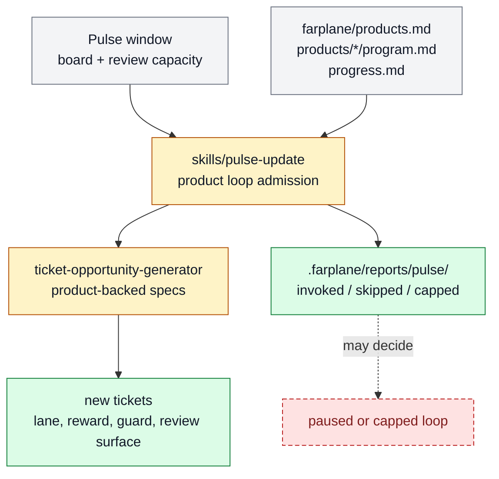

# Product-scoped Pulse loops

Product-scoped Pulse loops let Pulse refill work from named product lanes instead of
acting like one global ticket planner. The feature belongs to [Horizon
Loop](../systems/horizon-loop.md) and is experimental because the current value depends
on whether product loops create reviewable, reward-backed tickets without flooding the
operator.

```text
product_scoped_pulse(board_state, product_programs, strategy_inputs)
  -> product_loop_invocations + ticket_specs + handoffs + report_decision
```

## At A Glance

- Feature ID: `FEAT-0066`
- System: [Horizon Loop](../systems/horizon-loop.md)
- Status: `partial`
- Experimental: `true`
- Category: `planning`
- Primary user: operator, Pulse manager, and product-loop worker
- Job: refill the execution board from product-local beliefs, budgets, and review caps.

## Problem

One global Pulse planner can create a lot of work without enough product context. That
makes the board look active while hiding whether tickets are tied to a real product
lane, reward, or review capacity.

Product-scoped Pulse loops move the next-wave decision closer to each product's
program, progress, worker budget, and artifact contract.

## What It Does

- Reads `farplane/products.md` and product-local `program.md` / `progress.md`.
- Chooses eligible product loops when the reward-bearing board has capacity.
- Asks ticket generation to produce executable, product-backed ticket specs.
- Records invoked, skipped, capped, or blocked product loops in Pulse reports.
- Leaves ticket execution to Work Loop and Goal Advisor after a ticket exists.

## User Stories

- As an operator, I can see which product lane created a ticket and why it was worth review.
- As a Pulse manager, I can stop refilling from lanes that are already at review capacity.
- As a reviewer, I can judge whether generated tickets are duplicates, vague, or reward-backed.

## Operating Contract

Product-scoped Pulse is a planning and admission feature, not a background executor.

- Product-loop policy lives in `farplane/products/<product>/program.md`.
- Runtime learning lives in product-local `progress.md` and Pulse reports.
- Generated tickets must name product lane, workflow ID, reward, guard, artifact level,
  review surface, and learning writeback target.
- Dogfood review decides whether the loop continues, caps, adjusts, pauses, or
  graduates from experimental status.

## Feature Flow



Gray is product and window input, amber is Pulse admission behavior, green is generated ticket/report output, and red dashed is a loop capped or paused by review.

## Surfaces

- Owner surfaces:
  - `docs/farplane-framework/pulse-and-interval-loop.md`
  - `farplane/products.md`
  - `skills/pulse-update/SKILL.md`
  - `skills/ticket-opportunity-generator/SKILL.md`
- Supporting surfaces:
  - `farplane/products/*/program.md`
  - `farplane/products/*/progress.md`
- Generated surfaces:
  - `.farplane/reports/pulse/`
  - `.farplane/reports/dogfood-review/`

## Proof And Quality

- Evidence:
  - `skills/pulse-update/eval_task.json`
  - `farplane/products/experiments/program.md`
- Required checks:
  - `python3 docs/features/validate_features.py`
  - `python3 bin/validators/check_doc_refs.py`
- Acceptance signals:
  - Pulse reports show product-loop invoked/skipped/capped decisions.
  - Generated tickets are product-backed, non-duplicative, and reviewable.
  - Dogfood review recommends `continue` or `graduate` without review-overload warnings.

## Rollout And Maintenance

- Update path: refine product-loop policy, Pulse admission gates, and ticket generator
  evidence requirements before changing global agent policy.
- Rollback path: cap or pause product-loop refill and keep direct ticket execution working.
- Compatibility notes: legacy global Pulse planning is superseded by product-scoped
  planning for ticket supply, while interval reporting remains separate.
- Maintenance owner: Horizon Loop.

## Limits And Non-Goals

- This feature does not execute tickets.
- This feature does not guarantee every product lane gets equal work.
- This feature does not create a hidden queue or scheduler.
- Known weak spot: ticket supply quality still depends on product-loop evidence and
  review capacity.
- Delete or merge this feature when product-scoped Pulse either graduates into stable
  Pulse doctrine or is rejected and folded back into `FEAT-0065`.

## Alternatives Considered

- Option: Keep one global Pulse planner.
  Decision: adapt.
  Reason: global Pulse remains the manager bus, but ticket supply needs product-local
  evidence and caps.
- Option: Create a separate product scheduler.
  Decision: reject.
  Reason: Farplane should keep visible prompts, reports, and product files instead of
  adding hidden orchestration.

## Change History

- 2026-07-07: Created as the experimental successor for product-backed Pulse ticket supply.
