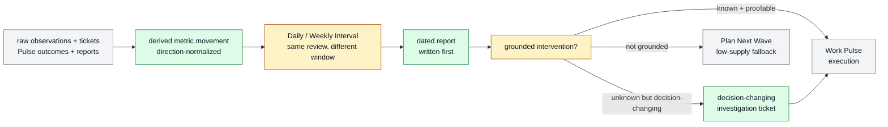

# Daily and weekly control-loop reviews

Daily and Weekly Interval run the same evidence-to-bottleneck-to-ticket review
over different evidence windows. Each run first writes a dated report from raw
observations, metric movement, ticket history, and supporting evidence. After
the report is finalized, the same run may create, update, reprioritize, date,
or reject tickets when the intervention is grounded, material, executable,
deduped, authority-safe, and tied to concrete proof.

```text
interval_update(project_root, interval_id, review_window, context_refs?,
                write_policy?)
  -> dated_report + problems
   + admitted_ticket_deltas[] + rejected_candidates[] + source_gaps
```

## At A Glance

- Feature ID: `FEAT-0067`
- System: [Horizon Loop](../systems/horizon-loop.md)
- Status: `implemented`
- Experimental: `true`
- Category: `planning`
- Primary user: operator and Work Pulse planner
- Job: turn report-first evidence review into the strongest proofable ticket
  deltas without creating hidden strategy state.

## Problem

The previous Interval matrix mixed reflection, Feed Scout, Dogfood Review,
reward mutation, maintenance, leverage synthesis, and next-window planning.
That made a reporting cadence compete with Pulse, refill planning, and
self-improvement for ownership. Interval now owns the first-principles review
for current evidence, while Pulse owns dispatch and Plan Next Wave owns
low-supply refill.

## What It Does

- Daily summarizes the last operational window: work outcomes, obligations,
  anomalies, current signals, raw metric observations, derived movement, and
  open problems.
- Weekly synthesizes repeated problems, metric movement, review load, and
  unresolved maintenance across Daily reports.
- Weekly may record zero to three proof-linked `Executive Update` cards for a
  separate company-level editorial workflow. Cards classify reader safety,
  carry only verified metrics and existing public media links, and may honestly
  report no eligible update; they never publish or affect ticket admission.
- Each report contains a minimal Markdown `## Problems` checkbox ledger.
- After finalization, a report may select at most one exceptional metric win
  and one lesson-bearing failure per team. Selection appends minimal rows to
  `.farplane/highlights/wins.jsonl` and `failures.jsonl`; an honest no-op is
  valid.
- Wins require verified comparative metric evidence such as a record,
  meaningful threshold crossing, or exceptional delta. Routine delivery is not
  a win. Failures require a reusable lesson for a human or later agent.
- A report may admit a ticket delta when the bottleneck, intervention,
  KPI/guard, proof, stop condition, authority, and dedupe checks are settled.
- An investigation ticket is valid only when its required output is
  decision-changing evidence: reproduced cause, ruled-out alternatives,
  selected correction, and proof artifact.
- A finding remains report-only when evidence is low-materiality, vague,
  duplicate, authority-unsafe, planning-only, or lacks a safe proof route.

## Operating Contract

```text
metric movement + evidence -> Interval report
grounded intervention      -> same-run ticket delta
decision-changing unknown  -> investigation ticket
insufficient evidence      -> no ticket mutation; possible later refill context
ticket execution/checkin   -> Work Pulse / Goal Packet
```

Interval writes its report before any board mutation, including highlights and
ticket deltas. Candidates must be actionable, material, deduped against
active/recent work, authority-safe, and able to name proof plus a stop
condition. There is no arbitrary ticket-count cap. Interval does not run Feed
Scout, Dogfood Review, reward check-ins, Plan Next Wave, Goal execution, or
workers.
Highlight selection is presentation output, not correction memory: tickets,
skills, gotchas, and lessons continue to own fixes and prevention.

## Feature Flow



## Proof And Quality

Required proof:

- raw observations remain the canonical evidence and derived movement is used
  only as a review signal;
- Daily and Weekly share the same review/admission contract and differ only by
  evidence window;
- grounded known interventions create ticket deltas in the same Interval run;
- investigations are admitted only when they must produce decision-changing
  evidence;
- duplicates, vague fixes, authority gaps, planning-only work, and ungrounded
  direction are rejected;
- highlight reruns are idempotent by `(kind, team, report)`, ordinary shipping
  is rejected as a win, and every failure includes a reusable lesson;
- Daily and Weekly reports remain useful without running Plan Next Wave;
- `python3 docs/features/validate_features.py` and
  `python3 bin/validators/check_doc_refs.py` pass.

## Rollout And Maintenance

- Update path: refine the two report profiles, Problems ledger, bottleneck
  review, and ticket-admission gates.
- Rollback path: retain reports with an empty candidate set.
- Maintenance owner: Horizon Loop.

## Limits And Non-Goals

- Interval does not store mutable project strategy outside tickets.
- Interval does not execute tickets or update delayed reward results.
- Interval reports link ticket-owned QA and review evidence instead of copying
  it into a findings registry.
- The Executive Update section is project-local editorial source material, not
  a publication channel; raw threads, private paths, client data, secrets, and
  unpublished media remain ineligible.
- Feed Scout and Dogfood remain separate scheduled jobs with separate reports.

## Change History

- 2026-07-07: Created as an experimental Daily report feature.
- 2026-07-11: Reframed Daily and Weekly as BAU problem reports with bounded
  prior-evidence maintenance candidates.
- 2026-07-12: Centralized exploratory admission in the one global planner while
  preserving bounded direct recovery for evidenced known failures.
- 2026-07-24: Added post-finalization exceptional-win and lesson-bearing
  failure highlights backed by minimal append-only JSONL ledgers.
- 2026-07-25: Consolidated Interval into the report-first evidence-to-ticket
  review owner for metric movement, bottlenecks, grounded interventions, and
  decision-changing investigations.
