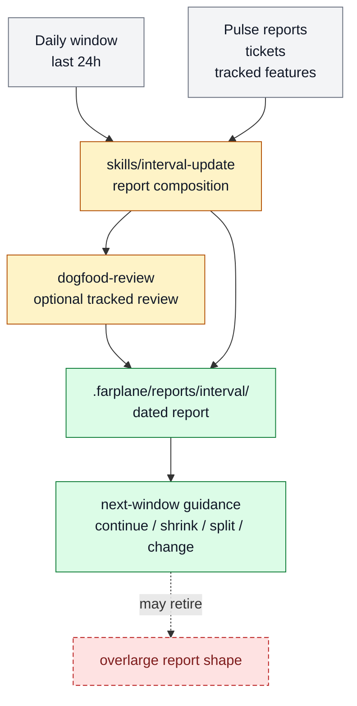

# Daily interval review reports

Daily interval review reports turn the last day of Farplane activity into an
operator-readable report with next-window guidance. The feature belongs to [Horizon
Loop](../systems/horizon-loop.md) and is experimental while the report learns how much
Pulse, ticket, dogfood, metric, and memory evidence belongs in one daily artifact.

```text
daily_interval_review(window, tracked_registry, reports, tickets)
  -> interval_report + dogfood_summary? + next_window_guidance
```

## At A Glance

- Feature ID: `FEAT-0067`
- System: [Horizon Loop](../systems/horizon-loop.md)
- Status: `partial`
- Experimental: `true`
- Category: `planning`
- Primary user: operator and horizon-loop agent
- Job: summarize daily outcomes, source gaps, tracked feature findings, and next bets.

## Problem

Pulse and product loops can create too much granular state for a human to inspect one
thread or ticket at a time. The operator needs a daily report that says what happened,
what mattered, what is noisy, and what should change.

## What It Does

- Reviews the last 24-hour window.
- Writes a dated interval report under `.farplane/reports/interval/`.
- Calls `dogfood-review` when tracked feature or system prompts exist.
- Links or summarizes dogfood reports before final next-window planning.
- Recommends Pulse guidance without mutating tickets, goals, or automation config directly.

## User Stories

- As an operator, I can read one report instead of opening every Pulse ticket.
- As a Pulse maintainer, I can see whether ticket supply is working or flooding review.
- As a dogfood reviewer, I can connect feature tracking decisions back to interval context.

## Operating Contract

Daily interval reports are evidence summaries, not hidden schedulers.

- The interval skill owns report composition.
- `dogfood-review` owns tracked feature/system judgment.
- Reports live under `.farplane/reports/interval/` and `.farplane/reports/dogfood-review/`.
- The report names missing evidence as a source gap instead of guessing.

## Feature Flow



Gray is evidence input, amber is report/review behavior, green is the report and guidance output, and red dashed is a report shape the experiment may shrink or retire.

## Surfaces

- Owner surfaces:
  - `skills/interval-update/SKILL.md`
  - `skills/interval-update/references/interval-update.md`
  - `skills/dogfood-review/SKILL.md`
- Generated surfaces:
  - `.farplane/reports/interval/`
  - `.farplane/reports/dogfood-review/`

## Proof And Quality

- Evidence:
  - `skills/interval-update/eval_task.json`
  - `skills/dogfood-review/eval_task.json`
- Required checks:
  - `python3 docs/features/validate_features.py`
  - `python3 bin/validators/check_doc_refs.py`
- Acceptance signals:
  - Daily interval report links dogfood review when tracking is enabled.
  - Report decisions cite evidence or source gaps.
  - Next-window guidance is short enough for the operator to act on.

## Rollout And Maintenance

- Update path: adjust interval report template, dogfood summary shape, and report filters.
- Rollback path: disable `tracked_feature_review` while keeping base interval reporting.
- Compatibility notes: this splits the daily report UX from the older umbrella
  Pulse/Interval feature.
- Maintenance owner: Horizon Loop.

## Limits And Non-Goals

- This feature does not run Pulse itself.
- This feature does not mutate feature docs after review.
- This feature does not replace ticket-level proof or reviewer receipts.
- Known weak spot: the report is only as good as recent tickets, Pulse reports, and
  dogfood evidence.
- Delete or merge this feature when daily reports become stable enough to fold into
  `FEAT-0065` or are replaced by a clearer report UI.

## Alternatives Considered

- Option: Keep all interval logic inside `FEAT-0065`.
  Decision: adapt.
  Reason: the daily review UX is distinct enough to track while experimental.
- Option: Make dogfood review the interval report.
  Decision: reject.
  Reason: dogfood review is one report input; interval still owns whole-window planning.

## Change History

- 2026-07-07: Created as the experimental daily report feature.
