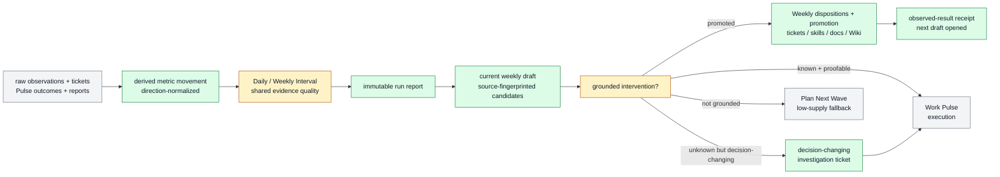

# Daily and weekly control-loop and knowledge reviews

Daily and Weekly Interval are one bounded review workflow with different write
authority. Daily writes its immutable window report and source-fingerprinted
candidate upserts into the current weekly working draft. Weekly dispositions
every candidate, freezes the report, promotes only authorized durable records,
writes the observed-result receipt, and opens the next draft.

```text
interval_update(project_root, interval_id, review_window, context_refs?,
                write_policy?, knowledge_write_policy?)
  -> dated_report + problems
   + weekly_draft_delta + candidate_sets + source_gaps
   + ticket_deltas[] + knowledge_receipt
   + promoted_records[]? + next_week_draft?
```

## At A Glance

- Feature ID: `FEAT-0067`
- System: [Horizon Loop](../systems/horizon-loop.md)
- Status: `implemented`
- Experimental: `true`
- Category: `planning`
- Primary user: operator and Work Pulse planner
- Job: turn one bounded evidence window into report-first operating context,
  selectively promoted project knowledge, and immutable weekly history.

## Problem

The previous Interval matrix mixed reflection, Feed Scout, Dogfood Review,
reward mutation, maintenance, leverage synthesis, and next-window planning.
That made a reporting cadence compete with Pulse, refill planning, and
self-improvement for ownership. Interval now owns the first-principles review
for current evidence, while Pulse owns dispatch and Plan Next Wave owns
low-supply refill.

## What It Does

- Daily summarizes the last operational window: work outcomes, obligations,
  anomalies, current signals, raw metric observations, derived movement, and
  open problems.
- Daily upserts progress, problems, decisions, SOPs, resources, entity facts,
  documentation-quality gaps, completeness questions, and follow-up proposals
  into the current weekly draft. It promotes no durable knowledge.
- Weekly reads the draft and Daily receipts, assigns every candidate an
  explicit disposition, freezes the report, applies authorized promotions,
  finalizes the draft, and opens the next reporting window.
- Candidate identity is stable source locator plus intended owner plus content
  digest. Draft fingerprints, current destinations, and receipts make reruns
  idempotent without a global mutable memory ledger.
- `farplane/harness.yaml` remains stable project identity; the current weekly
  draft is compact operating context; tickets, skills, docs, and Wiki articles
  are canonical promoted records; finalized weekly reports are history.
- Weekly may record zero to three proof-linked `Executive Update` cards for a
  separate company-level editorial workflow. Cards classify reader safety,
  carry only verified metrics and existing public media links, and may honestly
  report no eligible update; they never publish or affect ticket admission.
- Each report contains a minimal Markdown `## Problems` checkbox ledger.
- After finalization, a report may select at most one exceptional metric win
  and one lesson-bearing failure per team. Selection appends minimal rows to
  `.farplane/highlights/wins.jsonl` and `failures.jsonl`; an honest no-op is
  valid.
- Wins require verified comparative metric evidence such as a record,
  meaningful threshold crossing, or exceptional delta. Routine delivery is not
  a win. Failures require a reusable lesson for a human or later agent.
- Daily may update only explicitly supported mutable task progress. Weekly may
  admit a ticket delta when bottleneck, intervention, proof, authority, and
  dedupe checks are settled.
- An investigation ticket is valid only when its required output is
  decision-changing evidence: reproduced cause, ruled-out alternatives,
  selected correction, and proof artifact.
- A finding remains report-only when evidence is low-materiality, vague,
  duplicate, authority-unsafe, planning-only, or lacks a safe proof route.

## Operating Contract

```text
current-window evidence    -> immutable Daily report + weekly draft upserts
new problem                -> weekly candidate; no Daily ticket promotion
Weekly promoted problem    -> qualified ticket
Weekly promoted SOP        -> skill-maintenance -> owning skill
Weekly project knowledge   -> doc-advisor -> owning project doc or MEMORY
Weekly entity knowledge    -> manage-wiki -> Entity Markdown + projections
stale commitment           -> chase proposal; sending separately gated
ticket execution/checkin   -> Work Pulse / Goal Packet
```

Interval writes its report before any highlight, board, skill, doc, or Wiki
mutation. Ticket candidates must be actionable, material, deduped against
active/recent work, authority-safe, and able to name proof plus a stop
condition. There is no arbitrary ticket-count cap. Interval does not run Feed
Scout, Dogfood Review, reward check-ins, Plan Next Wave, Goal execution, or
workers.
Weekly candidates must pass their type-specific value gate, source quality,
destination diff, authority, privacy, and route validation. Ambiguous,
conflicting, weakly sourced, or broad changes remain report history. The
sibling receipt records observed results without rewriting the report.

## Feature Flow



## Proof And Quality

Required proof:

- raw observations remain the canonical evidence and derived movement is used
  only as a review signal;
- Daily and Weekly share evidence-quality, extraction, and dedupe rules while
  write authority differs explicitly;
- Daily upserts candidates without canonical knowledge promotion or new problem
  tickets and may update only supported mutable task progress;
- Weekly gives every candidate one disposition before finalization;
- investigations are admitted only when they must produce decision-changing
  evidence;
- duplicates, vague fixes, authority gaps, planning-only work, and ungrounded
  direction are rejected;
- highlight reruns are idempotent by `(kind, team, report)`, ordinary shipping
  is rejected as a win, and every failure includes a reusable lesson;
- Daily and Weekly reports remain useful without running Plan Next Wave;
- Daily reruns append no duplicate candidate and report zero promotions;
- Weekly reads the draft and Daily receipts, avoids raw-week replay, freezes the
  report before promotion, and opens the next draft afterward;
- SOP, project-doc, and entity knowledge route respectively through
  `skill-maintenance`, `doc-advisor`, and `manage-wiki`;
- `python3 docs/features/validate_features.py` and
  `python3 bin/validators/check_doc_refs.py` pass.

## Rollout And Maintenance

- Update path: refine the two report profiles, Problems ledger, bottleneck
  review, and ticket-admission gates.
- Rollback path: retain reports with an empty candidate set.
- Maintenance owner: Horizon Loop.

## Limits And Non-Goals

- The weekly draft stores bounded current operating context, not strategy; it
  cannot silently rewrite protected `farplane/harness.yaml` fields.
- Interval does not execute tickets or update delayed reward results.
- Interval does not copy raw task transcripts into durable docs or apply broad,
  ambiguous, unsupported, or privacy-sensitive knowledge changes.
- Interval reports link ticket-owned QA and review evidence instead of copying
  it into a findings registry.
- The Executive Update section is project-local editorial source material, not
  a publication channel; raw threads, private paths, client data, secrets, and
  unpublished media remain ineligible.
- Feed Scout and Dogfood remain separate scheduled jobs with separate reports.

## Change History

- 2026-07-07: Created as an experimental Daily report feature.
- 2026-07-11: Reframed Daily and Weekly as BAU problem reports with bounded
  prior-evidence maintenance candidates.
- 2026-07-12: Centralized exploratory admission in the one global planner while
  preserving bounded direct recovery for evidenced known failures.
- 2026-07-24: Added post-finalization exceptional-win and lesson-bearing
  failure highlights backed by minimal append-only JSONL ledgers.
- 2026-07-25: Consolidated Interval into the report-first evidence-to-ticket
  review owner for metric movement, bottlenecks, grounded interventions, and
  decision-changing investigations.
- 2026-08-20: Expanded Interval into the parent reporting-and-knowledge
  workflow with Daily incremental owner updates, immutable knowledge receipts,
  and Weekly consolidation/showcase.
- 2026-08-20: Replaced eager Daily knowledge writes with a current weekly
  working draft, Daily zero-promotion receipts, and Weekly selective promotion.
