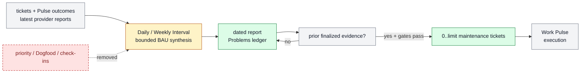

# Daily and weekly BAU problem reports

Daily and Weekly Interval compress bounded project evidence into reports and
resurface already-known business-as-usual problems as executable maintenance
tickets. They do not plan new direction or execute ticket work.

```text
interval_update(project_root, interval_id, review_window, context_refs?,
                maintenance_ticket_limit?)
  -> dated_report + problems
   + maintenance_ticket_deltas[0..limit] + source_gaps
```

## At A Glance

- Feature ID: `FEAT-0067`
- System: [Horizon Loop](../systems/horizon-loop.md)
- Status: `implemented`
- Experimental: `true`
- Category: `planning`
- Primary user: operator and Work Pulse planner
- Job: preserve a compact BAU problem history and create only already-justified
  corrective work.

## Problem

The previous Interval matrix mixed reflection, Feed Scout, Dogfood Review,
reward mutation, maintenance, leverage synthesis, and next-window planning.
That made a reporting cadence compete with Pulse and self-improvement for
ticket supply.

## What It Does

- Daily summarizes the last operational window: work outcomes, obligations,
  anomalies, current signals, metrics, and open BAU problems.
- Weekly synthesizes repeated BAU problems, goal/metric drift, review load, and
  unresolved maintenance across Daily reports.
- Each report contains a minimal Markdown `## Problems` checkbox ledger.
- A report may create or update a bounded maintenance ticket only when a prior
  finalized report, ticket, review, or run artifact already proves the problem.
- A problem first discovered in the current run remains ledger-only until a
  later interval or explicit operator action.

## Operating Contract

```text
new BAU direction       -> plan_next_wave
known BAU problem       -> Interval report + optional maintenance ticket
experiment improvement  -> Dogfood self-improvement automation
ticket execution/checkin -> Work Pulse
```

Interval writes its report before any ticket delta. Maintenance tickets must be
actionable, material, deduped against active/recent work, authority-safe, and
able to name proof plus a stop condition. Interval does not run Feed Scout,
Dogfood Review, reward check-ins, priority planning, Goal execution, or workers.

## Feature Flow



## Proof And Quality

Required proof:

- current-run discoveries remain ledger-only;
- prior-evidenced problems can create no more than the configured ticket cap;
- duplicates, vague fixes, authority gaps, and new direction are rejected;
- Daily and Weekly reports remain useful without priority planning;
- `python3 docs/features/validate_features.py` and
  `python3 bin/validators/check_doc_refs.py` pass.

## Rollout And Maintenance

- Update path: refine the two report profiles, Problems ledger, and maintenance
  admission checks.
- Rollback path: set maintenance ticket limit to zero while retaining reports.
- Maintenance owner: Horizon Loop.

## Limits And Non-Goals

- Interval does not decide product or harness strategy.
- Interval does not execute tickets or update delayed reward results.
- Interval reports link ticket-owned QA and review evidence instead of copying
  it into a findings registry.
- Feed Scout and Dogfood remain separate scheduled jobs with separate reports.

## Change History

- 2026-07-07: Created as an experimental Daily report feature.
- 2026-07-11: Reframed Daily and Weekly as BAU problem reports with bounded
  prior-evidence maintenance ticket supply.
