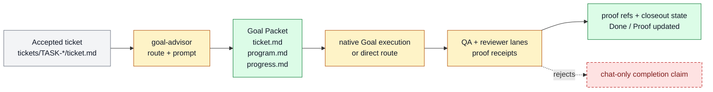

# Goal-backed ticket execution

Goal-backed ticket execution is the UX that turns an accepted ticket into autonomous
work with visible state, proof, and review. It belongs to [Work
Loop](../systems/work-loop.md) and is marked experimental because the current dogfood
question is whether the execution path feels reliable enough as a product workflow, not
because every underlying piece is new.

```text
goal_backed_ticket_execution(ticket, program?, progress?)
  -> changed_artifacts + proof_refs + reviewer_verdict + closeout_state
```

## At A Glance

- Feature ID: `FEAT-0068`
- System: [Work Loop](../systems/work-loop.md)
- Status: `implemented`
- Experimental: `true`
- Category: `execution`
- Primary user: operator, executor agent, and reviewer
- Job: execute a ticket through Goal Packet state, proof artifacts, and reviewer gates.

## Problem

Ticket execution can look complete in chat while the durable task state is incomplete.
The operator needs the execution path itself to be inspectable: scope, program, progress,
proof, review, closeout, and residual risk should survive interruption.

## What It Does

- Starts from a material ticket or equivalent accepted owner.
- Uses Goal Advisor to compile the execution route when Goal-backed work is needed.
- Keeps state in `ticket.md`, `program.md`, `progress.md`, and artifacts.
- Requires proof and reviewer evidence for material completion claims.
- Separates execution from Pulse planning and product-loop ticket supply.

## User Stories

- As an operator, I can see whether a ticket actually progressed or only produced chat.
- As an executor, I can resume from filesystem state.
- As a reviewer, I can compare the completion claim against proof and ticket gates.

## Operating Contract

Goal-backed ticket execution is not a daemon.

- Tickets own scope and Done / Proof.
- Goal Advisor owns route compilation.
- Native Goal mode owns continuation when selected.
- QA and reviewer lanes own proof capture and readiness judgment.
- Closeout updates durable state after proof exists.

## Feature Flow



Gray is the accepted ticket input, amber is execution/review behavior, green is durable packet or closeout state, and red dashed is the rejected chat-only completion path.

## Surfaces

- Owner surfaces:
  - `docs/farplane-framework/ticket-execution-loop.md`
  - `tickets/README.md`
  - `skills/goal-advisor/SKILL.md`
- Supporting surfaces:
  - `tickets/templates/ticket.md`
  - `tickets/templates/goal-loop/program.md`
  - `skills/qa/SKILL.md`
  - `skills/review/SKILL.md`

## Proof And Quality

- Evidence:
  - `docs/farplane-framework/ticket-execution-loop.md`
  - `skills/goal-advisor/evals/evals.json`
- Required checks:
  - `python3 docs/features/validate_features.py`
  - `python3 bin/validators/check_doc_refs.py`
- Acceptance signals:
  - Ticket state is enough to resume without chat.
  - Proof and reviewer receipts are linked before material completion.
  - Successful completion runs `farplane ticket finalize TASK-XXXX` so archive
    state and mining are emitted by one explicit boundary.
  - Pulse and interval reports can understand ticket state without acting as executor.

## Rollout And Maintenance

- Update path: strengthen ticket, Goal Advisor, QA, review, or closeout surfaces.
- Rollback path: use direct ticket execution without Goal mode for tiny reversible work.
- Compatibility notes: this feature names the ticket execution UX without adding a
  separate `ticket-executor` skill or daemon.
- Maintenance owner: Work Loop.

## Limits And Non-Goals

- This feature does not create a centralized executor service.
- This feature does not replace tickets with Goal prompts.
- This feature does not make Pulse execute arbitrary tickets.
- Known weak spot: compliance depends on agents keeping ticket/program/progress/proof
  state current.
- Delete or merge this feature if the execution UX is fully absorbed into `FEAT-0007`
  and `FEAT-0032` with no distinct dogfood need.

## Alternatives Considered

- Option: Create a separate `ticket-executor` skill.
  Decision: reject.
  Reason: the existing ticket, Goal Advisor, QA, and review surfaces already own the loop.
- Option: Leave execution split only across existing features.
  Decision: adapt.
  Reason: the dogfood UX needs a single feature handle while experimental.

## Change History

- 2026-07-07: Created as an experimental dogfood handle for ticket execution UX.
