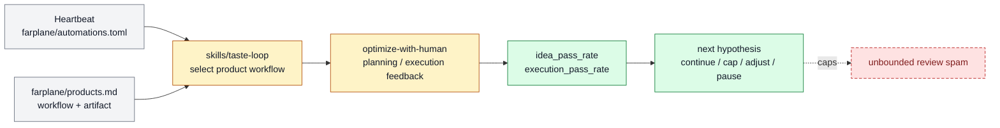

# Taste Loop human-feedback optimization

Taste Loop human-feedback optimization turns active human attention into structured
feedback cycles for product artifacts. It belongs to [Self-Improvement And
Learning](../systems/self-improvement-learning.md) and is experimental because it is a
recurring operator-facing UX whose quality depends on the feedback loop feeling worth
the interruption.

```text
taste_feedback_optimization(product_lane, workflow, worker_thread, artifacts)
  -> planning_signal + execution_signal + next_hypothesis
```

## At A Glance

- Feature ID: `FEAT-0069`
- System: [Self-Improvement And Learning](../systems/self-improvement-learning.md)
- Status: `partial`
- Experimental: `true`
- Category: `improvement-loop`
- Primary user: operator, Taste Loop controller, and worker thread
- Job: use human taste as the honest metric for improving product artifacts.

## Problem

Many Farplane artifacts are not ready for benchmark-style metrics. The fastest honest
signal is often Kenji deciding whether an idea, artifact, or direction is worth keeping,
revising, or rejecting. Without structure, that feedback becomes chat noise or a vague
approval request.

## What It Does

- Selects a product-lane artifact workflow from `farplane/products.md`.
- Creates or reuses a worker ticket, Goal Packet, and Codex thread.
- Uses `optimize-with-human` for phase-aware planning and execution feedback.
- Logs hypothesis cycles in worker progress.
- Treats human feedback as a metric signal, not as automatic completion.

## User Stories

- As an operator, I can review compact artifacts instead of broad internal summaries.
- As a Taste Loop controller, I can route feedback to the worker that can act on it.
- As a maintainer, I can see whether repeated feedback should harden a skill, change a
  product workflow, or stop the experiment.

## Operating Contract

Taste Loop owns the heartbeat and worker selection. `optimize-with-human` owns the
feedback protocol inside a worker loop.

- Feedback requests must name the artifact and decision.
- Planning and execution phases are logged separately.
- Dedicated worker threads own reply routing when feedback should resume work.
- Repeated same-phase failures may become skill hardening or productization evidence.

## Feature Flow



Gray is heartbeat/product input, amber is feedback-loop behavior, green is measured human-feedback output, and red dashed is the capped spam path.

## Surfaces

- Owner surfaces:
  - `skills/taste-loop/SKILL.md`
  - `skills/optimize-with-human/SKILL.md`
  - `farplane/automations.toml`
  - `farplane/products.md`
- Generated surfaces:
  - `.farplane/reports/taste-loop/`
  - `.farplane/automation/taste-loop/`

## Proof And Quality

- Evidence:
  - `skills/taste-loop/eval_task.json`
  - `skills/optimize-with-human/eval_task.json`
- Required checks:
  - `python3 docs/features/validate_features.py`
  - `python3 bin/validators/check_doc_refs.py`
- Acceptance signals:
  - Feedback requests point at reviewable artifacts.
  - Worker progress logs hypothesis cycles before and after feedback.
  - Review burden stays within budget and produces actionable next hypotheses.

## Rollout And Maintenance

- Update path: adjust Taste Loop workflow selection, feedback budget, and
  optimize-with-human request contract.
- Rollback path: pause the automation or route feedback manually through chat/review.
- Compatibility notes: this feature does not replace `FEAT-0064`; skill signals can
  inform candidate selection, while this feature owns the human-feedback loop UX.
- Maintenance owner: Self-Improvement And Learning.

## Limits And Non-Goals

- This feature does not treat human approval as completion proof.
- This feature does not edit target skills after one rejection.
- This feature does not send broad feedback requests without an artifact.
- Known weak spot: the loop can become annoying if the artifact is too thin or the
  feedback question is vague.
- Delete or merge this feature if the loop is rejected or fully absorbed into stable
  Taste Loop doctrine.

## Alternatives Considered

- Option: Track Taste Loop only through `FEAT-0064`.
  Decision: adapt.
  Reason: skill signals are input evidence; the feedback optimization UX deserves its
  own experimental feature handle.
- Option: Make `optimize-with-human` a standalone runtime feature.
  Decision: reject.
  Reason: it is a preset/protocol inside Goal-backed worker loops, not its own runtime.

## Change History

- 2026-07-07: Created as the experimental feature handle for Taste Loop feedback optimization.
