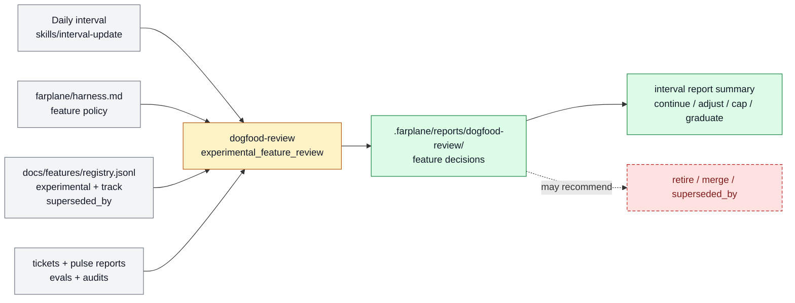

# Experimental feature evaluation reports

Experimental feature evaluation reports let Farplane review dogfooded capabilities
against the harness feature policy before they become stable product truth. The feature
belongs to [Self-Improvement And Learning](../systems/self-improvement-learning.md)
because it turns recent behavior evidence into maintenance decisions for the feature
registry.

```text
experimental_feature_review(feature_registry, harness_policy, evidence_window)
  -> dogfood_report + feature_decisions + registry_change_recommendations
```

## At A Glance

- Feature ID: `FEAT-0070`
- System: [Self-Improvement And Learning](../systems/self-improvement-learning.md)
- Status: `partial`
- Experimental: `true`
- Category: `improvement-loop`
- Primary user: operator, interval reviewer, and feature maintainer
- Job: evaluate experimental Farplane features against harness-maintenance policy and recent evidence.

## Problem

Farplane needs to dogfood new harness capabilities without letting every experiment
become permanent product identity. A human should not have to open every ticket, Pulse
report, worker thread, or feature doc to decide whether a feature is working.

## What It Does

- Reads the feature registry for `experimental: true` rows and non-empty `track` prompts.
- Reads the harness feature policy from `farplane/harness.md`.
- Reviews recent tickets, Pulse reports, interval reports, evals, audits, and evidence refs.
- Writes a dogfood report under `.farplane/reports/dogfood-review/`.
- Recommends `continue`, `adjust`, `cap`, `pause`, `rollback`, `graduate`,
  `split_feature`, `merge`, or `source_gap`.

## User Stories

- As an operator, I can review which dogfooded features are worth keeping from one report.
- As a feature maintainer, I can see whether an experimental feature should graduate,
  merge into a parent, split, or retire.
- As an interval agent, I can ground feature decisions in the harness policy instead of
  inventing a local definition of feature quality.

## Operating Contract

Experimental feature evaluation is a reporting feature, not a mutation engine.

- `farplane/harness.md` owns the feature policy.
- Feature/system frontmatter owns tracking opt-in through `track` and
  `experimental`.
- `dogfood-review` owns evidence gathering and report judgment.
- Interval updates may call the report and summarize it, but they do not directly mutate
  feature docs from the report.

## Feature Flow



Gray is policy, registry, or evidence input; amber is report judgment behavior; green is generated report guidance; red dashed is a retire, merge, or `superseded_by` recommendation.

## Surfaces

- Owner surfaces:
  - `farplane/harness.md`
  - `skills/dogfood-review/SKILL.md`
  - `skills/dogfood-review/templates/dogfood-report.md`
  - `skills/interval-update/SKILL.md`
- Generated surfaces:
  - `.farplane/reports/dogfood-review/`
  - `.farplane/reports/interval/`

## Proof And Quality

- Evidence:
  - `skills/dogfood-review/eval_task.json`
  - `skills/interval-update/eval_task.json`
- Required checks:
  - `python3 docs/features/validate_features.py`
  - `python3 bin/validators/check_doc_refs.py`
- Acceptance signals:
  - Reports cite the harness feature policy.
  - Experimental feature decisions cite evidence or source gaps.
  - Graduation, split, merge, and retirement recommendations are actionable without
    becoming automatic mutations.

## Rollout And Maintenance

- Update path: refine `farplane/harness.md` feature policy, dogfood report template,
  and interval summary behavior.
- Rollback path: keep feature `track` prompts but disable experimental-feed review.
- Compatibility notes: this feature complements `FEAT-0067` daily interval reports;
  daily reports may summarize it, but dogfood-review owns the feature evaluation.
- Maintenance owner: Self-Improvement And Learning.

## Limits And Non-Goals

- This feature does not create an automation registry.
- This feature does not label every automation invocation as a feature.
- This feature does not mutate feature docs, tickets, goals, or automation config.
- Known weak spot: report usefulness depends on the quality of recent tickets, reports,
  evidence refs, and harness policy clarity.
- Delete or merge this feature if experimental feature review becomes a stable part of
  `FEAT-0067` daily interval reports or the Documentation OS.

## Alternatives Considered

- Option: Put automation tracking in `farplane/automations.toml`.
  Decision: reject for now.
  Reason: the operator prefers feature frontmatter; automations remain evidence and
  invocation surfaces.
- Option: Put feature policy in `bindings.yaml`.
  Decision: reject.
  Reason: the rule defines Farplane's product identity, not a metric or integration
  binding.
- Option: Keep dogfood review as only a skill.
  Decision: adapt.
  Reason: the skill owns execution, but the report UX is a first-class
  harness-maintenance feature while experimental.

## Change History

- 2026-07-07: Created as the experimental feature handle for dogfood reports that
  evaluate experimental Farplane features.
