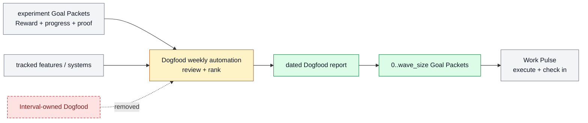

# Dogfood experiment review and ticket supply

Dogfood Review is Farplane's weekly self-improvement portfolio learner and
bounded next-wave planner. It reviews experiment history and tracked
feature/system behavior, writes a dated outcome ledger/report, and may create a
capacity-limited wave of experiment Goal Packets for Work Pulse.

```text
dogfood_review(project_root, window, active_experiments,
               recent_archived_experiments, previous_report?, registry_refs?,
               experiment_wave_size = 2, experiment_wip_limit = 3,
               max_concurrent_live_delayed = 1)
  -> dogfood_report + outcome_ledger + active_portfolio
   + transfer_candidates + ranked_candidates
   + experiment_goal_packets[0..experiment_wave_size] + source_gaps
```

## At A Glance

- Feature ID: `FEAT-0070`
- System: [Self-Improvement And Learning](../systems/self-improvement-learning.md)
- Status: `implemented`
- Experimental: `true`
- Category: `improvement-loop`
- Primary user: operator and harness maintainer
- Job: learn from experiment outcomes and supply the next bounded experiment.

## Problem

Hardening, refinement, documentation, feature maturity, and harness experiments
previously appeared as overlapping Interval subworkflows. Experiment execution
and review were also easy to confuse. Farplane needs one scheduled judgment
surface without creating another executor.

## What It Does

- Reads active and recent archived experiment `ticket.md`, `program.md`,
  `progress.md`, Reward rows, ticket-owned evidence, and the previous Dogfood
  report as a portfolio cursor.
- Reads tracked/experimental feature and system evidence under the harness
  feature policy.
- Returns continue, adjust, cap, pause, rollback, graduate, merge, split, or
  source-gap decisions for existing experiments and features.
- Ranks bounded hardening, refinement, documentation, feature, policy,
  automation, hook/validator, metric, and context-selection experiments.
- Writes a dated Dogfood report with settled outcomes, active/pending work,
  due-but-unscored gaps, transfer candidates, rejected patterns, capacity, and
  next wave before ticket creation.
- May create a bounded wave of complete experiment folders containing
  `ticket.md`, executable `program.md`, `progress.md`, and explicit
  immediate/delayed Reward rows.

## Operating Contract

Dogfood owns experiment review and experiment-ticket creation. It does not
implement the experiment, score a matured Reward row, dispatch a worker, or
start another heartbeat.

```text
Dogfood cron -> portfolio report -> bounded experiment Goal Packet wave
Work Pulse   -> admit -> execute -> derive due Reward rows -> resume check-in
```

The new experiment must name the target surface, gap, hypothesis, baseline,
feedback class, metric/provider, expected reward, check-in time when delayed,
proof, budget, promotion/rollback rule, and stop condition. Missing evidence is
a source gap, not permission to create a speculative ticket.

## Feature Flow



## Proof And Quality

Required proof:

- existing experiment results are reviewed before ranking a new experiment;
- report is written before any experiment ticket;
- wave/WIP/delayed-live caps, non-interference, dedupe, Goal Packet, Reward,
  proof, and authority gates hold;
- Dogfood does not execute or mature-check its new experiment;
- `python3 docs/features/validate_features.py` and
  `python3 bin/validators/check_doc_refs.py` pass.

## Rollout And Maintenance

- Update path: refine experiment evidence, ranking, report, and Goal Packet
  templates.
- Rollback path: set experiment wave size to zero and retain report-only runs.
- Maintenance owner: Self-Improvement And Learning.

## Limits And Non-Goals

- This feature is not a second Pulse or native Goal runtime.
- It does not mutate feature docs automatically from one experiment.
- It does not create one ticket per reviewed feature.
- It does not store QA or review proof outside the owning experiment ticket.

## Change History

- 2026-07-07: Created as the experimental feature-evaluation report handle.
- 2026-07-11: Made Dogfood the weekly experiment review and bounded Goal Packet
  ticket-supply owner.
- 2026-07-11: Expanded Dogfood into a history-aware portfolio learner with a
  bounded non-interfering packet wave and program-owned delayed check-ins.
