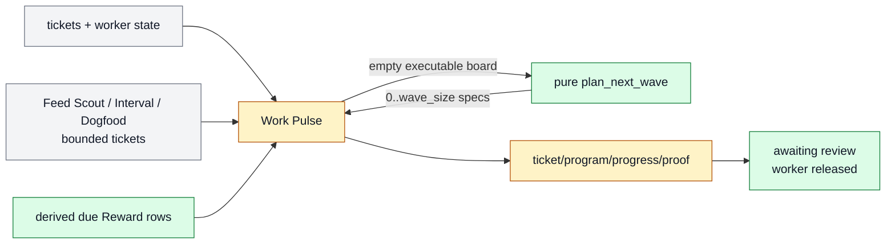

# Project Work Pulse

Project Work Pulse is the one fast board manager for a Farplane project. It
reconciles state, dispatches executable tickets, refills an empty board through
a pure planner, requests review, and writes visible receipts without creating
product-local controllers.

```text
work_pulse(project, wave_size, worker_limit, review_wip)
  -> reconciliation + ticket_deltas? + handoffs? + review_requests?
   + dated_report
```

## At A Glance

- Feature ID: `FEAT-0071`
- System: [Horizon Loop](../systems/horizon-loop.md)
- Status: `implemented`
- Experimental: `true`
- Primary user: project operator and Work Pulse manager
- Job: keep one visible board moving without hiding planning or execution state.

## Problem

The prior product-scoped design made artifact categories responsible for
strategy, progress, worker capacity, review capacity, planning, and heartbeat
state. That obscured the smallest useful project loop:

```text
do an executable ticket; otherwise plan a bounded next wave
```

## What It Does

- Reconciles terminal, active, blocked, and review-ready work.
- Derives matured check-in eligibility from the original ticket's
  `Reward.kpi_rewards[]` rows and Goal Packet instead of creating check-in tickets.
- Admits tickets by executable state, not product or reward origin.
- Dispatches up to `worker_limit` shared workers.
- Calls a pure planner only when no executable ticket exists.
- Materializes no more than `wave_size` accepted specs.
- Releases workers when tickets reach human review and applies `review_wip`
  backpressure.
- Reconciles at most one due ticket-owned review reminder without assigning a
  worker; queue size is not a chase trigger.
- Writes dated reports and changed worker/decision/outcome receipts.

## Operating Contract

- `pulse-update` owns board state transitions and dispatch.
- `ticket-opportunity-generator` owns pure next-wave specification.
- Capability skills own domain workflows.
- Goal Advisor owns material ticket execution compilation.
- Worker Artifact Review Request owns the phone-readable review message and
  receipt.
- Interval supplies dated BAU problem reports and bounded prior-evidenced
  maintenance tickets.
- Feed Scout, Interval, Dogfood, and the operator may create bounded tickets;
  Work Pulse is their shared admission, execution, and check-in heartbeat.

## Feature Flow



Gray is retained state, amber is changed execution behavior, and green is the
new minimal planning/review seam.

## Proof And Quality

Required proof:

- controlled classifier fixtures for `todo`, waiting, review, terminal,
  dependency, priority, and claim states;
- due review reminder fixture proving worker capacity is unchanged;
- derived due-row fixtures with matured and future Reward rows;
- skill evals for generic dispatch, bounded refill, Interval boundary, and
  product-parameter removal;
- one desired and live active Work Pulse automation;
- skill and docs registry validation;
- independent reviewer completion verdict.

## Limits And Non-Goals

- Workstream 2 behavior is implemented and ticket-local QA proves the composed
  sources/check-in paths; real scheduled runs remain the strongest monitoring
  evidence.
- Workstream 3 removed product files/readers and migrated the project manifest
  under TASK-0321 and TASK-0322.
- This feature does not add a daemon, scheduler, ticket executor skill, or
  hidden board runtime.
- Low-watermark refill is not active.

## Alternatives Considered

- Keep product-scoped Pulse loops: rejected because independent controller
  state was not justified by the basic loop proof.
- Fold the planner into Pulse: rejected because pure selection/specification
  and state-changing materialization/dispatch have different proof boundaries.
- Make Interval the planner wrapper: rejected because reporting and executable
  ticket supply have different latency and side effects.

## Change History

- 2026-07-10: Added as the Workstream 1 successor to FEAT-0066.
- 2026-07-11: Added derived experiment check-ins and shared execution for
  Feed Scout, Interval, and Dogfood ticket sources.
