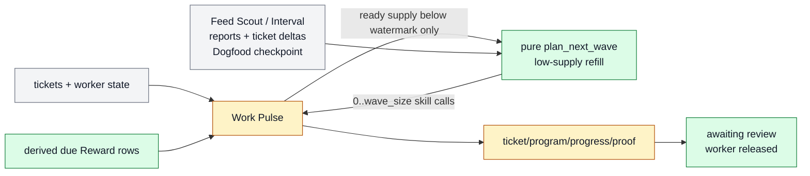

# Project Work Pulse

Project Work Pulse is the one fast board manager for a Farplane project. Each
wake reconciles board state, services review and check-ins, dispatches
executable tickets, and calls Plan Next Wave only when ready supply is low.
It writes one visible receipt without creating product-local controllers or a
second mutable strategy store.

```text
work_pulse(project, wave_size, worker_limit, review_wip,
           review_chase_limit, ready_low_watermark)
  -> reconciliation + ticket_deltas? + handoffs? + review_requests?
   + dated_report
```

## At A Glance

- Feature ID: `FEAT-0071`
- System: [Horizon Loop](../systems/horizon-loop.md)
- Status: `implemented`
- Experimental: `true`
- Primary user: project operator and Work Pulse manager
- Job: keep one visible board moving without hiding planning or execution state.

## Problem

The prior product-scoped design made artifact categories responsible for
strategy, progress, worker capacity, review capacity, planning, and heartbeat
state. That obscured the smallest useful project loop:

```text
do an executable ticket; otherwise plan a bounded next wave
```

## What It Does

- Reconciles terminal, active, blocked, and review-ready work.
- Derives matured check-in eligibility from the original ticket's
  `Reward.kpi_rewards[]` rows and Goal Packet instead of creating check-in tickets.
- Admits tickets by executable state, not product or reward origin.
- Dispatches up to `worker_limit` Pulse-owned workers; human-active tickets do
  not consume this capacity.
- Resolves missing or stale configured hard guards at point of use through each
  metric's declared refresher before constructing planner input. The
  skill-owned `guard_preflight.py` groups guards that share a provider, emits
  one dispatch per `refresh_ref`, reloads observations, and gates the planning
  fingerprint on a current healthy receipt. Healthy refresh continues in the
  same Pulse; a current failure stays fail-closed; refresh failure becomes an
  explicit source gap. Refresh work consumes no ticket or wave capacity.
- Orders executable tickets by priority, then earliest optional `due_at` with
  missing deadlines last, then ticket ID.
- Calls one pure adaptive `plan-next-wave` planner when ready supply after
  dispatch is below the configured low watermark; review backlog does not
  suppress comparison.
- Requires a recent global ticket-history sample before optional progressive
  skill/area/origin/KPI/Reward filters; it does not spawn area planners.
- Passes `harness.planning.skill_refs` as the only work allowlist and requires
  every selected skill call to bind that skill's declared `planner_contract`.
  Areas contribute passive ICP, evidence-bar, capability, and metric context;
  they never define workflows or become planners.
- Passes each area's canonical ICP plus selected complete facts from one
  configured Feed Scout Brief. Outward-facing calls must name the ICP
  job/pain, complete copied source facts and source refs, baseline/default, and
  intended belief or workflow delta; a trend label alone is not admissible
  context.
- Derives bounded `preference_memory` from terminal AI-planned Reward rows
  (`accept -> accept`, `kill -> reject`; nonterminal rows omitted) and passes it
  separately from Scout Brief and Tasty Pack evidence. Rejection teaches later
  ranking but is not a same-day planning outage.
- Requires every proposed call to name its configured `skill_ref`, bind exactly
  the required arguments, state objective impact and proof, and survive global
  dedupe and ranking. Pulse then allocates a ticket ID and materializes the call
  through the generic ticket contract without copying or reinventing workflow.
- Uses stable identity problems, planning areas, selected objective metrics,
  metric movement, source-backed current context, ticket history, and
  configured skill refs as refill context. It does not read retired
  project-level goals or product-bet portfolios.
- Uses skill-aware ticket Reward history as the experiment/experience ledger;
  optional Tasty Pack evidence can ground content taste without creating a
  separate content planner or Pulse.
- Derives one objective-progress receipt per selected metric from configured
  priority, current reading, freshness/source, and direction-normalized
  movement when available. Missing or stale reading evidence stays `unknown`;
  the planner does not infer urgency from stale UI projections.
- Fingerprints a derived `semantic_time_state` covering metric freshness,
  metric movement buckets, matured Reward IDs, ticket due_at buckets, and
  operator-availability validity. `as_of` or `serialized_at` churn is ignored
  only when that state is present; legacy inputs retain their canonical
  `as_of` as a conservative semantic clock so elapsed time cannot suppress
  replanning.
- Selects the top `0..wave_size` compatible skill calls through one priority-ordered
  constrained comparison of expected metric delta, confidence, duration,
  time-to-signal, cost, risk, human load, information gain, compounding value,
  and interference. Artifact count cannot displace a stronger risk-adjusted
  objective trajectory.
- Never materializes a metric refresh, observation restoration, planning
  precondition, or source-gap receipt as a wave ticket.
- Bundles avoidable setup into at most one first-exemplar ticket and prefers
  waves whose remaining work produces independently reviewable artifacts.
- Materializes no more than `wave_size` admitted calls.
- Releases workers when tickets reach human review, keeps every ticket and
  decision distinct, and projects pending review into at most `review_wip`
  operator-facing area pools. Saturation switches ranking and dispatch toward
  unattended-safe, machine-verifiable or delayed-feedback work rather than
  globally stopping workers. The projection preserves active and queued pools,
  constituent review refs/decisions, and one deterministic digest per active
  area.
- Reconciles due ticket-owned review reminders up to `review_chase_limit`
  without assigning workers; queue size is not a chase trigger.
- Treats missing or malformed Review ledgers as repair actions. The structured
  binding sends initial Telegram immediately, chases after configured
  unanswered Pulse turns, and then routes bounded Phone Chaser calls during
  active hours. Notification credentials belong to the automation, not the
  reviewed ticket's publication/account authority.
- Treats active ownership narrowly: blocked and awaiting-review tickets dedupe
  their own outputs and prerequisites but do not reserve an entire planning
  area, KPI, audience, or objective from independent artifact work.
- Writes dated reports and changed worker/decision/outcome receipts.

## Operating Contract

- `pulse-update` owns board state transitions and dispatch.
- `plan-next-wave` owns pure low-supply refill selection. The separate package
  exists to keep judgment-only planning testable and side-effect free; Pulse
  alone materializes tickets and dispatches workers. It does not delay
  grounded Interval work.
- Plan Next Wave performs the bounded leverage comparison required for refill
  directly. It does not invoke `leverage-advisor`; that operator-facing skill
  owns capability roadmaps, contingent campaigns, and first-proof selection
  outside the heartbeat refill path.
- Capability skills own domain workflows.
- Goal Advisor owns material ticket execution compilation.
- Worker Artifact Review Request owns the phone-readable review message and
  receipt.
- Interval supplies dated problem reports plus admitted/rejected ticket deltas
  for grounded interventions and decision-changing investigations.
- Feed Scout and Interval may admit bounded ticket deltas only when the
  evidence, proof, authority, and dedupe gates are already settled. Dogfood is
  report-only planner context. New opportunities and insufficiently grounded
  findings remain context for later low-supply refill; Work Pulse globally
  ranks and materializes those proactive calls through Plan Next Wave. Direct
  operator/customer/incident tickets remain obligations.

## Feature Flow



Gray is retained state, amber is changed execution behavior, and green is the
new minimal planning/review seam.

## Proof And Quality

Required proof:

- controlled classifier fixtures for `todo`, waiting, review, terminal,
  dependency, priority, and claim states;
- ordering fixtures proving priority dominates `due_at`, earlier valid
  `due_at` wins within one priority, and missing deadlines sort last;
- due review reminder fixture proving worker capacity is unchanged;
- missing-ledger, blocked-initial-Telegram, and Telegram-to-phone escalation
  fixtures proving silent review waits cannot persist;
- blocked/review ownership fixture proving independent substitute artifacts
  remain eligible;
- human-active ticket fixture proving it is unselectable but does not consume
  Pulse worker capacity or block refill;
- global-first ticket-history query and progressive filter fixtures;
- configured-skill fixtures proving the allowlist is closed and every selected
  call binds its public signature without copying workflow;
- deterministic skill-call validation for objective attribution, forecast
  evidence, proof, dedupe, authority, rank reason, and human load;
- bound-call materialization proof showing `skill_ref` and `arguments` survive
  in the generic ticket while workflow and todo prose do not;
- derived due-row fixtures with matured and future Reward rows;
- skill evals for generic dispatch, bounded refill, Interval boundary, due_at
  ordering, and retired project-strategy input removal;
- one desired and live active Work Pulse automation;
- skill and docs registry validation;
- independent reviewer completion verdict.

## Limits And Non-Goals

- Workstream 2 behavior is implemented and ticket-local QA proves the composed
  sources/check-in paths; real scheduled runs remain the strongest monitoring
  evidence.
- Workstream 3 removed product files/readers and migrated the project manifest
  under TASK-0321 and TASK-0322.
- This feature does not add a daemon, scheduler, ticket executor skill, or
  hidden board runtime.
- Low-watermark refill is active; longer scheduled-run monitoring remains an
  evidence follow-up rather than an implementation dependency.

## Alternatives Considered

- Keep product-scoped Pulse loops: rejected because independent controller
  state was not justified by the basic loop proof.
- Fold the planner into Pulse: rejected because pure selection
  and state-changing materialization/dispatch have different proof boundaries.
- Keep the historical `ticket-opportunity-generator` package name: rejected
  because `plan_next_wave` is now the canonical contract and active pre-launch
  surfaces do not need an obsolete compatibility identity.
- Make Interval call Plan Next Wave: rejected because known grounded work
  should be admitted in the report-first Interval run, while refill remains a
  later low-supply board operation.

## Change History

- 2026-07-10: Added as the Workstream 1 successor to FEAT-0066.
- 2026-07-11: Added derived experiment check-ins and shared execution for
  tickets informed by Feed Scout, Interval, and Dogfood.
- 2026-07-12: Made human-active work worker-free, replaced product descriptions
  with planning areas, added adaptive global-first history retrieval, and made
  scheduled sources context-only.
- 2026-07-16: Made Dogfood a report-only portfolio checkpoint; normal Plan Next
  Wave retains generation/ranking/admission and Pulse retains materialization.
- 2026-07-14: Added FEAT-0072 ICP/world-memory retrieval and ticket context.
- 2026-07-17: Replaced free-form work generation with configured skill
  calls and generic Pulse materialization.
- 2026-07-25: Narrowed Plan Next Wave to low-supply refill, removed retired
  project-goal/product-bet planner inputs, and documented priority then
  due_at ordering.
