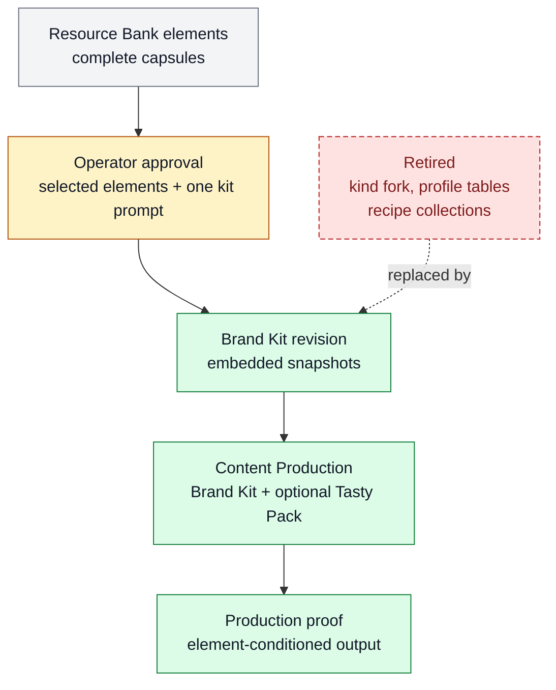

# Brand Kit approved creative identity

Brand Kit approved creative identity stores the creative elements an operator has approved for reuse as immutable embedded snapshots plus exactly one kit-wide prompt. It belongs to [Content Production](../systems/content-production.md) because it is the durable identity input that content plans compose with optional [Tasty Pack inspiration](FEAT-0056-inspiration-vault.md).

```text
promote_to_brand_kit(resource_elements, kit_prompt)
  -> brand_kit_revision(approved_element_snapshots[], kit_prompt)
```

## At A Glance

- Feature ID: `FEAT-0073`
- System: [Content Production](../systems/content-production.md)
- Status: `designed`
- Category: `content-production`
- Primary user: operator, creator, and content-planning agent
- Job: preserve approved creative identity so production can reuse what worked without depending on resettable candidate rows.

## Problem

Reusable creative identity needs a stronger owner than raw inspiration. Tasty Pack retrieval can surface useful current references, but approved brand behavior must survive Resource Bank resets, preserve the selected example, and remain inspectable before production spend.

## What It Does

- Stores approved creative elements as embedded Brand Kit snapshots.
- Preserves the same nine element kinds used by Resource Bank and Tasty Packs: `visual`, `audio`, `hook`, `storyboard`, `editing`, `copy`, `character`, `format`, and `constraint`.
- Preserves each element's `description`, `whyItWorks`, `goldenExample { assetId, description? }`, and `goldenRecipe` prompt string.
- Copies the stable golden-example locator needed for production, so a kit remains usable even when candidate Resource Bank rows are reset or reingested.
- Maintains exactly one kit-wide freeform prompt for the approved creative identity.
- Exposes approved identity to content planning as the governing creative source. Optional Tasty Pack elements can augment it only through explicit composition.

## User Stories

- As an operator, I can approve source elements into a Brand Kit and know the exact examples and prompts will travel with the kit.
- As a content planner, I can compose a Brand Kit with optional Tasty Pack inspiration while preserving approved identity precedence.
- As a reviewer, I can inspect whether a final artifact used the Brand Kit's approved examples and recipes rather than generic style prose.

## Operating Contract

Brand Kit is approved identity, not candidate inspiration.

- Brand Kit snapshots are embedded approved elements with copied provenance and stable example locators.
- Brand Kit does not add prompt variants, per-prompt membership, inheritance, bindings tables, formula tables, recipe collections, or style-profile tables.
- The kit prompt is one freeform prompt for whole-kit identity. It is distinct from each element's `goldenRecipe`, which is one prompt string for reproducing that element's function.
- Promotion from Resource Bank copies the complete semantic capsule and preserves the canonical kind. Hook, copy, storyboard, character, and constraint elements do not collapse into a generic story kind.
- Snapshot identity and dedupe semantics include the semantic fields and stable example locator, so changed recipes or examples create meaningful new revisions.
- Content Production treats Brand Kit constraints as the default truth. Tasty Pack inspiration can be selected only when it is compatible or when the conflict is explicitly rejected, revised, or escalated.
- Production outputs should record the Brand Kit revision, kit prompt revision, selected element IDs or hashes, and evidence of element-conditioned use.

## Feature Flow



Legend:

- `gray = existing input or evidence read`
- `amber = approval or changed live surface`
- `green = created artifact or proof`
- `red dashed = retired or rejected path`

## Surfaces

Owner surfaces:

- `docs/systems/content-production.md`

Related feature:

- `docs/features/FEAT-0056-inspiration-vault.md`

Implementation evidence:

- `/Users/kenjipcx/Zanarkand Technologies/projects/Farplane-UI/tickets/TASK-0068/ticket.md`

## Proof And Quality

Required checks:

- `python3 docs/features/validate_features.py`
- `python3 bin/validators/check_doc_refs.py`

Acceptance signals:

- The feature is listed under exactly one owning system, `SYS-0012`.
- The docs preserve one kit prompt and one element-level `goldenRecipe` string without adding recipe/profile tables.
- The docs preserve the existing nine kinds and do not introduce `director`, `layout`, or `pacing`.
- The owning implementation ticket can prove Resource Bank to Tasty Pack to Brand Kit to production without field or kind loss.

## Rollout And Maintenance

- Update this feature page when Brand Kit approval, snapshot, prompt, or production-resolution behavior changes.
- Update [Content Production](../systems/content-production.md) when composition or timing-master policy changes.
- Regenerate feature/system registries when metadata changes.
- Maintenance owner: Content Production.

## Limits And Non-Goals

- This feature does not define a generic creative database or hidden production orchestrator.
- This feature does not make Tasty Pack inspiration approved identity.
- This feature does not add Brand Kit prompt variants, recipe/profile tables, or saved Tasty Pack rows.
- Known weak spot: implementation proof is still owned by TASK-0068; this page records the approved durable contract.
- Delete or merge this feature only if approved creative identity moves to a clearer feature owner and all active refs are updated.

## Alternatives Considered

- Fold Brand Kit into Tasty Pack.
  Decision: reject.
  Reason: Tasty Pack is computed candidate inspiration; Brand Kit is approved durable identity.
- Store recipes, prompt variants, or profile tables.
  Decision: reject.
  Reason: TASK-0068 approved one kit prompt and one element-level `goldenRecipe` string to avoid profile/recipe sprawl.

## Change History

- 2026-07-22: Created from the TASK-0068 durable documentation slice.
