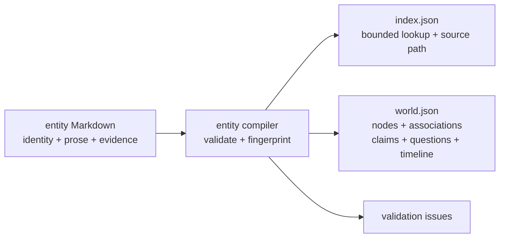

# Entity Markdown and World projection

Farplane stores durable project entities as human-readable Markdown and
compiles them into a deterministic search index and generic World graph. This
feature gives projects one canonical place for identity, useful context,
question-backed claims, sourced timelines, and explicit relationships.

```text
entity_world(.farplane/entities/*.md)
  -> index.json + world.json + validation_issues
```

## At A Glance

- Feature ID: `FEAT-0075`
- System: [Graph Systems](../systems/graph-systems.md)
- Status: `implemented`
- Category: `memory`
- Primary user: project maintainer and agent
- Job: preserve durable entity facts in readable files and produce a generic
  graph without introducing a second source of truth

## Problem

Research reports and transcripts contain useful facts, but they are dated,
owner-specific artifacts rather than stable entity memory. Storing canonical
entities directly in generated JSON would make edits opaque and mix authored
truth with disposable indexes.

## What It Does

- Reads flat `.farplane/entities/<id>.md` files with required `id`, `kind`, and
  `name` frontmatter.
- Emits a schema-v5 lookup index containing bounded identity, alias, location,
  reference, question, and canonical-path fields.
- Compiles `[label](entity:<id>)` links into sourced, paragraph-backed,
  undirected World associations.
- Compiles question footnotes into claims and question indexes without turning
  questions into default graph nodes.
- Compiles dated timeline evidence, aliases, locations, and optional
  coordinates.
- Emits project-qualified node and edge keys plus a deterministic source
  fingerprint.
- Emits schema-v4 World nodes without raw frontmatter, generic metadata,
  repeated diagnostics, or derived counts.
- Reports malformed files, IDs, references, links, coordinates, questions, and
  other authoring issues instead of guessing.

## User Stories

- As a project maintainer, I can edit durable facts in Markdown and regenerate
  machine views deterministically.
- As an agent, I can resolve identities through the index and follow `path` to
  inspect the canonical prose behind a graph association.
- As a graph consumer, I can detect stale mixed projections through the shared
  source fingerprint.

## Operating Contract

Entity Markdown is canonical. `index.json` and `world.json` are generated and
must not be hand-edited. The filename stem equals the entity ID, nested entity
folders are invalid, and explicit body links are the only authored World
associations.

`index.json` is a lookup catalogue, not a document snapshot. It omits Markdown
bodies, raw frontmatter, claims, timelines, funnel state, view definitions, and
duplicate `by_id` records. Its envelope contains only schema version, source
fingerprint, and entity rows. World likewise omits raw frontmatter and generic
metadata. Consumers needing full context read the canonical file referenced by
`path`; compiler diagnostics come from the command result.

The generic World graph does not infer predicates, inverse relationships,
transfers, or private facts. Project-specific interpretation belongs in
[Typed entity view projections](FEAT-0076-typed-entity-view-projections.md).
Funnel selection belongs in [CRM entity projection](FEAT-0077-crm-entity-projection.md).

See [Entity Markdown Authoring](../farplane-framework/entity-markdown-authoring.md)
for the complete write contract.

## Feature Flow



## Surfaces

- Owner surfaces:
  - `bin/core/farplane_entities.py`
  - `docs/farplane-framework/entities.md`
  - `docs/farplane-framework/entity-markdown-authoring.md`
- Supporting surfaces:
  - `skills/ingest-world-data/SKILL.md`
  - `bin/farplane.py`
- Generated surfaces:
  - `.farplane/entities/index.json`
  - `.farplane/entities/world.json`

## Proof And Quality

- `python3 -m unittest bin/tests/test_farplane_entities.py`
- `farplane entities compile --project-root <project> --no-write`
- Tests cover the bounded index schema, absence of duplicated prose,
  lean World nodes, deterministic compilation, entity validation, associations, questions,
  claims, timelines, coordinates, code masking, and project identity.

## Rollout And Maintenance

- Update the authoring and framework contracts when parser-visible Markdown
  changes.
- Update tests before changing schema or semantic key material.
- Recompile affected projects after authoring or compiler changes.
- Roll back by reverting source Markdown or compiler behavior and recompiling;
  generated projections are disposable.

## Limits And Non-Goals

- No graph database, inferred ontology, automatic geocoding, or cross-project
  entity merge.
- No duplicate authored edge records.
- Full dated research remains in skill-owned reports and links into canonical
  entities when durable.
- Merge this feature only if canonical entity authoring and the generic World
  projection move together to a clearer owner.

## Alternatives Considered

- Option: store canonical entities directly in JSON.
  Decision: reject.
  Reason: generated data is harder for humans to review and would mix source
  truth with projections.
- Option: use Harness GraphIR for entity data.
  Decision: reject.
  Reason: GraphIR models repository declarations and references; entity World
  needs claims, questions, timelines, locations, and durable domain identity.

## Change History

- 2026-08-02: Reduced the index envelope to schema/fingerprint/entities and
  replaced World schema v3 with schema v4 lean nodes plus compiler-owned diagnostics.
- 2026-08-02: Replaced the schema-v3 full-record index with a schema-v4 bounded
  lookup catalogue; canonical Markdown now remains the only full-text owner.
- 2026-07-31: Added the registry-backed feature owner for existing entity
  Markdown and World behavior.
