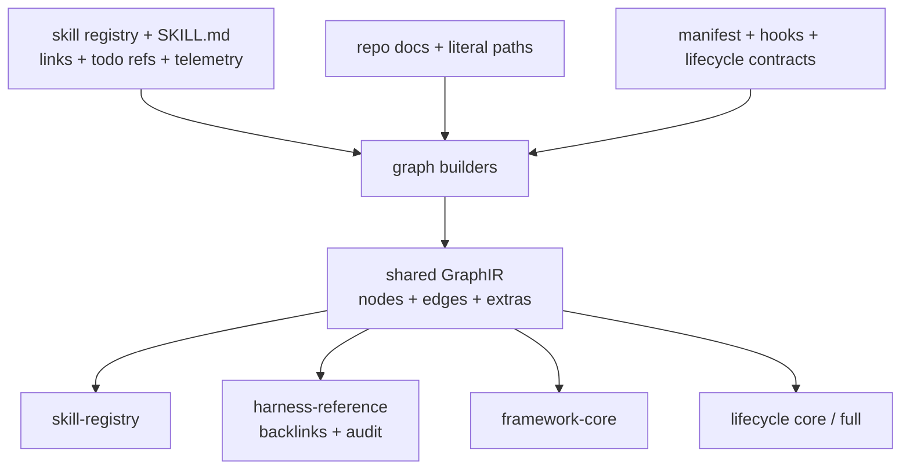

# Harness GraphIR projections

Harness GraphIR normalizes Farplane repository declarations and references into
sibling graph projections for skills, documentation backlinks, Framework Core,
and lifecycle inspection. It explains the harness itself rather than storing
project-world entities.

```text
harness_graph(repository_sources, projection_profile)
  -> GraphIR(nodes, edges, extras)
  -> skill | reference | framework | lifecycle projection
```

## At A Glance

- Feature ID: `FEAT-0078`
- System: [Graph Systems](../systems/graph-systems.md)
- Status: `implemented`
- Category: `projections`
- Primary user: operator, skill maintainer, documentation maintainer, and UI
- Job: inspect how Farplane files, skills, routes, hooks, and lifecycle
  contracts refer to and affect one another

## Problem

Farplane's harness behavior is distributed across skills, Markdown links,
registries, hooks, manifests, tickets, reports, and curated lifecycle
contracts. A skill-only graph cannot explain non-skill runtime and file
relationships, while a repo-wide reference graph is too noisy to serve as a
new-user lifecycle map.

## What It Does

GraphIR supplies shared node, edge, bundle, serialization, comparison, and
projection-filter primitives. Named profiles then generate sibling views:

| Profile | Purpose |
| --- | --- |
| `skill-registry` | Skills, declared skill references, todo order, common chains, rendered skill docs, and usage signals |
| `harness-reference` | Repo-wide local links and literal-path references used for navigation, backlinks, and documentation audits |
| `farplane-framework-core` | Manifest-selected framework sources plus a curated operator-facing workflow spine |
| `farplane-lifecycle-core` | Compact lifecycle graph across skills, files, hooks, and routes |
| `farplane-lifecycle-full` | Audit view with optional gates, abstract state, and finite-state nodes |

## Skill Links And Backlinks

The skill graph reads three distinct authored relationship classes:

- `markdown-ref`: direct skill references found in skill Markdown and registry
  metadata;
- `todo-chain`: ordered skill references parsed from the required Todo List;
- `common-chain`: declared common `after` relationships.

It also reads skill invocation telemetry for heat and composition signals.
Incoming-reference counts and top referrers are derived by reversing the
generated outgoing edges. A skill does not maintain a separate backlink list.

The repo-wide `harness-reference` profile separately scans local Markdown links
and literal repo paths. Its inbound counts answer “what points here?” for docs
and files. Those edges are navigational evidence, not automatic execution
order. Only todo-chain or curated lifecycle edges carry stronger sequencing
meaning.

## User Stories

- As a skill maintainer, I can see what a skill calls and what other skills
  refer to it.
- As a documentation maintainer, I can find inbound references, unresolved
  links, and apparently unreferenced docs before cleanup.
- As an operator, I can open a compact Framework or lifecycle projection
  without loading the full repository connector graph.
- As a reviewer, I can distinguish explicit, parsed, and curated lifecycle
  edges.

## Operating Contract

All harness graph families use shared GraphIR primitives, but they are sibling
projections rather than one graph filtered repeatedly from the skill graph.
Each builder has different source evidence and may add profile-specific extras.

The entity compiler does not currently use Harness GraphIR. Both systems share
the abstract node-edge-projection pattern, but their contracts differ:

| Entity knowledge plane | Harness GraphIR plane |
| --- | --- |
| Canonical people, companies, topics, sources, and evidence | Repository skills, files, hooks, routes, and states |
| Human-authored entity Markdown | Registries, links, signatures, manifests, hooks, and curated maps |
| Claims, questions, timelines, locations, funnels, resources | Reference types, confidence, heat, file paths, FSA projections |
| Durable facts with generated consumer views | Generated inspection and navigation graphs |

Sharing low-level serialization helpers could be evaluated separately, but
forcing both planes into one universal schema would either erase entity
semantics or overload GraphIR with domain-specific state.

## Feature Flow



## Surfaces

- Owner surfaces:
  - `skills/skill-maintenance/scripts/graph_ir.py`
  - `skills/skill-maintenance/scripts/graph_projection.py`
  - `skills/skill-maintenance/scripts/graph_projection_config.py`
- Builders:
  - `skills/skill-maintenance/scripts/generate_skill_graph.py`
  - `skills/skill-maintenance/scripts/generate_harness_graph.py`
  - `skills/skill-maintenance/scripts/generate_farplane_lifecycle_graph.py`
- Human contracts:
  - `skills/skill-maintenance/graph/README.md`
  - `docs/farplane-framework/graph-contract.md`
  - `docs/farplane-framework/harness-maintenance.md`
- Generated surfaces:
  - `.farplane/generated/graphs/skill-graph.json`
  - `.farplane/generated/graphs/harness-graph.json`
  - `.farplane/generated/graphs/farplane-framework-core-graph.json`
  - `.farplane/generated/graphs/farplane-lifecycle-graph.json`

## Proof And Quality

- `python3 skills/skill-maintenance/scripts/test_generate_skill_graph.py`
- `python3 skills/skill-maintenance/scripts/test_generate_harness_graph.py`
- `python3 skills/skill-maintenance/scripts/test_generate_farplane_lifecycle_graph.py`
- `python3 skills/skill-maintenance/scripts/generate_graph_projection.py --list`
- Tests cover ordered todo edges, heat and composition signals, reference-scan
  exclusions, lifecycle extraction, projection filtering, manifest selection,
  finite-state shapes, and generated-output freshness.

## Rollout And Maintenance

- Add graph-wide primitives to GraphIR only when several builders need them.
- Keep source extraction in the owning builder and projection filtering in the
  shared projection layer.
- Add a named profile when a stable consumer needs a distinct selection or
  detail contract.
- Regenerate ignored graph artifacts after registry, link, manifest, or
  lifecycle changes.

## Limits And Non-Goals

- Reference edges do not prove runtime execution or dependency.
- Backlinks are derived and may be incomplete when source syntax is not
  recognized.
- Curated edges must cite an owning contract and remain distinguishable from
  explicit or parsed evidence.
- GraphIR does not own the Wiki graph, CRM, typed domain views, ticket execution,
  or a central state machine.

## Alternatives Considered

- Option: make the lifecycle graph a child projection of the skill graph.
  Decision: reject.
  Reason: hooks, files, automations, reports, routes, and FSA states are not
  skill-registry entities.
- Option: replace entity compilation with GraphIR.
  Decision: defer.
  Reason: the current engines share structural primitives but not semantic
  schemas or source lifecycles; no demonstrated maintenance problem justifies
  the migration.

## Change History

- 2026-07-31: Added the registry-backed feature owner and clarified skill
  backlink derivation and the entity-engine boundary.
