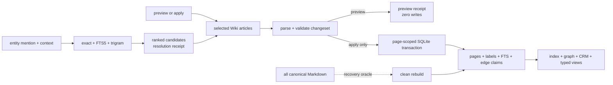

# Wiki resolution and incremental projections

Wiki resolution and incremental projections give `manage-wiki` a deterministic
project-local way to find existing entities, create only genuinely missing
ones, author entity links, and update search and graph outputs without
reparsing unchanged articles.

```text
wiki_resolve_and_sync(source_ref, publication_intent, context, changed_paths?)
  -> staged_pages + changed_pages + candidates + resolution_receipt + projection_refs
```

## At A Glance

- Feature ID: `FEAT-0079`
- System: [Wiki](../systems/wiki.md)
- Status: `implemented`
- Category: `memory`
- Primary user: agent and project maintainer
- Job: resolve mentions safely and keep generated Wiki state current after a
  bounded article changeset

## Problem

The previous entity workflow described duplicate lookup and full compilation
in prose. It offered no common search command, no deterministic ambiguity
contract, and no page-owned incremental state. Every edit reparsed the whole
article set, while each writing skill had to reinterpret how to find or create
an entity.

## What It Does

- Builds `.farplane/wiki/wiki.sqlite` from canonical Markdown using Python's
  standard-library `sqlite3`.
- Checks FTS5 and trigram-tokenizer support before any generated-state
  mutation.
- Indexes exact IDs, normalized canonical names, aliases, kind, location, and
  article text for project-local candidate retrieval.
- Returns exact, FTS5 lexical, and trigram candidate evidence without treating
  similarity as identity.
- Caches parsed page state and source-page-owned edge claims.
- Syncs changed or deleted pages transactionally and exports the bounded
  index, graph, CRM, and typed-view JSON consumers.
- Fails closed on invalid sources and proves incremental exports equal a clean
  rebuild.

## User Stories

- As an agent, I can search one canonical project index before creating an
  entity so that aliases and spelling variations do not create duplicates.
- As a maintainer, I can update one article and replace only the claims it
  authored while preserving claims authored by every other article.
- As a consumer, I can delete all generated Wiki state and rebuild equivalent
  projections from Markdown.
- As an operator, I can ask research or ingestion to preview or save durable
  findings to Wiki without choosing the affected files or entity IDs.

## Publication Intent Contract

`manage-wiki` owns one explicit publication decision:

```text
publication_intent = preview | apply
```

Callers map explicit save/add/update/write/publish-to-Wiki language and “apply
these Wiki changes” to `apply`. Preview/propose/draft/show language, an explicit
no-write direction, or ordinary analysis without Wiki-write intent maps to
`preview`. Conflicting directions never silently apply.

Both modes select pages, retrieve and inspect identity candidates, choose
create/update/link outcomes, and validate the complete staged changeset.
`preview` returns expected sync and projection evidence with zero canonical or
generated writes. `apply` publishes and page-syncs only after all source,
privacy, ambiguity, reference, and validation gates pass. Direct Wiki-write
intent is sufficient; approval of a report, offer, or outreach draft alone is
not Wiki-write intent.

## Resolution Contract

Candidate retrieval and identity judgment are separate:

```text
resolve(mention, entity_scope, article_context, source_evidence)
  -> link | update_existing | create_new | ambiguity
   | skip_source_gap | blocked
```

Resolution order:

1. Match normalized ID, canonical name, and aliases. Normalization applies
   Unicode decomposition and case folding, then keeps alphanumeric characters.
2. Retrieve FTS5 token/prefix and trigram candidates, optionally filtered by
   `kind`.
3. Read plausible canonical articles through their returned `path`.
4. Compare kind, location, nearby linked entities, article context, and source
   evidence.
5. Link or update only one supported identity; create only when no plausible
   candidate exists and the source supports a durable entity.

Only one unique exact ID/name/alias match may auto-link. Similarity scores rank
candidates; they never authorize a merge. Multiple plausible candidates always
produce `ambiguity` and leave canonical state unchanged.

Search JSON has the bounded shape:

```json
{
  "query": "Open AI",
  "normalized_query": "openai",
  "kind": "company",
  "candidates": [
    {
      "id": "openai",
      "name": "OpenAI",
      "kind": "company",
      "path": ".farplane/entities/openai.md",
      "matched_label": "OpenAI",
      "match_types": ["exact_name", "trigram"],
      "similarity": 1.0
    }
  ]
}
```

`location` is present when authored. Callers use `path` to inspect full
canonical context instead of treating the result row as the entity record.

## Incremental Projection Contract

Every generated claim retains its originating article. Sync computes the
validated changed-page set, then transactionally replaces that set's cached
pages, identity labels, FTS rows, and outgoing edge claims. A deleted source
page removes only state it originated.

An association may be undirected for consumers while still having an authored
origin. Therefore sync deletes claims by originating page, never every edge
touching the edited entity. Removing all endpoint edges would destroy inbound
claims authored by other articles.

JSON projections remain deterministic exports over the complete generated
database state. A clean rebuild is the recovery oracle:

```text
export(sync(changed_pages)) == export(rebuild(all_canonical_pages))
```

No database row or JSON edge is manually authored. Markdown remains the only
entity truth, and `.farplane/views.yaml` remains the typed-view membership and
vocabulary truth.

SQLite and all JSON projections are staged together. Promotion backs up the
existing generated bundle and restores it if any database, JSON, or stale-view
replacement fails, so a failed command does not leave a partial generated
bundle behind.

## Command Contract

```bash
farplane wiki doctor [--project-root ROOT] [--json]
farplane wiki rebuild [--project-root ROOT] [--no-write] [--json]
farplane wiki sync [--project-root ROOT] [--path PATH ...] [--no-write] [--json]
farplane wiki search QUERY [--project-root ROOT] [--kind KIND] [--limit N] [--json]
```

`doctor` reports `sqlite_version`, `fts5`, `trigram`, `database_path`,
`database_exists`, `schema_version`, `stale`, and runtime `ready`. It does not mutate state.
Rebuild reconstructs all generated state. Sync validates and applies a bounded
path set, including deletions. With no `--path`, sync applies every detected
change; with `--path`, it limits work to the named articles. A missing or
incompatible database makes sync perform a clean rebuild. Search returns ranked project-local candidates.
Search refuses missing, incompatible, or stale generated state and directs the
caller to rebuild or sync first.
`--no-write` runs the applicable validation and projection work without
replacing generated files.

## Feature Flow



## Surfaces

- Owner surfaces:
  - `bin/core/farplane_wiki.py`
  - `bin/core/farplane_wiki_store.py`
  - `skills/manage-wiki/SKILL.md`
  - `docs/farplane-framework/entities.md`
- Supporting surfaces:
  - `bin/core/farplane_entities.py`
  - `bin/core/farplane_cli_parser.py`
  - `bin/core/farplane_cli_commands.py`
  - `docs/farplane-framework/entity-markdown-authoring.md`
- Generated surfaces:
  - `.farplane/wiki/wiki.sqlite`
  - `.farplane/entities/index.json`
  - `.farplane/entities/graph.json`
  - `.farplane/entities/crm.json`
  - `.farplane/views/<view-id>.json`

## Proof And Quality

- `python3 -m unittest bin/tests/test_farplane_wiki.py`
- `python3 -m unittest bin/tests/test_farplane_entities.py`
- `python3 docs/features/validate_features.py`
- `python3 bin/validators/check_doc_refs.py`
- Required cases: unavailable FTS5/trigram, exact and alias resolution, typo
  candidates, ambiguity, deletion, source-page edge replacement, invalid input
  without mutation, and clean-rebuild equivalence.

## Rollout And Maintenance

- Run `farplane wiki doctor` before the first generated-state write in a new
  runtime.
- Run `farplane wiki rebuild` to initialize, recover, or prove the database.
- Use `farplane wiki sync --path ...` after validated bounded article changes.
- Roll back canonical changes by reverting the Markdown and rebuilding.
- Delete and rebuild the database after an incompatible generated schema
  change; no compatibility reader or migration shim is required.
- Maintenance owner: Wiki Core and `manage-wiki`.

## Limits And Non-Goals

- No cross-project identity, hosted synchronization, vector retrieval, or
  graph-database query language.
- No inferred relationship predicate or automatic ambiguous entity merge.
- Search quality cannot replace missing source evidence.
- The database is an optimization and inspection surface, not a manual CRUD API.
- Merge this feature only if resolution and incremental generated state stop
  having an independent proof and maintenance boundary.

## Alternatives Considered

- Option: scan the bounded JSON index for every mention.
  Decision: reject as the sole path.
  Reason: exact lookup is fast but does not provide article FTS, typo candidate
  retrieval, or one transactional cache for page-scoped claims.
- Option: CRUD `graph.json` directly.
  Decision: reject.
  Reason: it would turn a disposable consumer projection into mutable truth.
- Option: use a hosted vector or graph database.
  Decision: reject.
  Reason: project-local lexical resolution and incremental state fit the
  standard library without a second service or canonical store.

## Change History

- 2026-08-19: Added explicit preview/apply publication intent and renamed the
  generated generic graph output to `graph.json`.
- 2026-08-19: Created the feature for deterministic hybrid resolution,
  page-scoped SQLite/FTS5 state, originating-page edge replacement, and
  clean-rebuild equivalence.
