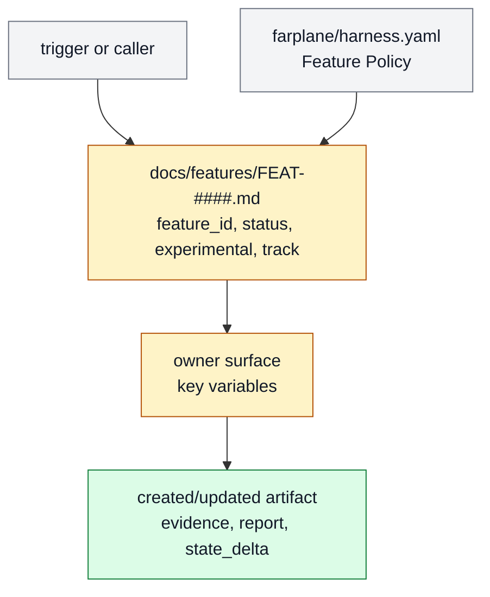

# Feature Name

One plain-English paragraph that says what the feature does, who or what uses
it, and why it earns a stable `FEAT-*` handle. A reader should understand the
feature before seeing paths, metrics, or implementation detail.

```text
feature_name(input, state?) -> user_visible_result + evidence + state_delta
```

## At A Glance

- Feature ID: `FEAT-####`
- System: [System Name](../systems/README.md)
- Status: `designed`
- Category: `category`
- Primary user: agent | operator | maintainer | project
- Job: the job this feature makes possible

## Problem

Describe the concrete pain this feature solves. Name the weak prior state,
reader/user impact, and why the feature exists now.

## What It Does

State the behavior as a short contract. Prefer concrete verbs and observable
outcomes over internal labels.

- The feature accepts or reads:
- The feature produces or changes:
- The feature refuses or escalates when:

## User Stories

- As a `role`, I can `do the thing` so that `outcome`.
- As a `role`, I can `inspect proof/state` so that `trust outcome`.

## Operating Contract

Explain how the feature works when it is already part of Farplane. Include
named concepts, state transitions, input/output shape, and ownership boundaries
only as far as a future maintainer needs to preserve behavior.

## Feature Flow



Legend:

- `gray = existing input or policy`
- `amber = feature owner or changed behavior`
- `green = created or updated artifact`
- `red dashed = retired or superseded handle`

## Surfaces

- Owner surfaces:
  - `path/to/owner`
- Supporting surfaces:
  - `path/to/support`
- Generated surfaces:
  - `path/to/generated-output`

## Proof And Quality

- Evidence:
  - `path/to/proof`
- Required checks:
  - `command or validator`
- Acceptance signals:
  - observable behavior or registry state that proves the feature is working

## Rollout And Maintenance

- Update path:
- Rollback path:
- Compatibility notes:
- Maintenance owner:

## Limits And Non-Goals

- This feature does not:
- Known weak spot:
- Delete or merge this feature when:

## Alternatives Considered

- Option:
  Decision: adopt | adapt | reject | defer
  Reason:

## Change History

- YYYY-MM-DD: Created.
