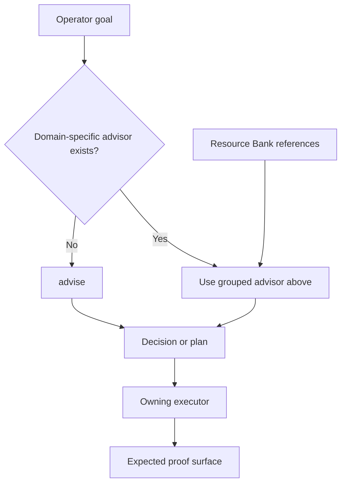

# Advisor System Index

The Advisor System is Farplane's decision-and-routing layer. An advisor turns
an under-specified goal into a recommendation, plan, configuration, or explicit
handoff to the skill that executes the work.

```text
advisor(goal, context, constraints) -> decision_or_plan + handoff + proof_expectation
```

This page is the human index. The generated
[`registry.jsonl`](registry.jsonl) and each linked `SKILL.md` remain the source
of truth for which skills exist and what they do.

## Inventory Rule

The current family contains:

- every active skill whose canonical name ends in `-advisor`; and
- `advise`, the foundational recommendation
  primitive used when no domain-specific advisor owns the decision.

As of 2026-08-03, that is 18 named advisor packages plus `advise`: 19 entries.

## Choose By Use Case

### Decide, prioritize, and measure

| Need | Advisor | Produces |
| --- | --- | --- |
| Compare viable options and recommend one | [`advise`](../../skills/advise/SKILL.md) | Three options, tradeoffs, one recommendation, and next action |
| Change effort or review depth without changing the caller's output contract | [`budget-advisor`](../../skills/budget-advisor/SKILL.md) | Base, plus, or max execution program with bounded council lanes |
| Rank compounding opportunities and select the next wave | [`leverage-advisor`](../../skills/leverage-advisor/SKILL.md) | Ranked leverage roadmap, next wave, and first proof step |
| Define honest success, guardrails, and failure signals | [`metric-advisor`](../../skills/metric-advisor/SKILL.md) | Metric card, guard metrics, anti-metrics, and route hint |

### Shape projects and harness execution

| Need | Advisor | Produces |
| --- | --- | --- |
| Decide where a Farplane behavior or capability belongs | [`harness-advisor`](../../skills/harness-advisor/SKILL.md) | Owner-surface recommendation across policy, skills, agents, hooks, tickets, docs, and validators |
| Compile material work into the right execution loop | [`goal-advisor`](../../skills/goal-advisor/SKILL.md) | Goal architecture, ticket-backed state, and native Goal prompt when warranted |
| Initialize or migrate a project into Farplane | [`init-advisor`](../../skills/init-advisor/SKILL.md) | Substrate/readiness audit, optional scaffold, and harness handoff |
| Define project-owned recurring Codex work | [`automation-advisor`](../../skills/automation-advisor/SKILL.md) | Automation configuration using Pulse and Interval workflows |

### Plan proof and durable documentation

| Need | Advisor | Produces |
| --- | --- | --- |
| Decide how a behavior claim should be proved | [`proof-advisor`](../../skills/proof-advisor/SKILL.md) | Proof cases, proof-surface choice, and QA/eval/review handoff |
| Place, write, or revise durable documentation | [`doc-advisor`](../../skills/doc-advisor/SKILL.md) | Docs strategy or grounded doc delta with quality checks |

### Produce creative assets and video

`content-impl-plan` is the orchestrator for this production family. The lanes
below are siblings because each returns a different required output; Asset
Advisor does not own editing or rendering.

```text
Content Impl Plan
├── Storyboard -> approved narrative and scene design
├── Asset Advisor -> accepted media files + provenance + asset receipts
│   ├── AI Image Advisor -> generated image bundle
│   ├── AI Video Advisor -> generated video bundle
│   ├── Avatar Advisor -> persistent identity/avatar bundle
│   └── Audio Advisor -> accepted audio bundle + mix direction
├── Editing Advisor -> timed edit direction
├── Remotion -> implemented timeline + rendered video
└── Review / QA -> independent readiness evidence
```

The generation advisors are asset-realization children only when Asset Advisor
has selected generation as the route. Content Impl Plan orders those returned
actions; it does not independently choose the same generation route again.

| Need | Advisor | Produces |
| --- | --- | --- |
| Turn source material or a storyboard into required production assets | [`asset-advisor`](../../skills/asset-advisor/SKILL.md) | Asset inventory, acquisition/recreation plan, and downstream handoffs |
| Create, edit, upscale, or cut out model-native images | [`ai-image-advisor`](../../skills/ai-image-advisor/SKILL.md) | Provider route, prompt/input packet, spend gate, and saved image bundle |
| Create, edit, upscale, or control model-native video | [`ai-video-advisor`](../../skills/ai-video-advisor/SKILL.md) | Provider route, prompt/input packet, topology/spend gate, and saved video bundle |
| Preserve a presenter, character, likeness, or lipsync identity | [`avatar-advisor`](../../skills/avatar-advisor/SKILL.md) | Avatar direction packet and generation route |
| Plan or generate voice, music, SFX, Foley, dubbing, or mixes | [`audio-advisor`](../../skills/audio-advisor/SKILL.md) | Audio plan, approved assets, verification, and mix handoff |
| Compose pacing, transitions, motion, captions, and compositing | [`editing-advisor`](../../skills/editing-advisor/SKILL.md) | Timed edit recipe and renderer-ready handoff |

### Market and communicate

| Need | Advisor | Produces |
| --- | --- | --- |
| Turn a paid-ad directive into one approval-ready campaign ticket | [`ad-impl-plan`](../../skills/ad-impl-plan/SKILL.md) | Canonical campaign ticket, conditional action graph, and approval inventory |
| Turn an offer and audience into a spend-gated advertising campaign | [`ad-advisor`](../../skills/ad-advisor/SKILL.md) | Reviewed campaign configuration, CLI plan, and execution handoff |
| Write emotionally coherent product or landing-page copy | [`copywriting-advisor`](../../skills/copywriting-advisor/SKILL.md) | Story, page copy, word bank, and copy QA verdict |
| Create people-first search content | [`seo-content-advisor`](../../skills/seo-content-advisor/SKILL.md) | SEO brief, draft, and content QA verdict |

## Boundaries

Use these ownership rules to avoid creating duplicate advisors:

| Surface | Owns | Does not own |
| --- | --- | --- |
| Resource Bank | Source media and reusable creative patterns: description, why, example, and conditioning recipe | Branching, tool use, gates, or executable workflow |
| Advisor | Selection, constraints, compatibility, configuration, and the handoff contract | Permanent storage for every source artifact |
| Advisor method | A reusable branch inside one advisor, such as visual camera control inside AI Video Advisor | A new top-level identity before independent callers prove the split |
| Executor | Rendering, generation, testing, publishing, or another concrete side effect | The upstream decision when an advisor is required |

Use the terms consistently:

```text
Creative Element = reusable creative pattern
goldenRecipe = conditioning recipe
skill method = executable agent procedure
```

A Creative Element is data supplied to a skill. A method tells the agent how
to reason, branch, call tools, handle failure, and prove the result.

## Lean-boundary scorecard

Use three raw counts; do not combine them into a synthetic simplicity score:

- `owner_collision_count`: canonical decisions authored by more than one
  sibling owner. Target `0`.
- `avoidable_handoff_count`: mandatory handoffs that produce no distinct
  artifact, decision, side effect, or proof. Target `0`.
- `cold_route_accuracy`: representative requests routed correctly from
  first-load contracts without corrective explanation. Target `5/5` for the
  content-production calibration set.

An orchestrator may aggregate a child result without becoming its second
author. A parent may order a child action without re-deciding the child's
domain result.

Promote a method into a new advisor only when it has a stable independent
trigger, distinct inputs and outputs, repeated callers, and an ownership boundary
that no existing advisor can carry cleanly.

## Selection Flow



## Maintenance

When an advisor is added, renamed, or removed:

1. Change the owning `skills/<name>/SKILL.md` package first.
2. Regenerate [`registry.jsonl`](registry.jsonl).
3. Update the relevant use-case table on this page.
4. Verify that every `*-advisor` registry row appears exactly once and that no
   retired advisor remains linked.
5. Run the skill-registry and documentation reference validators.

Do not add a second hand-authored machine registry here. The grouping is an
editorial reader aid; package metadata and the generated registry remain
canonical inventory.
