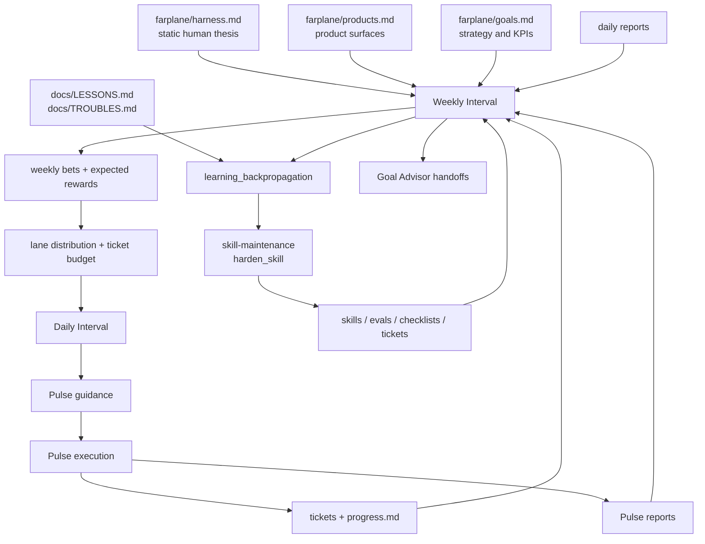

# Minimal Autonomy Loop

## Purpose

Farplane's minimal autonomy loop defines how an autonomous project decides what
to do, how much work to create, how fast to execute it, and how to learn from
the result without a hidden scheduler or bloated planning stack.

The core problem is not raw AI capability. The hard problem is work calibration:
how many tickets to create, how detailed the tickets should be, which actions
actually move the goal, and how delayed feedback updates the next planning
layer.

## Core Model

```text
weekly_interval(project) -> weekly_bets + expected_rewards + ticket_budget + pulse_guidance
daily_interval(project) -> recalibrated_queue + next_24h_plan + priority_changes
pulse(project) -> ready_ticket_execution + outcome_feedback + planning_request?
weekly_learning_backprop(project) -> skill_hardening + planning_calibration + next_reward_model
```

The loops have different reward horizons:

- Pulse optimizes immediate bounded progress.
- Daily Interval recalibrates the queue and next-day execution plan.
- Weekly Interval chooses bets, expected rewards, ticket supply, and strategy
  adjustments.
- Weekly learning backprop turns qualitative progress into durable skill,
  eval, checklist, ticket, or planning improvements.

Files are the shared memory. Codex automations own cadence. Skills own reusable
workflow behavior.

## Product-First Framing

Every autonomous project should know its products before it optimizes its
ticket queue. Research, maintenance, marketing, and admin work are investments
or chores that serve product output; they are not the project identity by
default.

For a Farplane-like project, the product shape can include:

- experiments and ablations that prove harness improvements.
- implemented harness improvements in the product itself.
- trust-building artifacts such as papers, writeups, demos, and educational
  content.

`farplane/products.md` owns plannable work lanes. `farplane/harness.md` owns
allocation guardrails: static safety rails that planners should not cross
without explicit approval. Weekly Interval chooses the actual lane distribution
for the next week based on goals, work done, reward closure, and queue health.

```text
weekly_distribution(goals, products.work_lanes, harness.guardrails, outcomes)
  -> lane_weights + bets + ticket_budget + expected_rewards
```

## Ticket Supply Learning

There is no fixed correct number of tickets. The system learns ticket supply
from observed execution.

Weekly Interval proposes a bet slate, a lane distribution, and enough ticket
inventory for the next planning window. Daily Interval recalibrates if the
queue is too sparse, stale, oversized, low-yield, or misaligned. Pulse executes
ready tickets; if none are executable, it writes a planning request instead of
inventing strategy.

Useful signals:

- `pulse_idle_count`: Pulse had no proceedable action.
- `ready_queue_coverage`: proceedable work remaining at current burn rate.
- `split_rate`: how often Pulse had to decompose work before action.
- `abandon_rate`: planned tickets killed or parked after execution learned they
  were weak.
- `proof_closure_rate`: completed tickets with accepted proof.
- `completion_yield`: completed work that advanced the weekly bet or metric.
- `planning_waste`: planned work that became stale before execution.
- `reward_prediction_error`: expected reward versus observed reward.

Ticket count is a control variable, not a success metric. More tickets help
only when they increase validated progress without increasing stale work,
coordination cost, or proof debt.

## Reward Model

Weekly bets should carry an expected reward signal. The signal can be
qualitative at first, but it must state what future evidence would make the bet
look better or worse.

```text
weekly_bet = {
  id,
  objective,
  expected_reward,
  reward_signal,
  reward_due_at,
  cost_cap,
  confidence,
  ticket_budget,
  proof_surface,
  stop_or_resize_rule
}
```

Pulse and ticket outcomes feed back as plain evidence first:

```text
outcome_feedback = {
  ticket_ref,
  parent_bet?,
  action_arm,
  result,
  evidence_refs,
  immediate_reward,
  qualitative_notes,
  blockers,
  followup_needed
}
```

Weekly Interval closes due reward signals before selecting new bets:

```text
close_reward(previous_bet, observed_evidence)
  -> accept | continue | kill | resize | source_gap
```

If numeric calibration becomes useful, use a simple update:

```text
new_estimate = old_estimate + alpha * (observed_reward - old_estimate)
```

Do not force numeric scoring before the evidence surface is stable. Reasoned
qualitative updates are acceptable early on.

## Pulse Execution Modes

Pulse is an executor and admission controller, not a strategy planner. It should
execute ready tickets in parallel up to the configured policy cap. If execution
cannot proceed, it records why and asks the planning layer for new or better
work.

Default modes:

- `execute_ready_tickets`: execute all ready, unblocked, approval-free,
  unclaimed, dependency-satisfied, parallelizable tickets up to policy cap.
- `repair_ticket_admission_state`: fix mechanical ticket metadata or proof
  state when that is the only blocker to execution.
- `request_planning`: write a planning request when the board has no executable
  work, the queue is too vague, or the next work needs product/goal judgment.
- `no_op_blocked`: stop only when execution, repair, and planning request are
  all blocked or unsafe.

Work categories such as experiments, ablations, productization, distribution,
research, and maintenance are planner work lanes in `farplane/products.md`, not
Pulse arms.

## Daily Interval

Daily Interval is the short planning convolution layer.

```text
daily_interval(last_24h, goals, latest_weekly_plan)
  -> daily_report
   + next_24h_plan
   + queue_reprioritization
   + ticket_splits_or_refill
   + pulse_guidance
   + ticket_deltas?
   + goal_advisor_handoffs?
```

It should:

- summarize recent work so the operator does not need to inspect every turn.
- check whether the queue still serves the weekly plan.
- create or reprioritize only the work needed for the next day.
- split vague weekly bets into executable leaf tickets.
- identify missing proof, blockers, or source gaps early.
- avoid changing static strategy unless it emits an approval-required delta.

## Weekly Interval

Weekly Interval is the main planning and learning layer.

```text
weekly_interval(last_week, goals, daily_reports)
  -> weekly_report
   + reward_closure
   + next_week_bets
   + lane_distribution
   + expected_rewards
   + ticket_budget
   + pulse_guidance
   + goal_advisor_handoffs
   + learning_backpropagation
```

It should:

- read daily reports, Pulse reports, tickets, progress logs, lessons, troubles,
  goals, products, and harness charter.
- close prior reward signals before choosing new bets.
- compare work against goals and static human thesis.
- read product work lanes and static allocation guardrails.
- choose a small number of next-week bets with expected rewards.
- create or propose enough tickets to test those bets.
- route durable execution through Goal Advisor when needed.
- run learning backpropagation into `skill-maintenance(mode: harden_skill)`.

## Learning Backpropagation

Learning backpropagation is the decoupled feedback updater. It should run from
Weekly Interval after reports and reward closure, not as a separate compatibility
automation.

```text
learning_backpropagation(review_window, tickets, progress_logs, lessons, troubles,
                         pulse_reports, interval_reports)
  -> harden_skill_handoffs
   + eval_candidates
   + checklist_guardrails
   + improvement_tickets
   + processed_state_delta
   + deferred_learning
```

The owner is `skill-maintenance(mode: harden_skill)`.

Inputs:

- `tickets/TASK-*/progress.md` and ticket closeout notes.
- Pulse and interval reports.
- `docs/TROUBLES.md` raw pain rows.
- `docs/LESSONS.md` distilled prevention rows.
- eval, QA, review, and proof artifacts when linked.

Outputs:

- skill eval cases for repeated preventable failures.
- gotchas or checklist guardrails for existing skills.
- improvement tickets when the owner surface is not a skill edit.
- processed-state records so the same row is not reprocessed.
- deferred learning when evidence is too weak or owner surface is unclear.

This replaces the old `learning-drain` compatibility surface. New automations
call `interval-update` with `learning_backpropagation` enabled, which then
routes to `skill-maintenance(mode: harden_skill)`.

## Human Authority

Humans own the thesis, non-tradeoffs, product boundary, and material strategy
changes. Agents own bounded execution, evidence gathering, ticket maintenance,
and proposed deltas.

Human approval is required for:

- static harness thesis or non-tradeoff changes.
- north-star or KPI tree changes.
- product boundary changes that shift the team into a different field.
- external publishing, spend, customer contact, deployment, or destructive
  cleanup when not already authorized.

Agents may autonomously:

- create leaf tickets inside approved weekly or daily direction.
- close proof gaps.
- run bounded experiments and evals.
- propose weekly bet changes.
- harden skills from repeated lessons and troubles.

## End-To-End Graph



## Minimal Implementation Contract

Required surfaces:

- `farplane/harness.md`: static human will and authority boundary.
- `farplane/products.md`: plannable work lanes and default lane weight hints.
- `farplane/goals.md`: current strategy, metrics, and holds.
- `farplane/automations.md`: Pulse, Daily Interval, and Weekly Interval prompt
  text.
- `skills/pulse-update`: fast ticket execution, planning requests, and outcome
  recording.
- `skills/interval-update`: daily and weekly report-then-plan workflow.
- `skills/skill-maintenance`: learning backpropagation owner.
- `.farplane/reports/pulse/**`: Pulse reports.
- `.farplane/reports/interval/**`: dated interval reports.
- `tickets/**/progress.md`: qualitative execution feedback.

Non-goals:

- no hidden Steer scheduler thread.
- no separate quarterly/yearly loop unless it produces useful decisions often
  enough to deserve its own automation.
- no compatibility learning-drain automation.
- no Pulse-level strategy or planner-level exploration before reward learning
  proves it is useful.
