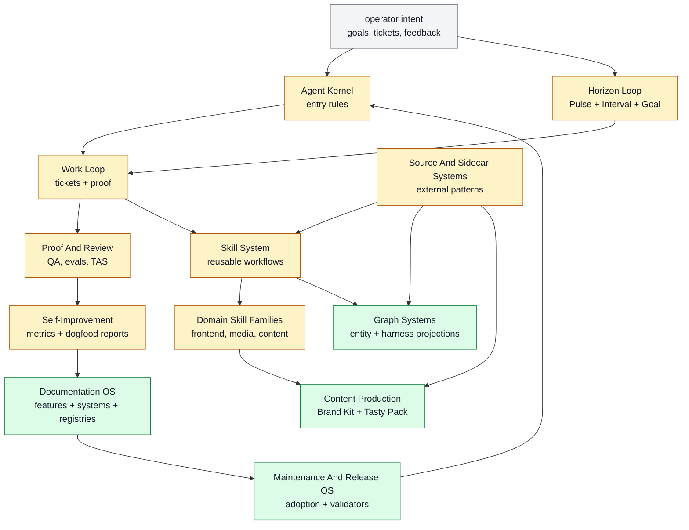

# Systems

Farplane systems are the public, maintainable product modules. Each Markdown
file in this directory owns one `system_record_json` block and links to the
first-class feature docs that belong to that system.

```text
docs/systems/*.md
  -> docs/systems/registry.jsonl       # public system inventory
```

Use this directory when deciding what Farplane is made of. Use
[`docs/features/`](../features/README.md) when a capability deserves its own
`FEAT-*` feature doc, registry row, proof path, and template/source refs.
Feature docs may be experimental when they represent a dogfooded capability,
but experiments themselves remain evidence in tickets, Goal Packet progress,
or reports until they graduate into a feature contract.

Each system owner doc should include a compact `## System Flow` diagram. The
diagram should show inputs, owner surfaces, feature-doc groupings, and created
reports/proof/registries without duplicating feature-level file detail.

System records may include optional `"track": false` or `"track": "<review prompt>"`
inside `system_record_json`. Tracking prompts are compact review briefs for
workflows such as `dogfood-review`; detailed review logic belongs in the
owning skill.

## System Map



Each owner doc also includes a `## System Flow` diagram that shows that
system's inputs, coordinating surfaces, feature docs, and created outputs at a
higher level than individual feature flows.

## Current Systems

| System | Primary feature | Owner file |
| --- | --- | --- |
| Agent Kernel | `FEAT-0042` | `agent-kernel.md` |
| Work Loop | `FEAT-0007` | `work-loop.md` |
| Horizon Loop | `FEAT-0029` | `horizon-loop.md` |
| Proof And Review | `FEAT-0008` | `proof-review.md` |
| Skill System | `FEAT-0022` | `skill-system.md` |
| Self-Improvement And Learning | `FEAT-0039` | `self-improvement-learning.md` |
| Source And Sidecar Systems | `FEAT-0011` | `source-sidecar-systems.md` |
| Maintenance And Release OS | `FEAT-0061` | `maintenance-release-os.md` |
| Domain Skill Families | `FEAT-0014` | `domain-skill-families.md` |
| Documentation OS | `FEAT-0060` | `documentation-os.md` |
| Content Production | `FEAT-0073` | `content-production.md` |
| Graph Systems | `FEAT-0075` | `graph-systems.md` |

## Update Flow

1. Update the owning system Markdown file when the system layer changes.
2. Update or delete the owning feature page in `docs/features/` when the
   feature set changes.
3. Run `python3 docs/features/validate_features.py --write`.
4. Run `python3 docs/features/validate_features.py`.
5. Run template/adoption/doc validators when a referenced feature or owner
   path changes.

Do not hand-edit generated JSONL registries.
