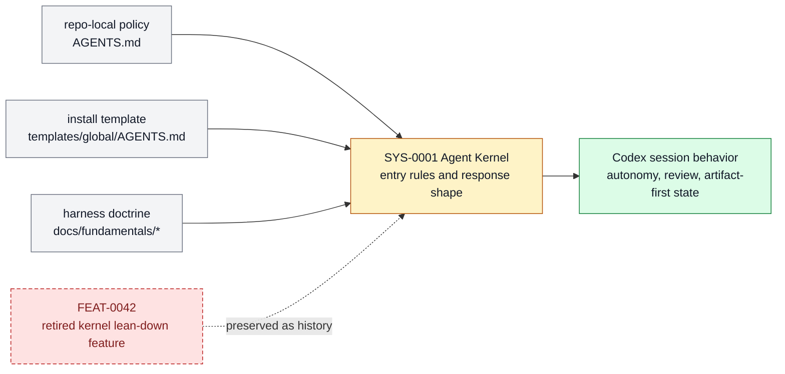

# Agent Kernel

The installed agent context, templates, prompt rules, and response conventions that let
a Codex enter Farplane with the right operating shape. This page is the product-layer
owner for that subsystem: it explains what belongs here, which feature specs make up the
stack, and where adjacent responsibilities should move.

```text
agent_kernel(change, repo_state?) -> owned_feature_set + boundary_decision + maintenance_signal
```

## At A Glance

- System ID: `SYS-0001`
- Status: `implemented`
- Primary feature: `FEAT-0042`
- Owner spec: `docs/systems/agent-kernel.md`
- Feature count: `1`

## Role

Agent Kernel owns the always-loaded operating shape for Farplane agents: autonomy,
action/plan/answer mode, reading discipline, skill routing, proof expectations, and
concise communication. It keeps permanent context lean by pointing detailed procedure to
skills, specs, tickets, validators, and templates.

## Feature Docs

- [FEAT-0042 Lean global agent operating kernel](../features/FEAT-0042-lean-global-agent-operating-kernel.md)

## What Belongs Here

Global and project AGENTS policy, install templates, prompt-load boundaries, response
conventions, and routing rules that every Farplane coding agent must inherit.

## What Belongs Elsewhere

Detailed workflows belong in skills; product capability contracts belong in feature
specs; task-local state belongs in tickets; generated checks belong in validators.

## Static Contract Route

Farplane keeps static source contracts, generated projections, and lifecycle
proof on separate routes:

- `farplane lint` selects read-only repository contracts from the typed
  `bin/core/lint/` registry. `lint all --changed` is also the Git-gate route,
  so feature, project, skill, eval, and ticket edits select their semantic
  static checks from one source of truth.
- Sync and generator commands are the only routes that update registries,
  graphs, or other projections. A lint command must never write them.
- `farplane validate ticket --phase planning|complete` remains lifecycle
  validation: it selects phase-dependent evidence and may write a ticket-local
  receipt.
- A validator that checks one skill's generated packet or integration payload
  remains owned by that skill rather than becoming a repository-wide lint rule.

The command reference and maintenance examples live in
[`bin/README.md`](../../bin/README.md).

## Operating Contract

- Keep always-loaded policy lean and navigational.
- Require plain, concrete human-to-human writing in the global communication
  default. Keep artifact-specific examples and finish checks with their
  templates and review owners.
- Require independent evaluation before agreement; responses lead with the
  conclusion or evidence rather than stock praise or reflexive validation.
- Route detailed procedures to the smallest durable owner.
- Preserve feedback-first planning for materially branching design choices.
- Require local context and proof before implementation completion claims.
- Feature-level behavior belongs in `docs/features/FEAT-*.md`; this page owns the system boundary and feature grouping.
- Registry data is generated from system and feature docs, not edited by hand.
- When a capability no longer deserves a feature page, fold its current truth into the best owner and remove active refs.

## System Flow



The Agent Kernel turns local and install-time policy into the operating shape every Farplane Codex starts from.

## Surfaces

- `AGENTS.md`
- `templates/global/AGENTS.md`
- `docs/fundamentals/harness-engineering-doctrine.md`

## Proof And Maintenance

- Registry proof: `python3 docs/features/validate_features.py`.
- Link proof: `python3 bin/validators/check_doc_refs.py`.
- Static-contract proof: `python3 bin/farplane.py lint all`.
- Update this system page when product-layer boundaries or feature membership changes.
- Update feature pages when capability behavior changes.
- Regenerate registries and commit generated outputs with the source docs.

## Change History

- 2026-08-23: Established the pure static-lint registry and the explicit
  lint/sync/lifecycle routing boundary.

- 2026-07-19: Added the cross-project independent-reasoning and
  non-sycophantic response-opening contract.
- 2026-06-27: Migrated into the reader-first system-spec shape.
