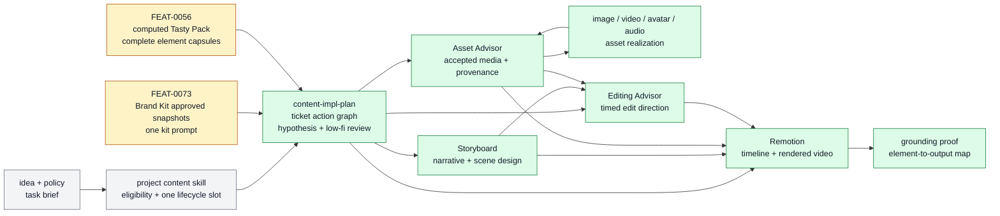

# Content Production

Content Production owns the reusable flow that turns an idea, approved Brand Kit identity, and optional computed Tasty Pack inspiration into a reviewable creative hypothesis, low-fidelity plan, ticket-owned action graph, and grounding proof.

```text
content_production(idea, brand_kit?, tasty_pack?)
  -> ticket.md { Change Plan + Done + QA Strategy } + proof
```

## At A Glance

- System ID: `SYS-0012`
- Status: `designed`
- Primary feature: `FEAT-0073`
- Owner spec: `docs/systems/content-production.md`
- Feature count: `2`

## Role

Content Production is the system boundary for creative reuse after source material has been captured. It distinguishes candidate inspiration from approved identity, composes them for a specific idea, routes selected elements through existing production advisors, and preserves proof that the final artifact used the selected elements rather than only their names.

The owning implementation evidence for this system split is `/Users/kenjipcx/Zanarkand Technologies/projects/Farplane-UI/tickets/TASK-0068/ticket.md`.

## Feature Docs

- [FEAT-0056 Tasty Pack inspiration vault](../features/FEAT-0056-inspiration-vault.md)
- [FEAT-0073 Brand Kit approved creative identity](../features/FEAT-0073-brand-kit-approved-creative-identity.md)

## What Belongs Here

Brand Kit approved snapshots, computed Tasty Pack retrieval, Brand Kit plus optional Tasty Pack composition, creative hypotheses, low-fidelity review packets, visual storyboard notes, element realization packets, timing-master decisions, advisor handoffs, Remotion assembly, and final grounding proof.

## What Belongs Elsewhere

Raw source capture and unresolved inspiration belong in [Source And Sidecar Systems](source-sidecar-systems.md). General domain skill packaging belongs in [Domain Skill Families](domain-skill-families.md). `ingest-content` may compile a saved capture into a reusable style profile, but that profile is not a third creative source inside the Brand Kit plus Tasty Pack content-production path.

## Operating Contract

- Project-level content skills own editorial eligibility, audience/channel
  defaults, account bindings, cadence, and workstream admission. They may hold
  or preempt a candidate, but they do not re-author production steps.
- `content-impl-plan` starts only after project admission. It records the
  resolved Brand Kit id/revisions/prompt/elements, optional computed Tasty Pack
  ref, selected element IDs, conflict decisions, ICP, platform, proof limits,
  and production policy in the canonical content ticket's `Change Plan`.
- The only reusable creative inputs for this path are `Brand Kit` and optional computed `Tasty Pack`; the task idea and invocation policy remain the brief.
- Brand Kit supplies approved identity, production policy, and one kit-wide
  prompt. Its embedded element snapshots are durable production inputs, not
  live Resource Bank pointers. The prompt may include provider, model, voice,
  format, and other advisor direction as prose; downstream agents interpret the
  complete prompt without a parallel advisor-configuration object.
- Tasty Pack supplies ad hoc source-grounded inspiration from Resource Bank candidates. It is computed at retrieval time and does not create saved Tasty Pack rows.
- Resource Bank remains candidate storage. It is not a production profile system and does not create recipe, formula, or profile tables.
- `is_element(value) = independently selectable && independently conditionable from an example && owned by a recognizable production step`.
- `should_store_element(value, note) = is_element(value) && explicitly_selected_for_reuse(value, note)`: whole-source context belongs in capture analysis, while only operator-selected reusable components become CreativeElement rows.
- Resource Bank captures keep optional transcript text separate from one
  freeform analysis-Markdown field. A note with future-creation intent creates
  or reuses a thin source-addressable content ticket whose first operation is
  `content-impl-plan`; the ticket does not require a reverse ingestion-job link.
- Creative elements use exactly six kinds: `format`, `storyboard`, `visual`, `character`, `audio`, and `editing`.
- Hook mechanics fold into the opening beat of `storyboard`; semantic copy folds into `storyboard`; subtitle rendering, caption timing, transitions, and cut rhythm belong to `editing`; layout remains `visual`; vocal pacing remains `audio`.
- Constraints are production policy or Brand Kit prompt content, not `CreativeElement` rows.
- Each production-ready element carries `description`, `whyItWorks`, `goldenExample { assetId, description? }`, and `goldenRecipe` as one prompt string.
- Brand Kit production policy wins over conflicting Tasty Pack inspiration. Compatible Tasty Pack elements can augment the idea by role; conflicts must be selected or rejected explicitly.
- Each selected element maps to a beat, planned artifact, advisor action, or production rule. Not every element creates a file.
- Content Impl Plan owns orchestration and aggregation, not every child result:
  Storyboard authors narrative/scene design; Asset Advisor resolves media;
  Editing Advisor authors timed edit direction; Remotion implements and
  renders; Review / QA judges readiness.
- Visual work records an owner-separated action graph in the canonical ticket.
  Storyboard, Asset Advisor, Editing Advisor, Remotion, and Review are distinct
  actions; Remotion cannot begin until it receives the accepted outputs of the
  three upstream production owners.
- Asset Advisor may route image, video, avatar, and audio realization, but it
  does not own edit direction, timeline assembly, or rendering. Content Impl
  Plan orders Asset Advisor's returned realization actions without re-deciding
  their generation route.
- Resource Bank Creative Elements are reusable creative patterns whose
  `goldenRecipe` is conditioning data. Skill methods are executable agent
  procedures with branching, tools, gates, failure handling, and proof.
- The approval packet names the creative hypothesis, why the combination should work, rejected conflicts, low-fidelity demo, visual storyboard notes, and exact element leverage map before final generation.
- Timing-sensitive production chooses a timing master before final visual generation when applicable: voiceover, music, source video, or none.
- Voice-led work locks script and voice timing before final visual prompts; music-led work selects or generates music first; source-video-led work inspects source duration first; all paths converge on Remotion with evidence.

## System Flow



Content Production converts approved identity and optional inspiration into a bounded ticket-owned action graph with visible review gates.

## Surfaces

- `docs/features/FEAT-0056-inspiration-vault.md`
- `docs/features/FEAT-0073-brand-kit-approved-creative-identity.md`
- `skills/content-impl-plan/SKILL.md`
- `skills/storyboard/SKILL.md`
- `skills/asset-advisor/SKILL.md`
- `skills/audio-advisor/SKILL.md`
- `skills/ai-image-advisor/SKILL.md`
- `skills/ai-video-advisor/SKILL.md`
- `skills/avatar-advisor/SKILL.md`
- `skills/editing-advisor/SKILL.md`
- `skills/remotion/SKILL.md`

## Proof And Maintenance

- Registry proof: `python3 docs/features/validate_features.py`.
- Link proof: `python3 bin/validators/check_doc_refs.py`.
- Ticket proof: `farplane ticket check <ticket> --phase planning`.
- Update this system page when the composition policy, timing-master policy, or feature membership changes.
- Update feature pages when Brand Kit or Tasty Pack behavior changes.
- Regenerate registries and commit generated outputs with the source docs.

## Change History

- 2026-08-08: Made the canonical content ticket the sole action-graph
  container; removed the duplicate JSON projection and validator.
- 2026-08-04: Separated project admission/configuration from the reusable
  compiler and added the immutable Creative Input Bundle plus mechanically
  owner-separated action graph.
- 2026-08-03: Standardized sibling production lanes and separated reusable
  creative patterns from executable skill methods.
- 2026-07-22: Created SYS-0012 for the TASK-0068 durable documentation slice.
