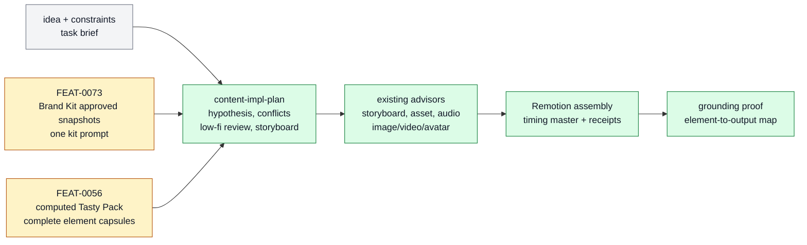

# Content Production

Content Production owns the reusable flow that turns an idea, approved Brand Kit identity, and optional computed Tasty Pack inspiration into a reviewable creative hypothesis, low-fidelity plan, production program, and grounding proof.

```text
content_production(idea, brand_kit?, tasty_pack?)
  -> hypothesis + low_fi_review + production_program + proof
```

## At A Glance

- System ID: `SYS-0012`
- Status: `designed`
- Primary feature: `FEAT-0073`
- Owner spec: `docs/systems/content-production.md`
- Feature count: `2`

## Role

Content Production is the system boundary for creative reuse after source material has been captured. It distinguishes candidate inspiration from approved identity, composes them for a specific idea, routes selected elements through existing production advisors, and preserves proof that the final artifact used the selected elements rather than only their names.

The owning implementation evidence for this system split is `/Users/kenjipcx/Zanarkand Technologies/projects/Farplane-UI/tickets/TASK-0068/ticket.md`.

## Feature Docs

- [FEAT-0056 Tasty Pack inspiration vault](../features/FEAT-0056-inspiration-vault.md)
- [FEAT-0073 Brand Kit approved creative identity](../features/FEAT-0073-brand-kit-approved-creative-identity.md)

## What Belongs Here

Brand Kit approved snapshots, computed Tasty Pack retrieval, Brand Kit plus optional Tasty Pack composition, creative hypotheses, low-fidelity review packets, visual storyboard notes, element realization packets, timing-master decisions, advisor handoffs, Remotion assembly, and final grounding proof.

## What Belongs Elsewhere

Raw source capture and unresolved inspiration belong in [Source And Sidecar Systems](source-sidecar-systems.md). General domain skill packaging belongs in [Domain Skill Families](domain-skill-families.md). Standalone `video-production` style-profile ingestion remains available to direct callers, but it is not a third reusable creative source inside the Brand Kit plus Tasty Pack content-production path.

## Operating Contract

- The only reusable creative inputs for this path are `Brand Kit` and optional computed `Tasty Pack`; the task idea and invocation constraints remain the brief.
- Brand Kit supplies approved identity, constraints, and one kit-wide prompt. Its embedded element snapshots are durable production inputs, not live Resource Bank pointers.
- Tasty Pack supplies ad hoc source-grounded inspiration from Resource Bank candidates. It is computed at retrieval time and does not create saved Tasty Pack rows.
- Resource Bank remains candidate storage. It is not a production profile system and does not create recipe, formula, or profile tables.
- Creative elements keep the existing nine kinds: `visual`, `audio`, `hook`, `storyboard`, `editing`, `copy`, `character`, `format`, and `constraint`.
- Each production-ready element carries `description`, `whyItWorks`, `goldenExample { assetId, description? }`, and `goldenRecipe` as one prompt string.
- Brand Kit constraints win over conflicting Tasty Pack inspiration. Compatible Tasty Pack elements can augment the idea by role; conflicts must be selected or rejected explicitly.
- Each selected element maps to a beat, planned artifact, advisor action, production rule, or constraint. Not every element creates a file.
- The approval packet names the creative hypothesis, why the combination should work, rejected conflicts, low-fidelity demo, visual storyboard notes, and exact element leverage map before final generation.
- Timing-sensitive production chooses a timing master before final visual generation when applicable: voiceover, music, source video, or none.
- Voice-led work locks script and voice timing before final visual prompts; music-led work selects or generates music first; source-video-led work inspects source duration first; all paths converge on Remotion with evidence.

## System Flow



Content Production converts approved identity and optional inspiration into a bounded production program with visible review gates.

## Surfaces

- `docs/features/FEAT-0056-inspiration-vault.md`
- `docs/features/FEAT-0073-brand-kit-approved-creative-identity.md`
- `skills/content-impl-plan/SKILL.md`
- `skills/storyboard/SKILL.md`
- `skills/asset-advisor/SKILL.md`
- `skills/audio-advisor/SKILL.md`
- `skills/ai-image-advisor/SKILL.md`
- `skills/ai-video-advisor/SKILL.md`
- `skills/avatar-advisor/SKILL.md`
- `skills/remotion/SKILL.md`

## Proof And Maintenance

- Registry proof: `python3 docs/features/validate_features.py`.
- Link proof: `python3 bin/validators/check_doc_refs.py`.
- Update this system page when the composition policy, timing-master policy, or feature membership changes.
- Update feature pages when Brand Kit or Tasty Pack behavior changes.
- Regenerate registries and commit generated outputs with the source docs.

## Change History

- 2026-07-22: Created SYS-0012 for the TASK-0068 durable documentation slice.
