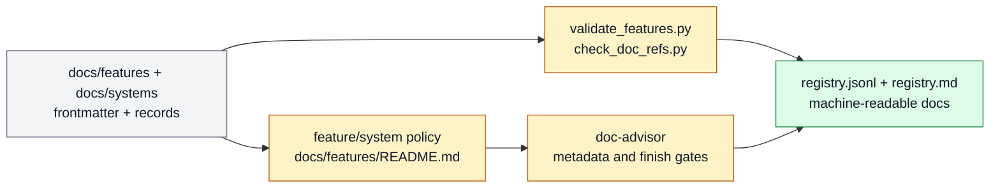

# Documentation OS

Documentation OS owns how Farplane turns durable written truth into human-readable
docs and generated machine inventories. It is the system boundary for doc
architecture, feature and system specs, documentation lifecycle, registry-backed docs,
and the operational `doc-advisor` skill.

```text
documentation_os(doc_delta, repo_state)
  -> owner_surface + doc_type + feature_or_system_decision + proof_route
```

## At A Glance

- System ID: `SYS-0011`
- Status: `implemented`
- Primary feature: `FEAT-0060`
- Owner spec: `docs/systems/documentation-os.md`
- Feature count: `1`

## Role

Documentation OS decides where durable documentation belongs, how it should be
shaped, how it stays linked to generated registries, and which review path proves
the result is usable.

## Feature Docs

- [FEAT-0060 Registry-backed documentation OS](../features/FEAT-0060-registry-backed-documentation-os.md)

## What Belongs Here

Reader-first feature specs, system specs, documentation placement policy, doc
split/merge/delete decisions, generated doc registries, feature/system metadata,
documentation lifecycle rules, and the `doc-advisor` skill's operating
contract.

## What Belongs Elsewhere

Release scans, adoption tracking, and rollout hygiene belong in Maintenance And
Release OS. Completion proof belongs in Proof And Review. Reusable skill package
structure belongs in Skill System. Task-local plans and proof stay in tickets and
artifacts until distilled.

## Operating Contract

- Durable docs optimize for reader action first and generated registry use second.
- Feature docs own capability behavior, surfaces, evidence, limits, and metrics.
- System docs own product-layer grouping, boundaries, and feature membership.
- `doc-advisor` and its references own operational workflow, not canonical lore.
- Generated JSONL and Markdown registries are derived from docs, not edited by hand.
- Stale documentation is folded into an active owner or deleted; tracked archives are
  not the default cleanup move.
- Material docs route readiness through documentation-quality review when checklist
  inspection alone is not enough.

## Feature Vs System Policy

Use this decision rule when a doc grows beyond a local explanation:

```text
doc_scope_decision(change)
  -> feature_doc | system_doc | local_reference | ticket_artifact | delete
```

- Create or update a feature doc when one capability has a stable behavior
  contract, owner surfaces, proof path, known limits, and durable references.
- Create or update a system doc when the work groups multiple capabilities,
  defines a product-layer boundary, names what belongs elsewhere, or explains a
  long-lived subsystem.
- Use a skill reference when the content is an executable branch for one skill.
- Use a ticket artifact when the content is task-local planning, proof, or
  decision context that has not earned durable ownership.
- Delete or fold content when it duplicates a stronger owner, preserves stale lore,
  or only exists because a registry row once existed.

## System Flow



Documentation OS keeps Farplane's durable written truth machine-indexable, human-readable, and tied to feature/system ownership.

## Surfaces

- `docs/features/FEAT-0060-registry-backed-documentation-os.md`
- `skills/doc-advisor/SKILL.md`
- `skills/doc-advisor/references/*.md`
- `skills/doc-advisor/qa_checklist.md`
- `docs/review/rubrics/documentation-quality.md`
- `docs/features/README.md`
- `docs/systems/README.md`

## Proof And Maintenance

- Registry proof: `python3 docs/features/validate_features.py`.
- Link proof: `python3 bin/validators/check_doc_refs.py`.
- Skill proof: `python3 skills/skill-maintenance/scripts/check_skills.py --write`.
- Eval proof: `doc-advisor` eval rows under `skills/doc-advisor/eval_task.json`.
- Update this system page when documentation architecture or feature/system boundaries
  change.

## Change History

- 2026-06-27: Promoted broad documentation architecture from `FEAT-0060` into a
  system boundary.
